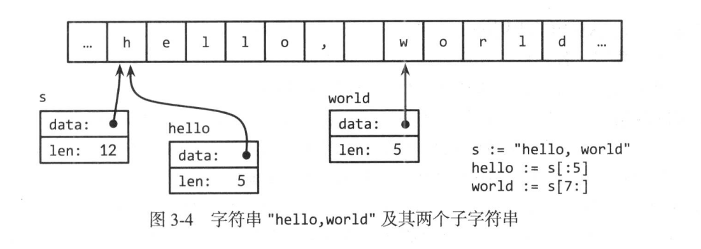
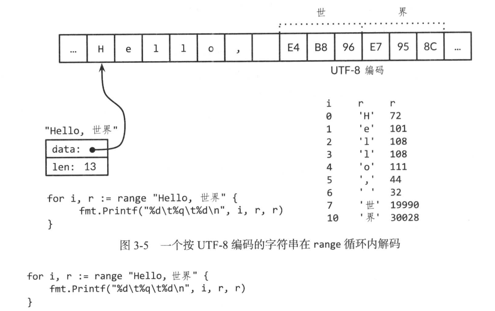
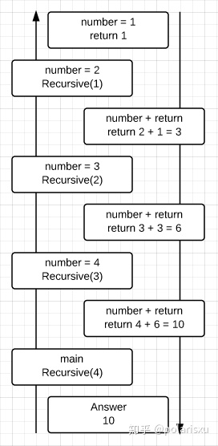

[toc]

基本数据

毫无疑问，计算机底层全是位，而实际操作则是基于大小固定的单元中的数值，称为字(word), 这些值可解释为整数、浮点数、位集(bitset)或内存地址等，进而构成更大的聚合体，以表示数据包、像素、文件、诗集，以及其他种种。Go 的数据类型宽泛，并有多种组织方式，向下匹配硬件特性，向上满足程序员需求，从而可以方便的表示复杂的数据结构。
Go 的数据类型可以分为四大类: 基础类型(basic type)、聚合类型(aggregate type)、引用类型(refrence type) 和 接口类型(interface type)。本章的主题是基础类型，包括数字(number)、字符串(string)和布尔型(boolean)。聚合类型--数组和结构体是通过组合各种简单的类型得到更复杂的数据类型。引用是一大分类，其中包含很多不同类型，如指针、slice、map、函数基于通道。他们的共同点是全都间接指向程序变量或状态，于是操作所引用的数据的效果就会遍及该数据的全部引用。

# 1. 整数
Go 的数值类型包含了几种不同大小的整数、浮点数和复数。各种数值类型有自己的大小，对正负号支持也各异。我们从整数开始。

Go 同时具备有符号整数和无符号整数。有符号整数分四种大小: 8位，16位，32位，64位，用 int8, int16, int32, int64表示，对应的无符号整数是 uint8, uint16, uint32, uint64。

此外还有两种类型的 int 和 uint。在特定平台上，其大小与原生的有符号整数\无符号整数相同，或等于该平台上的运算效率最高的值。int 是目前使用最广泛的数值类型。这两种类型大小相等，都是32位或64位，但不能认为他们一定是32位，或一定是64位; 即使在同样的硬件平台上，不同的编译器可能选择不同的大小。

rune 类型是 int32 类型的同义词，常常用于指明一个值是 Unicode 码点(code point)。这两个名称可以互换使用。
同样byte 类型是 uint8 类型的同义词，强调一个值是原始数据，而非量值。

最后，还有一中无符号整数 uintptr ， 其大小并不明确，但足以完整存放指针。uintptr 类型仅仅用于底层编程，例如在 Go 程序与 C 程序库或操作系统的接口界面。

int 、uint 和 uintptr 都有别于 其 大小明确的相似类型的类型。就是说， int 和 int32 是不同类型，尽管 int 天然的大小是32 位，但是 int 值 若要当作 int32 使用，必须显示转换，反之亦然。

有符号整数以补码表示，保留最高位作为符号位，n 位数字的取值范围是 -2 ^n-1 ~ 2^n-1 -1, 无符号整数由全部位构成其非负值，范围是 0 ~ 2^n -1 , 例如 int8 可以从 -128~127 取值，而uint8 0~255 取值。

Go 的二位操作符涵盖了算术、逻辑和比较运算。按优先级的降序排列如下: 
*   /   %   <<  >>  &   &^
+   -   |   ^   
==  !=  <   <=  >   >=
&&
||

二元运算符分五大优先级。同级别的运算符满足左结合律，为求清晰，可能需要圆括号，或 为使表达式内的运算符按指定次序运算，如 mask & (1<<28)
上述列表中前两行的运算符(如加法运算+) 都有对应的赋值运算符(如 +=)，用于简写赋值语句。

算术运算符 +、-、*、/ 可应用于整数、浮点数和复数，而取模运算符 % 仅能用于整数。
取模运算符 % 的行为 因编程语言而异。就 Go 语言，取模余数的 正负号总是与被除数一致，于是 -5%3 和 -5%-3 都得 -2。
除法运算 /  的行为取决于操作数是否都是整数，整数相除，商会舍弃小数部分，于是 5.0/4.0 得到1.24，而 5/4 结果是1
```go
fmt.Println(5/4) // 1
fmt.Println(5/4.0) // 1.25
fmt.Println(5.0/4.0) // 1.25
fmt.Println(5.0/4) // 1.25
```
不论是有符号数还是无符号数，若表示算术运算结果所需的位超出该类型的范围，就称为 溢出，溢出的高位部分会无提示的丢弃。假如原本的计算结果是有符号类型，且最左侧位是 1，则会形成负值。以 int8 为例：
```go
package main

import "fmt"

var u uint8 = 255
var i int8 = 127
func main(){
	fmt.Println(u, u+1, u*u) // 255, 0, 1
	fmt.Println(i, i+1, i*i) // 127, -128, 1
}
```
下列二元比较运算符用于比较两个类型相同的整数，比较表达式本身的类型是布尔型。
==  等于
!=  不等于
<   小于
<=   小于等于
>   大于
>=   大于等于

实际上，全部基本类型的值(布尔值，数值，字符串)都可以比较，这意味着两个相同类型的值可用 == 和 != 运算符比较。整数、浮点数和字符串还能根据比较运算符排序。许多其他类型的值是无法比较的，也无法排序。后面介绍每种类型时，我们将分别说明比较规则。
对于整数， +x 是 0+x 的简写，而 -x 是 0-x 的简写。对于浮点数和复数，+x 就是x，-x 是为 x 的复数。
Go 也具备下列位运算符，前 4 个对操作数的运算逐位独立进行，不涉及算术进位或正负号。
&   位运算 AND
|   位运算 OR
^   位运算符XOR，异或
    1^1=0 
　　0^0=0 
　　1^0=1 
　　0^1=1 

&^  位清空 (AND NOT)
<<  左移
>>  右移

如果作为二元运算符，运算符 ^ 表示按位 异或; 若作为一元前缀运算符，则它表示按位取反或按位取补，运算结果就是操作数逐位取反。运算符 &^ 是按位清除: 表达式 z = x &^ y 中，若 y 某位 是 1，则 z 对应位 是 0；否则它就等于 x 的对应位。

&^
解释：如果运算符右侧数值的第 i 位为 1，那么计算结果中的第 i 位为 0；如果运算符右侧数值的第 i 位为 0，那么计算结果中的第 i 位为运算符左侧数值的第 i 位的值。
```go
func main() {
    x := 11
    y := (1 << 0) | (1 << 3) //保证 z 中的第 0 位和第 3 位为 0
    z := x &^ y
​
    fmt.Printf("x = %b\n", x)
    fmt.Println("\t\t&^")
    fmt.Printf("y = %b\n", y)
    fmt.Println("————————")
    fmt.Printf("z = %04b\n", z)
}

// 运算结果:
x = 1011
        &^
y = 1001
————————
z = 0010
结果说明：

x = 11 = 1011。由于 y 中的第 0 位和第 3 位为 1，因此 z 中的第 0 位和第 3 位为 0。y 中的第 1 位和第 2 位为 0，因此，z 中第 1 位和第 2 位的值为 x 中第 1 位和第 2 位的值——1 和 0。所以 z 的值为 0010。

运算符作用
保证数值中的某些位一定为 0。
```

左移: <<
用来将一个数的各二进制位全部左移若干位。例如：
左移运算符
左移运算符(3张)
将a的二进制数左移2位，右补0。若a=15，即二进制数00001111，左移2位得00111100，即十进制数60（为简单起见，用8位二进制数表示十进制数15，如果用16位二进制数表示，结果是一样的）。
高位左移后溢出，舍弃。
左移一位相当于该数乘以2，左移2位相当于该数乘以2^2=4。上面举的例子15<< 2=60，即乘了4。但此结论只适用于该数左移时被溢出舍弃的高位中不包含1的情况。
例如，假设以一个字节（8位）存一个整数，若a为无符号整型变量，则a=64，即二进制数01000000时，左移一位时溢出的是0。而左移2位时，溢出的高位中包含1，则不符合上述结论。 [2] 
由下表可以看出，若a的值为64，在左移一位后相当于乘2，左移2位后，值等于256。
a的值
a的二进制形式
a<<1
a<<2
64
01000000
10000000
00000001,00000000
127
01111111
11111110
00000001,11111100

右移运算符，移位运算符的一种：程序设计中，位操作运算符的一种。在c++中，移位运算符有双目移位运算符：<<（左移）和>>（右移）。移位运算符组成的表达式也属于算术表达式，其值为算术值。左移运算是将一个二进制位的操作数按指定移动的位数向左移位，移出位被丢弃，右边的空位一律补0。右移运算是将一个二进制位的操作数按指定移动的位数向右移动，移出位被丢弃，左边移出的空位或者一律补0，或者补符号位，这由不同的机器而定。在使用补码作为机器数的机器中，正数的符号位为0，负数的符号位为1。

下面的代码说明了如何用位运算将一个 uint8 值作为位集(bitset)处理，其含有8个独立的位，高效且紧凑。Printf 用谓词 %b 以二进制形式输出数值。副词08 在这个输出结果前补零，补够8位


```go
package main

import "fmt"

var x uint8 = 1<<1 | 1<<5
var y uint8 = 1<<1 | 1<<2

func main() {
	fmt.Println(x)          // 34
	fmt.Printf("%08b\n", x) // 00100010, 集合 {1, 5}
	fmt.Printf("%08b\n", y) // 00000110, 集合 {1, 2}
	fmt.Printf("%08b\n", x&y) // 00000010, 交集 {1}
	fmt.Printf("%08b\n", x|y) // 00100110, 并集 {1, 2, 5}
	fmt.Printf("%08b\n", x^y) // 00100100, 对称差 {2, 5}
	fmt.Printf("%08b\n", x&^y) // 00100000, 差集 {5}
	// 解释：如果运算符右侧数值的第 i 位为 1，那么计算结果中的第 i 位为 0；
	// 如果运算符右侧数值的第 i 位为 0，那么计算结果中的第 i 位为运算符左侧数值的第 i 位的值。
	for i := uint(0); i <8;i++{
		if x&(1<<i) != 0{ // 元素判定，判断 x 位为1的位置
			fmt.Println(i) // "1" , "5"
		}
	}
	fmt.Printf("%08b\n", x<<1) // 01000100
	fmt.Printf("%08b\n", x>>1) // 00010001

}

```
```shell
在位移运算 x<<n 和 x >> n 中 , 操作数 n 决定位移量，而且 n 必须为 无符号型；操作数 x 可以是有符号性也可以是无符号型，
算术上，左移运算 x << n 等价于 x 乘以 2^n ; 而右移等价于 x 除以 2^n ,向下取整。
左移以 0 填补右边空位，无符号整数右移同样以0 填补左边空位，但有符号的右移操作是按照符号位的值填补空位。因此，请注意，如果将整数以位模式处理，须使用无符号整型。

尽管 Go 具备无符号整型数和相关算术运算，也尽管某些量值不可能为负，但是我们往往还采用有符号整型数，如数组的长度(即使直观上明显更应该选用uint), 下面的例子从后向前输出奖牌名称，循环里用到了内置函数len，它返回有符号整数。
```
```go
medale := []string{"gold", "sliver", "bronze"}
for i := len(medale) - 1; i >= 0; i-- {
    fmt.Println(medale[i]) // "bronze", "sliver", "gold"
}
```
相反，假若 len 返回的是一个无符号整型，就会导致严重的错误，因为 i 随之也称为 uint 类型，根据定义，条件 i >=0 将恒成立，第3轮迭代后，语句 i-- 使得 i 变成了 uint 类型的最大值(例如，可能是 2^64 -1)， 而非 -1，导致 madale[i] 试图越界访问元素，超出 slice的范围，引发运行失败或宕机。

因此，无符号整数往往只用于位运算符和特定算术运算符，如实现位集时，解析二进制格式的文件，或散列和加密。一般而言，无符号整数极少表示非负数。

通常，将某种类型的值转换成另一种，需要显示转换。对于算术和逻辑(不含位移)的二元运算符，其操作数的类型必须相同。虽然这有时会导致表达式相对冗长，但是一整类错误得以避免，程序也更容易理解。

考虑下面的语句，它与某些场景类似。
```go
var apples int32 = 1
var oranges int16 = 2
var compote int = apples + oranges // 编译错误，类型不一致
```
尝试编译这三个声明将产生错误信息:
非法操作: apples + oranges (int32 和 int16 类型不匹配)
类型不匹配的问题有几种方法改进，最直接的，将全部操作数该成同一类型。
```go
var compote = int(apples) + int(oranges)
```

对于每种类型 T ,若允许转换，操作 T(x) 会将 x 的值转换成类型 T 。
很多整型-- 整型转换不会引起值的变化，仅告知编译器应如何解读该值。不过，缩减大小的整型转换，以及整型与浮点型的相互转换，可能改变值或损失精度。
```go
f := 3.141 // a float64
i := int(f)
fmt.Println(f, 1) // 3.141, 3
f := 1.99
fmt.Println(int(f)) // 1
```
浮点型转换成整型，会舍弃小数部分，正值向下取整，负值向上取整
```go
package main

import "fmt"

func main() {

	f := 3.141
	fmt.Printf("%T\n", f) // float64
	a := -1.12
	fmt.Println(int(a)) // -1
}
```
如果有些转换的操作数的值超出了目标类型的取值范围，就应当避免这种转换，因为其行为依赖具体实现。
```go
package main

import "fmt"

func main() {
	f := 1e100 // a float64
	i := int(f)
	fmt.Println(i) // -9223372036854775808
}
```
不论有无大小和符号的限制，源码中的整数都能写成常见的十进制; 也可以写成八进制数，以 0 开头，如 0666; 还可以写成十六进制数, 以 0x 或 0X开头，如 0xabc 。十六进制的数字(或字母)大小写都可以。当前，八进制数似乎仅有一种用途---表示POSIX 文件系统的权限，而十六进制数广泛用于强调其模式，而非数值大小。

如下列所示：如果我们使用 fmt 包输出数字，我们可以用 %d, %o 和 %x 指定进制数
```go
package main

import "fmt"

func main() {
	o := 0666
	fmt.Printf("%d %[1]o %#[1]o\n", o) //438 666 0666
	x := int64(0xdeadbeef)
	fmt.Printf("%d %[1]x %#[1]X\n", x) //3735928559 deadbeef 0XDEADBEEF
}
```
通常Printf 的格式化字符串含有多个 % 谓词，这要求提供相同数目的操作数，而 % 后面的 副词[1] 告诉Printf 重复使用第一个操作数，其次，%o , %x, 或 %X 之前的副词 # 告诉 Printf 输出相应的前缀 0， 0x，0X

源码中，文字符号(rune literal) 的形式是字符写在一对 单引号内。最简单的例子就是 ASCII 字符， 如 'a' ，但也可以使用 Unicode 码点(codepoint) 或 码值转移。
用 %c 输出文字符号，如果希望输出带有单引号的则 用 %q
```go
package main

import "fmt"

func main() {
	ascii := 'a'
	unicode := '国'
	newline := '\n'
	fmt.Printf("%d %[1]c %[1]q\n", ascii) // 97 a 'a'
	fmt.Printf("%d %[1]c %[1]q\n", unicode) // 22269 国 '国'
	fmt.Printf("%d  %[1]q\n", newline) //  10  '\n'
}
```


## 2. 浮点数
Go 具有两种大小的浮点数 float32 和 float64, 其算术标准遵循从 IEEE 754 标准，所有新式 CPU 都支持该标准。
这两个类型的值可以从超细微到超宏大。math 包给出了 浮点值的极限。常量 math.MaxFloat32 是 float32 的最大值，大约3.4e38, 而 math.MaxFloat64 则大约是 1.8e308, 相应的，最小的正浮点值大约是 1.4e-45, 和 4.9e-324

十进制下，float32 的有效数字大约是 6位，float64 有效数字大约是15位。绝大多数的情况下，应优先选用 float64，因为除非格外小心，否则 float32 的运算会迅速积累误差。另外，float32 能精确表示的正整数范围有限。

```go
package main

import "fmt"

var f float32 = 16777216

func main() {
	fmt.Println(f == f+1) // true
}
```
在源码中，浮点数可写成小数，如:
```go
const e = 2.71828 // 近似值
```
小数点前的数字可以省略(例如: 0.121, 可以写成 .121) ,后面也可以省略(1.0 可以写成 1.)。非常小或者非常大的数字最好使用科学计数法表示，次方法在数量级指数前写字母 e 或者 E:
```go
const avo = 6.02212e23
const bvo = 6.6E23
```
浮点值能方便的通过 Printf 的谓词 %g(根据情况选择 %e 或 %f 以产生更紧凑的) 输出，该谓词会自动保持足够的精度，并选择最简介的表示方式，但是对于数据表 %e(有指数) 或者 %f(无指数)的形式更加合适。这三个谓词都能掌控输出宽度和数值精度。
```go
package main

import (
	"fmt"
	"math"
)

func main() {
	for x := 0; x < 8; x++ {
		fmt.Printf("x = %d e = %8.3f\n", x, math.Exp(float64(x)))
	}
}

输出:
x = 0 e =    1.000
x = 1 e =    2.718
x = 2 e =    7.389
x = 3 e =   20.086
x = 4 e =   54.598
x = 5 e =  148.413
x = 6 e =  403.429
x = 7 e = 1096.633
其中:
%8.3f表示 按 8 个字符的宽度输出自然对数 e 的各个幂方，结果保留三位小数
```
除了大量常见的数学函数外，math 包还有函数用于创建和判断 IEEE 754 标准定义的特殊值: 正无穷大和负无穷大，它表示超出最大许可制的数及除以零的商；以及 NaN (Not a Number) ，它表示数学上无意义的运算结果(如 0/0 或 sqrt(-1))
```go
package main

import "fmt"

var z float64
func main() {
	fmt.Println(z, -z, 1/z, -1/z, z/z) // 0 -0 +Inf -Inf NaN
}
```
math.IsNaN 函数判断其参数是否是非数值，math.NaN 函数则返回非数值(NaN) 。 在数字运算中，我们倾向于将 NaN当作信号值(sentinel value) , 但是直接判断具体的计算结果是否为 NaN 可能导致潜在的错误，因为 与 NaN 的比较总不成立(除了 != , 它总是与 == 相反)
```go
package main

import (
	"fmt"
	"math"
)

var z float64
func main() {
	nan := math.NaN()
	fmt.Println(nan == nan, nan < nan, nan > nan, nan != nan) // false false false true
}
```
一个函数的返回值是浮点型且它有可能出错，那么最好单独报错，如下:
```go
func compute() (value float64, ok bool) {
    // ...
    if failed {
        return 0, false
    }
    return result, true
}
```


## 3. 复数
略


## 4. 布尔值
bool 型的值或布尔值(boolean) 只有两种可能: 真(true) 和 假(false) 。 if 和 for 语句里的条件就是布尔值，比较操作符(如 == 和 <) 也可能得出布尔值结果。一元操作符(!) 表示逻辑取反，因此 !true 就是false， !true == false, 考虑到代码风格上，布尔表达式 x==true 相对冗长，我们总简化为 x 。
布尔值可以有运算符&&(AND) 和 ||(OR) 组合运算，这可能引起短路行为: 如果运算符左边的操作数已经能直接确定结果，则右边的操作数不会计算在内，所以下面的表达式总是安全的。
```go
s != "" && s[0] == 'x'
```
其中，如果s 是空字符串，则 s[0]会触发宕机异常。
因为 && 比 || 优先级更高，所以如下形式的条件无需加括号
```go
if 'a' <= c && c <= 'z' || 'A' <= c && c <= 'Z' || '0' <= c && c <= '9' {...}
```
布尔值无法隐式的转换成数值(如0 或 1)，反之也不行。如下状况下就有必要使用显示 if:
```go
i := 0
if b {
    i = 1
}
```

假如转换操作常常用到，就需要写个转换函数了
```go
func btoi(b bool) int {
    if b {
        return 1
    }
    return 0
}
```
```go
func itob(i int) bool {
    return i != 0 // 如果 i为0 ，return false， 否则返回true
}
```

## 5. 字符串
字符串是不可变的字节序列，它可以包含任意数据，包括 0 值字节，但主要是人类可读的文本。习惯上，文本字符串被解读成按 UTF-8 编码的 Unicode 码点(文字符号) 序列。

内置的 len 函数返回字符串的字节数(并非文字符号的数目), 下标访问操作 s[i] 则取第 i 个字符，其中 0 <= i <= len(s)
```go
package main

import "fmt"

func main() {
	s := "hello, world"
	fmt.Println(len(s)) // 12
	fmt.Println(s[0], s[7]) // 104, 119
	fmt.Printf("%c, %c" , s[0], s[7]) // h, w
}
```
试图访问许可范围以为的字节会触发宕机异常。
```go
c := s[len(s)] // 宕机: 下标越界
```
字符串的第 i 个字节不一定就是第 i 个字符，因为 非 ASCII 字符的 UTF-8 码点需要两个字节或多个字节。
子串生成操作 s[i:j] 产生一个新字符串，内容取自原字符串的字节，下标从 i(含边界值) 开始，直到 j(不含边界值)结束。结果大小是 j-i 个字节。
```go
fmt.Println(s[0:5]) // hello
```
如果下标越界，或者 j 的值小于 i，将触发宕机异常。
操作数 i 和 j 的默认值分别是 0(从字符串起始位置)和 len(s) (字符串终止位置)，若省略 i 或 j，或两者都省略，则取默认值。
```go
fmt.Println(s[:5]) // hello
fmt.Println(s[7:]) // world
fmt.Println(:) // hello, world
```
加号(+) 运算符连接两个字符串而生成一个新字符串: 
```go
fmt.Println("goodbye" + s[5:]) // goodbye, world
```
字符串可以通过比较运算符做比较，如 == 或 < ; 比较运算符按字节进行，结果服从本身的字典排序。

尽管肯定可以将新值赋予字符串变量，但是字符串值无法改变: 字符串值本身所包含的字节序列永不改变。要在一个字符串后添加新的字符串，可以如下编写代码:
```go
s := "left foot"
t := s
s += ", right foot"
```
这并不改变 s 原有字符串的值，只是将 += 语句生成的新字符串赋予 s，同时，t 仍然持有就的字符串的值。
```go
fmt.Println(s) // "left foot, right foot"
fmt.Println(t) // "left foot"
```
因为字符串不可改变，所以字符串内部的值不允许修改。
```go
s[0] = 'L' // 编译错误: s[0] 无法赋值 
```

不可改变意味着两个字符串能安全的共用同一段底层内存，使得复制任何长度字符串的开销都低廉。类似的，字符串 s 及其 字串 如(s[7:]) 可以安全的共用数据，因此字串生成操作开销低廉。这两种情况下，都没有分配新内存。
如下图： 展示了一个字符串及其两个字字符串的内存布局，他们共用底层字节数组。



### 5.1 字符串字面量
字符串的值可以直接写成字符串字面量，形式上就是带双引号的字节序列:
"Hello, 世界"
因为 Go 的源文件总是按 UTF-8 编码，并且习惯上 Go 的字符串会按照 UTF-8 解读，所以在源码中我们可以将 Unicode 码点写入字符串字面量。

在带双引号的字符串字面量中，转义序列以反斜杠开始(\ )开始，可以将任意值的字节插入字符串中。下面是一组转义符,表示 ASCII 控制码，如换行符、回车符和制表符
\a  警告或响铃
\b  退格符
\f  换页符
\n  换行符(指直接跳到下一行的同一位置)
\r  回车符(指返回行首)
\t  制表符
\v  垂直制表符
\'  单引号(仅用于文字字符字面量 '\'')
\"  双引号(仅用于 "......" 字面量内部)
\\  反斜杠

源码中的字符串也可以包含十六进制或八进制的任意字节。十六进制的转义字符写成 \xhh 的形式，h 是十六进制数字(大小写即可), 且必须是两位。八进制的转义字符写成 \ooo 的形式，必须使用三位八进制的数字(0~7), 且不能超过\377。 这两者都表示单个字节，内容是给定值。

原生的字符串字面量的书写形式是 `......` , 使用反引号，而不是使用双引号。原生的字符串字面量内，转义序列不起作用；实质内容与字面写法严格一致，包括反斜杠和换行符，因此在程序源码中，原生的字符串字面量可以展开多行。唯一特殊处理的是回车符会被删除(换行符会被保留), 使得同一字符串在所有平台上的值都相同，包括在文本文件存入换行符的系统。

正则表达式往往含有大量反斜杠，可以方便的写成原生的字符串字面量。原生的字面量也适用于 HTML 模板、JSON 字面量、命令行提示信息、以及需要多行文本表达的场景。
```go
const GoUsage = `Go is a tool for managing Go source code .

Usage: 
    go command [arguments]`
```

### 5.2 Unicode
从前，事情简单明晰，至少，狭隘的看，软件只需处理一个字符集: ASCII 。ASCII 码使用 7 位表示 128 个 字符: 
大小写英文字母、数字、各种标点和设备控制符。这对早期的计算机行业已经够了，但是让世界上众多使用其他语言的人无法在计算机上使用自己的文书体系。伴随着互联网的兴起，包含纷繁语言的数据屡见不鲜。到底怎样才能应付语言的繁杂多样，还能兼顾高效率。
答案是 Unicode , 它囊括了世界上所有文书体系的全部字符，还有重音符和其他变音符、控制码(如制表符和回车符)，以及许多特有文字，对他们赋予了一个叫 Unicode 码点的标准数字，在 Go 的术语中，这些字符记号称为 文字符号(rune)。

Unicode 第 8 版定义了超过一百种语言文字的 12 万个字符的码点。他们在计算机程序和数据中如何表示？天然适合保存单个文字符号的数据类型就是 int32 ，为 Go 所采用，正因如此，rune 类型作为 int32 类型的别名。

我们可以将文字符号的序列表示成 int32 值序列，这种表示方式 称作 UTF-32 或 UCS-4 ，每个 Unicode 码点的编码长度相同，都是32 位。这种编码简单划一，可是大多数面向计算机的可读的文本是 ASCII 码，每个字符只需 8 位，也就是一个字节，导致了比不要的存储空间消耗。而使用广泛的字符的数目也少于 65535 个，字符用 16位就可以容纳。下面 UTF-8 可以改进。

### 5.3 UTF-8
UTF-8 以字节位单位对 Unicode 码点做变长编码。UTF-8 是现行的一种 Unicode 标准。每个文字符号用 1~4 个字节表示，ASCII 字符的编码仅占 1个字节，而其他常用的 文书字符的编码只是 2或者3个字节。一个文字符号编码的首字节的最高位指名的后面还有多少个字节。若最高位是 0 ，则标示着它是 7 位的 ASCII 码，其文字符号的编码仅占 1个字节，这样就与传统的 ASCII码一致。若最高几位是 110， 则文字符号的编码占用 2 个字节，第二个字节以 10 开始。更长的编码依次类推。

0xxxxxxx                                文字符号 0~127          ASCII(占用一个字节)
110xxxxx 10xxxxxx                       128~2047                少于128个未使用的值(两个字节)
1110xxxx 10xxxxxx 10xxxxxx              2048~65535              少于2048个未使用的值(三个字节)
11110xxx 10xxxxxx 10xxxxxx 10xxxxxx     65536~0x10ffff          其他未使用的值

变长编码的字符串无法按照下标直接访问第 n 个字符，然而有失有得，UTF-8 换来许多有用的特性。UTF-8 编码紧凑，兼容 ASCII，并且自同步: 最多追溯 3 字节，就能定位一个字符的起始位置。 UTF-8 还是前缀编码，因此他能从左往右解码而不产生歧义，也无需超前预读。于是查找文字符号仅需搜索它自身的字节，必须考虑前文内容。文字符号的字典字节顺序与 Unicode 码点顺序一致，因此 按照 UTF-8 编码排序自然就是对文字符号排序。UTF-8 编码本身不会嵌入 NUL 字节(0 值)，这便于某些程序语言用 NUL 标记字符串结尾。

Go 源文件总是以 UTF-8 编码，同时，需要用 Go 程序操作的文本字符串也优先采用 UTF-8 编码。unicode 包具备针对单个文字符号的函数(例如区分字母和数字，转换大小写)，而 unicode/utf8 包则提供了按照 UTF-8 编码和解码文字符号的函数。

许多 Unicdoe字符难以直接从键盘输入；有的看起来相似几乎无法区分，有些甚至不可见。Go 语言中，字符串字面量的转义让我们得以用码点的值来指名 Unicode 字符。有两种形式，\uhhhh 表示16位码点值，\Uhhhhhhhh 表示 32位码点值，其中每个 h 代表一个十六进制数字；32位形式的码点几乎不需要用到。这两种形式都以 UTF-8 编码表示给定的码点。因此，下面几个字符串字面量都表示长度为 6 字节的相同串。

```go
package main

import "fmt"

func main() {
	fmt.Println("世界") // 世界
	fmt.Println("\xe4\xb8\x96\xe7\x95\x8c") //世界
	fmt.Println("\u4e16\u754c") //世界
	fmt.Println("\U00004e16\U0000754c")//世界

}
```
后面三行的转义序列用不同形式表示第一行字符串，但实质上他们的字符串值都一样。

Unicode 转义符也能用于文字符号，下列的字符是等价的：
'世'    '\u4e46'    '\U00004e46'

码点值小于256 的文字符号可以写成单个十六进制数转义的形式，如 'A' 写成 '\x41' ; 而更高的码点值则必须使用 \u 或者 \U 转义。这就导致，'\xe4\xb8\x96' 不是合法的文字符号，虽然这三个字节构成了某个有效的 UTF-8 编码码点。

由于 UTF-8 的优良特性，需要字符串操作都无需解码。我们可以直接判断某个字符串是否为另一个的前缀。

```go
// 判断子串是否为一个字符串的前缀
func HasPrefix(s, prefix string) bool {
	return len(s) >= len(prefix) && s[:len(prefix)] == prefix
}
// 判断子串是否为一个字符串的后缀
func HasSuffix(s, suffix string) bool {
	return len(s) >= len(suffix) && s[len(s) - len(suffix):] == suffix
}
// 判断是否为子串
func Contains(s, substr string) bool {
	for i := 0; i < len(s); i++{
		if HasPrefix(s[i:], substr){
			return true
		}
	}
	return false
}
```
按照 UTF-8 编码的文本的逻辑同样也适用于原生字节序列，但其他编码则无法如此。

另一方面，如果我们需要逐个逐个的处理 Unicode 字符，则必须使用其他编码机制。考虑我们第一个例子的字符串，它包含两个中国字符，内存布局如下图:

它含有 13 个字节，而按照 UTF-8 解读，本质是 9 个码点或文字符号的编码。

```go
package main

import (
	"fmt"
	"unicode/utf8"
)

func main() {
	s := "Hello, 世界"
	fmt.Println(s)
	fmt.Println(utf8.RuneCountInString(s))

	for i := 0; i<len(s); {
		r, size := utf8.DecodeRuneInString(s[i:])
		fmt.Printf("%d\t%c\n", i, r)
		i += size
	}

}
结果：
Hello, 世界
9
0	H
1	e
2	l
3	l
4	o
5	,
6	 
7	世
10	界
```
每次 DecodeRuneInString 的调用都返回 r(文字符号本身) 和一个值 (表示 r 按照 UTF-8 编码所占用的字节数)，这个值迎来更新下标 i，定位字符串下一个文字符号。可是按照此方法，我们总是需要使用上例中的循环形式。所幸，Go 中的 range 循环也适用于字符串，按照 UTF-8 隐式的编码，注意: 对于非 ASCII文字符号，下标增量大于 1

```go
package main

import (
	"fmt"
)

func main() {
	s := "Hello, 世界"
	for i, r := range s {
		fmt.Printf("%d\t%q\t%d\n", i,r,r)
	}

}

// %q 打印单引号

结果：
0	'H'	72
1	'e'	101
2	'l'	108
3	'l'	108
4	'o'	111
5	','	44
6	' '	32
7	'世'	19990
10	'界'	30028
```

我们可以用简单的 range 循环统计字符串中的文字符号数目，

```go
package main

import (
	"fmt"
	"unicode/utf8"
)

func main() {
	n := 0
	s := "Hello, 世界"
	for _ ,_ = range s {
		n++
	}
	fmt.Println(n) // 9
	m := 0
	for range s {
		m++
	}
	fmt.Println(m) // 9

	fmt.Println(utf8.RuneCountInString(s)) // 9
}
```
之前提到过，文本字符串作为按照 UTF-8 编码的 Unicode 码点序列解读，很大程度是处于习惯，但为了确保使用 range 循环能正确处理字符串，则必须要求而不仅仅是处于习惯。如果字符串含有任意二进制数，也就是说 UTF-8 数据出错，而我们对它 进行 range 循环，会发生什么？
每次 UTF-8 解码器读入一个不合理的字节，无论是显示调用 utf8.DecodeRuneInString， 还是在 range 循环内隐式读取，都会产生一个专门的 Unicode 字符 '\uFFFD' 替换他，其输出通常是个黑色六角形或类似钻石的形状，里面有个白色问号。如果程序碰到这个文字符号值，通常意味着，生成字符串数据的系统上游部分在处理文本编码方面存在瑕疵。
UTF-8 是一种很便捷的交互格式，而在程序内部使用文字字符类型可能更加方便，因为他们大小一致，便于在数组和 slice 中用下标访问。

当 []rune 转换作用域 UTF-8 编码字符串时，返回该字符串的 Unicode 码点序列。
```go
package main

import "fmt"

func main() {
	s := "世界"
	fmt.Printf("% x\n", s) // e4 b8 96 e7 95 8c
	r := []rune(s)
	fmt.Printf("%x\n", r) // [4e16 754c]
}
```
第一个 Printf 里的谓词 % x (注意 % 和 x 之间有空格)以十六进制数形式输出，并在每两个数之间插入空格。
如果把文字符号的 slice 转换成一个字符串，它会输出各个文字符号的 UTF-8 编码拼接结果。
```go
fmt.Println(string(65)) // "A" 而不是 65
fmt.Println(string(0x4eac)) // "京"
```
如果文字符号值非法，将被专门的字符替换(\uFFFD)
```go
package main

import "fmt"

func main() {
	fmt.Println(string(123456)) //𞉀
}
```

### 5.4 字符串和字节 slice
4 个 标准包对字符串操作特别重要： bytes, strings, strconv 和unicode

strings 包提供了许多函数，用于搜索、替换、比较、修整、切分和连接字符串。
bytes 包也有类似的函数，用于操作字节 slice ([]byte 类型，其某些属性和字符串相同)
由于字符串可不变，因此按增量方式构建字符串会导致多次内存分配和复制。在这种情况下，使用 bytes.Buffer 类型会更高效。
strconv 包具备的函数，主要用于转换布尔值、整数、浮点数为与之对应的字符串形式，或者把字符串转换为布尔值、整数、浮点数，另外还有为字符串添加/去除引号的函数。
unicode 包有判别文字符号值特性的函数，如 IsDigit、IsLetter、IsUpper 和 IsLower。
每个函数以单个文字符号值作为参数，并返回布尔值。若文字符号值是英文字母，转换函数(如 ToUpper和ToLower)将其转换成指定的大小写。上面所有的函数都遵循 Unicode 标准对字母数字等的分类原则。strings 包也有类似的函数，函数名也是 ToUpper和ToLower ，他们对原字符串的每个字符做指定变换，生成并返回一个新字符串。

下例中，basename 函数模仿 UNIX shell 中的同名实用程序。只要 s 的前缀看起来像是文件系统路径(各部分由斜杠分割)，该版本的basename(s) 就将其移除，貌似文件类型的后缀也会被移除。
```go
fmt.Println(basename("a/b/c.go")) // c
fmt.Println(basename("c.d.go")) // c.d
fmt.Println(basename("abc")) // abc
```

basename1.go
```go
// basename 移除路径部分 和 . 后缀
// e.g. , a ==> a, a.go==>a, a/b/c.go ==> c, a/b.c.go ==> b.c
package main

import "fmt"

func main() {
	a := "a/b/c/d/e/f.go"
	fmt.Println(basename(a)) // f
	b := "a.b.g.go"
	fmt.Println(basename(b))// a.b.g
	c := "a"
	fmt.Println(basename(c))// a
}

func basename(s string) string {
	// 将最后一个 / 和之前的部分全部舍弃，倒叙
	for i := len(s) - 1; i >= 0; i-- {
		if s[i] == '/' {
			s = s[i+1:]
			break
		}
	}
	// 保留最后一个 '.' 之前的所有内容，去掉 '.'
	for i := len(s) - 1; i >= 0; i-- {
		if s[i] == '.'{
			s = s[:i]
			break
		}
	}

	return s

}
```

简化版利用库函数 string.LastIndex
basename2.go
```go
// basename 移除路径部分 和 . 后缀
// e.g. , a ==> a, a.go==>a, a/b/c.go ==> c, a/b.c.go ==> b.c
package main

import (
	"fmt"
	"strings"
)

func main() {
	a := "a/b/c/d/e/f.go"
	fmt.Println(basename(a)) // f
	b := "a.b.g.go"
	fmt.Println(basename(b))// a.b.g
	c := "a"
	fmt.Println(basename(c))// a
}

func basename(s string) string {
	slash := strings.LastIndex(s, "/") // 如果没找到 ’/' ，则 slash == -1
	s = s[slash+1:]
	if dot := strings.LastIndex(s, "."); dot >=0{
		s = s[:dot]
	}
	return s

}
```

path 包和 path/filepath 包提供了一组更加普遍使用的函数，用来操作文件路径等具有层次结构的名字。path 包处理以斜杠 '/' 分段的路径字符串，部分平台。它不适用于处理文件名，却适合其他领域，像 URL 地址的路径部分。相反的，path/filepath 包根据宿主平台的规则处理文件名，例如 POSIX 系统使用 /foo/far, 而 Microsoft Windows 系统使用 c:\foo\bar
我们继续看另一个例子，它设计子字符串操作。任务是接收一个表示整数的字符串，如 "123456", 从右侧开始每三位数字后面就插入一个逗号，形如"12,345"。这个版本仅对整数有效，对浮点数无效。
```go

package main

import (
	"fmt"
)

func main() {
	res := comma("1234567890")
	fmt.Println(res) // 1,234,567,890
}

func comma(s string) string {
	n := len(s)
	if n < 3 {
		return s
	}
	return comma(s[:n-3]) + "," + s[n-3:]  // comma("1234567") + "," + "890" ==> comma("1234") + "," + "567" + "," + "890" ==> comma("1") + "," + "234" + "," + "567" + "," + "890" ==> "1,234,567,890"

}
```
comma 函数的参数是一个字符串，若字符串长度小于 3 ，则不插入逗号，否则，comma 以仅包含字符串最后三个字符的子字符串作为参数，递归调用自己，最后在递归调用的结果后面添加一个逗号和最后三个字符。


递归说明:
```go
func Recursive(number int) int {
    if number == 1 {
        return number
    }
    return number + Recursive(number-1)
}

func main() {
    answer := Recursive(4)
    fmt.Printf("Recursive: %d\n", answer)
}
```
上面的这个递归函数需要传入一个整数作为参数，并 return 回一个整数。如果传入函数值是 1，那么函数将会立马返回。这个 if 函数包含了锚点，并采用栈来完成执行任务。

如果传入的变量并不是 1，那么递归函数将开始工作。递归函数将参数值减去 1，然后使用减掉后的参数作为下一次递归调用的参数。栈内存随着每一次的函数调用增加，直到达到锚点，所有的递归调用开始返回一直到主函数。


1. 该流程图，从左下角开始，至下往上的递归操作，该流程展现了详细的调用链。
2. 主函数中调用递归函数传入参数 4，接着递归函数调用自身传入参数 3。这样反复调用，直到参数值 1 传入递归函数。
3. 递归函数在 return 前调用自己三次，当到达锚点的时候有 3 个扩展栈桢（extended stack frames）对应每一个调用操作。
4. 接着，递归开始展开，真正的工作开始进行。从图中可知，右边从上到下就是展开操作。
5. 每一个 return 操作通过获取参数并将其添加到函数调用的返回值来执行每个返回操作。
6. 最后的 return 操作执行后我们得到了最终的答案 10。


若字符串包含一个字节数组，创建它后就无法改变；相反的，字节 slice 的元素允许随意修改。
字符串可以和字节 slice 相互转换。

```go
s := "abc"
b := []bytes(s)
s2 := string(b)
```
概念上, []byte(s) 转换操作会分配新的字符数组，拷贝填入 s 含有的字节，并生成一个 slice 引用，指向整个数组。 具备优化功能的编译器在某些情况下可能会避免分配内存和复制内容，但一般而言，复制由必要保持 s 的字节维持不变(即使 b 的字节在转换后发生变化)。反之，用 string(b) 将字节 slice 转换成字符串也会产生一份副本，确保 s2 也不应变。
为了避免转换和不必要的内存分配，bytes 包和 strings 包都预备了很多对应的实用函数。他们两两相对应，strings 包具备下面6个函数:
func Contains(s, substr string) bool
func Count(s, sep string) int
func Fields(s string) []string
func HasPrefix(s, prefix string) bool
func Index(s, sep string) int
func Join(a []string, sep string) string

bytes 包里面对应的函数:
func Contains(s, substr []byte) bool
func Count(s, sep []byte) int
func Fields(s []byte) []string
func HasPrefix(s, prefix []byte) bool
func Index(s, sep []byte) int
func Join(s [][]byte, sep []byte) string    

唯一不同的是，操作对象由字符串变成为字节 slice
bytes 包为高效处理字节 slice 提供了 Buffer 类型。Buffer 起始为空，其大小随着各种类型数据的写入而增长，如 string, byte, 和 []byte 。 如下例所示，bytes.Buffer 变量无需初始化，原因是零值本来就有效。
```go
package main

import (
	"bytes"
	"fmt"
)

func main() {
	fmt.Println(intsToString([]int{1, 2, 3, 4}))
}

func intsToString(values []int) string {
	var buf bytes.Buffer
	buf.WriteByte('[')
	for i, v := range values {
		if i > 0 {
			buf.WriteString(", ")
		}
		fmt.Fprintf(&buf, "%d", v)
	}
	buf.WriteByte(']')
	return buf.String()
}
```
若要在 bytes.Buffer 变量后面添加任意文字符号的 UTF-8 编码，最好使用 bytes.Buffer 的 WriteRune 方法，而追加 ASCII 字符，如 '[' 和 ']' , 则使用 WriteByte 即可。

### 5.5 字符串和数字的相互转换
除了字符串、字节符号和字节之间的转换，我们常常也需要相互转换数值及字符串表示形式，这由 strconv 包的函数完成。
要将整数转换成字符串，一种选择是使用 fmt.Sprintf, 另一种是用函数 strconv.Itoa
```go
x := 123
y := fmt.Sprintf("%d", x) // "123"
fmt.Println(y, strconv.Itoa(x)) // "123 123"
```
FormatInt 和 FormatUnit 可以按照不同的进制位格式化数字。
```go
fmt.Println(strconv.FormatInt(int64(x), 2)) // "1111011"
```
fmt.Printf 里面的谓词 %b, %d, %o, %x, 往往比 Format 更加方便，若要包含数字以外的附加信息，他就更加有用。
```go
s := fmt.Sprintf("x=%b", x) // "x=1111011"
```
strconv 包内的 Atoi 函数或者 ParseInt 函数用于解释表示整数的字符串，而 ParseUnit 用于无符号整数。
```go
x, err := strconv.Atoi("123") // x 是整型
y, err := strconv.ParseInt("123", 10, 64) // 十进制，最长为64位
```
ParseInt 的第三个参数指定了结果必须匹配何种大小的整型，例如: 16表示 int16，而 0 作为特殊值表示 int。任何情况下，结果 y 的类型总是 int64，可将它转换成更小的类型。


## 6. 常量
常量是一种表达式，其可以保证在编译阶段就计算出表达式的值，并不需要等到运行时，从而使编译器得以知晓其值。所有常量本质上都属于基本类型: 布尔型，字符串或数字。

常量的声明定义了具体的值，它看起来在语法上与变量类似，但该值恒定，这防止了程序运行过程中的意外(或恶意)修改。例如，需要表示圆周率，在 Go 程序中使用常量比变量更加合适。
```go
const pi = 3.14159 // 近似值，math.Pi 是更精确的近似
```
与变量类似，同一个声明可以定义一系列常量，这适用于一组相关的值。
```go
const (
    e = 2.1111
    pi = 3.14159
)
```
许多针对常量的计算完全可以在编译时完成，以减免运行时的工作量并让其他编译器优化得以实现。某些错误通常需要在运行时才能检测到，但是如果操作数是常量，编译时就会报错，例如 整数除以0，字符串下标越界，以及任何产生无限大值的浮点数运算。

对于常量操作数，所有的数学运算、逻辑运算和比较运算的结果依然是常量，常量的类型转换结果和某些内置函数的返回值，同样是常量。
因为编译器知晓其值，常量表达式可以出现在涉及类型的声明中，具体而言就是数组类型的长度。
```go
const IPV4Len = 4
// parseIPV4 函数解释一个 IPV4地址
func parseIPV4(s string) IP {
    var p [IPV4Len]byte
}
```
常量声明可以同时指定类型和值，如果没有显示的指定类型，则类型根据右边的表达式推断。下例中，time.Duration 是一种具体类型，其基本类型是 int64，time.Minute 也是基于 int64的常量。下面声明的两个常量都属于 time.Duration 类型。通过 %T 进行展示。
```go
const noDelay time.Duration = 0
const timeout = 5 * time.Minute
fmt.Printf("%T %[1]v\n", noDelay) // "time.Dutation 0"
fmt.Printf("%T %[1]v\n", timeout) // "time.Dutation 5m0s"
fmt.Printf("%T %[1]v\n", time.Minute) // "time.Dutation 1m0s"
```
若同时声明一组变量，除了第一项之外，其他项在等号右侧的表达式都可以省略，这意味着会复用前面一项表达式及其类型
```go
const (
    a = 1
    b
    c = 2
    d
)
fmt.Println(a,b,c,d) // 1 1 2 2
```
如果复用右侧表达式导致计算结果总是相同，这就并不太实用，假设该结果可变怎么办。 iota

### 6.1 常量生成器 iota
常量的声明可以使用常量生成器 iota，它创建一系列相关的值，而不是逐个显示出来。
常量声明中，iota 的值从 0 开始，逐项加 1
下列取自 time 包，它定义了 Weekday 的具名类型，并声明每周的 7 天为该类型的常量，从 Sunday 开始，其值为 0 。这种类型通常称为 枚举型(enumeration, 或者缩写 enum)。

```go
type Weekday int
const (
    Sunday Weekday = iota
    Monday
    Tuesday
    Wednesday
    Thursday
    Friday
    Saturday
)
```
上面的声明中，Sunday 的值为 0， Monday 的值为 1，以此类推。
更复杂的表达式也可以使用 iota，net 包的代码如下，无符号整数最低 5 位数中的每一个都逐一命名，并解释为布尔型。
```go
package main

import "fmt"

type Flags uint

const (
	FlagUp Flags = 1 << iota  // 1 向左 0 位移
	FlagBroadcost // 1 向左 1 位移
	FlagLoopback // 1 向左 2 位移
	FlagPointToPoint // 1 向左 3 位移
	FlagMulticast // 1 向左 4 位移

	)
func main() {
	fmt.Println(FlagUp) // 1
	fmt.Println(FlagBroadcost) // 2
	fmt.Println(FlagLoopback) // 4
	fmt.Println(FlagPointToPoint) // 8
	fmt.Println(FlagMulticast) // 16
}
```
随着 iota 的递增，每个常量都按照 1<< iota 赋值，这等价于 2 的连续次幂，他们分别与单个位对应。

下列更复杂的，声明的常量表示 1024 的幂。
```go
package main

import "fmt"


const (
	_ = 1 << (10 *iota)
	KiB
	MiB
	GiB
	TiB
	PiB
	EiB
    YiB
    ZiB
)
func main() {
	fmt.Println(KiB) // 1024
	fmt.Println(MiB) // 1048576
	fmt.Println(GiB) // 1073741824
	fmt.Println(TiB) // 1099511627776
	fmt.Println(PiB) // 1125899906842624
	fmt.Println(EiB) // 1152921504606846976
}
```
然后，iota机制存在局限，比如，因为不存在指数运算符，所以无法生成 1000 的幂(KB, MB)等。


### 6.2 无类型常量
Go 的常量自由特别之处。虽然常量可以是任何基本数据类型，如 int 或 float64，也包括具名类型(time.Duration), 但是许多常量并不从属某一具体类型。编译器将这些从属类型待定的常量表示成某些值，这些值比基本类型的数字精度更高，且算术精度高于原生的极其精度。可以认为他们的精度至少可以达到256位。从属类型待定的常量共由6种。分别是 无类型布尔型，无类型整数，无类型文字符号，无类型浮点数，无类型复数，无类型字符串。
借助推迟确定从属类型，无类型常量不仅能暂时维持更高的精度，与类型已经确定的常量相比，他们还能写进更多表达式而无需转换类型。比如 上例种的 ZiB 和 YiB的值过大，用那种类型都无法存储，但他们都是合法常量并且可以用在下列表达式种。
```go
fmt.Println(YiB/ZiB) // 1024
```
再例如，浮点型常量 math.Pi 可用于任何需要浮点值或复数的地方。
```go
var x float32 = math.Pi
var y float64 = math.Pi
var z complex128 = math.Pi
```
若常量 math.Pi 一开始就确定从属于某具体类型，如 float64 ，就会导致结果的精度下降，另外，即使最终需要 float32值或complex128值，则可能需要转换类型。
```go
const Pi64 float64 = math.Pi
var x float32 = float32(Pi64)
var y float64 = Pi64
```

字面量的类型由语法决定。0、0.0、0i和'\u0000' 全都表示相同的常量值，但类型相异，分别是: 无类型整型，无类型浮点型，无类型复数和无类型文字符号。类似的，true 和 false是无类型布尔值，而字符串字面量则是无类型字符串。
根据除法运算中操作数的类型，除法运算的结果可能是整型或浮点型，所以，常量除法表达式中，操作数选择不同的字面写法会影响结果:
```go
var f float64 = 212
fmt.Println((f - 32) * 5/9) // 100, 结果是 float64类型
fmt.Println(5/ 9 * (f-32)) // 0, 5/9 的结果是无类型整型，0
fmt.Println(5.0/9.0 * (f-32)) // 100, 5.0/9.0 的结果是无类型浮点型
```
只有常量才可以是无类型的，若将无类型常量声明为变量(如下面第一条语句)，或在类型明确的变量赋值的右边出现无类型常量(下例第三条语句)，则常量会被隐式的转换成该变量的类型。
```go
var f float64 = 3 + 0i // 无类型复数--> float64
f = 2 // 无类型整数 --> float64
f = 1e123 // 无类型浮点数 --> float64
f = 'a' // 无类型 --> float64
```
上述语句与下述语句等价
```go
var f float64 = float64(3+0i)
f = float64(2)
f = float64(1e123)
f = float64('a')
```
不论是隐式还是显示，常量从一种类型转换成另一种，都要求目标类型可以表示原值。实数和复数允许舍入取整
```go
const (
    deadbeef = 0xdeadbeef // 无类型整数，值为 3735928559
    a = uint32(deadbeef) // uint32; 值为 3735928559
    b = float32(deadbeef) // float32; 值为 37359285576(向上取整)
    c = float64(deadbeef) // float64; 值为 3735928559
    d = int32(deadbeef) // 编译错误，溢出，int32 无法容纳常量值
    e = float64(1e309) // 编译错误，溢出，float64 无法容纳常量值
    f = uint(-1) // 编译错误，溢出，uint 无法容纳常量值
)
```
变量声明(包括短变量声明)中，假如没有显示指定类型，无类型常量会隐式转换成该变量的默认类型，如下例所示。
```go
i := 0 // 无类型整型，隐式 int(0)
r := '\000' // 无类型文字字符，隐式 rune('\000')
f := 0.0 // 无类型浮点数，隐式 float64(0.0)
c := 0i // 无类型整数；隐式 complex128(0i)
```

注意各类型的不对称性: 无类型整数可以转换成 int，其大小不确定，但无类型浮点数和无类型复数被转换成大小明确的 float64 和 complex128, Go语言中只有大小不明确的 int类型，不存在大小不确定的 float类型和 complex类型，原因是：如果浮点型数据的大小不明确，很难写出正确的数值算法。
要将变量转换成不同的类型，我们必须将无类型常量显示转换为期望的类型，或在声明变量时指名想要的类型。
```go
var i = int8(0)
var i int8 = 0
```
在将无类型常量转换为接口值时，这些默认类型就很重要了，因为他们决定了接口值的动态类型。
```go
fmt.Println("%\T\n", 0) // int
fmt.Println("%T\n", 0.0) // float64
fmt.Println("%\T\n", 0i) // complex128
fmt.Println("%T\n", '\000') // int32 (rune)
```

