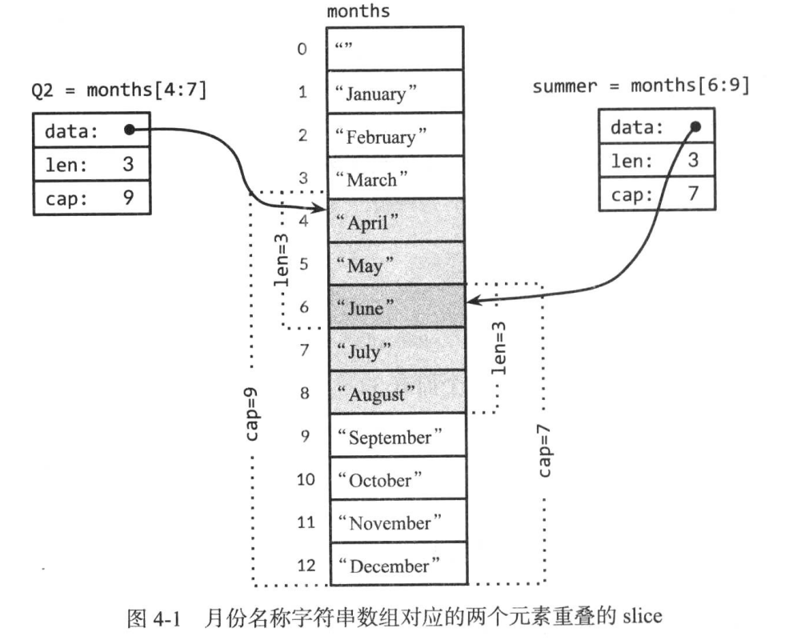
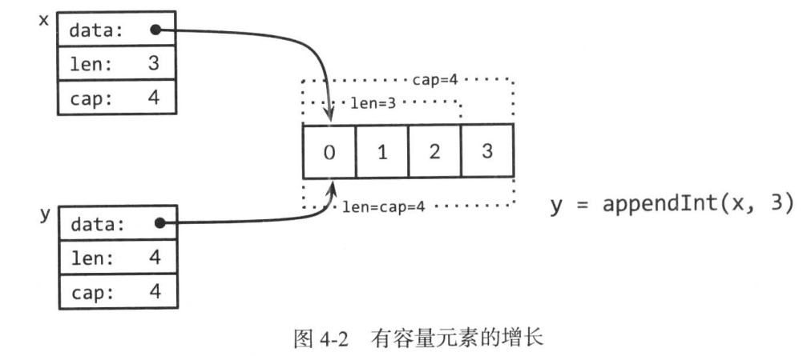
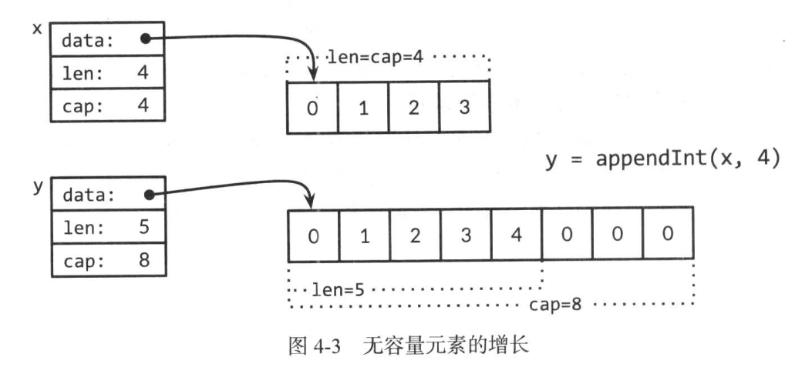

[toc]

复合数据类型是由基本数据类型以各种方式组合而构成的，就像分子由原子构成的一样。
四种复合数据类型: 数组、slice、map、和结构体。

数组和结构体都是聚合类型，他们的值由内存中一组变量构成。数组的元素具有相同的类型，而结构体中元素的数据类型则可以不同。数组和结构体长度都是固定的，反之 slice、map都是动态数据结构，他们的长度在元素添加到结构中可以动态增长。

## 1 数组
数组具有固定长度，且拥有零个或者多个相同数据类型元素的序列。由于数组的长度固定，所以在 Go 里面很少直接使用。slice 的长度可以增长或缩短，在很多场合下使用更多。然而，在理解 slice之前，我们需要先理解 数组。

数组中的每个元素都是通过索引来访问的，索引从 0 到 数组长度减 1。Go 内置函数 len 可以返回数组中的元素个数。
```go
package main

import "fmt"

func main(){
	var a [3]int                // 定义3个整数的数组
	fmt.Println(a[0])           // 打印数组的第一个元素
	fmt.Println(a[len(a) -1])   // 打印数组的最后一个元素
	for i, v := range a{        // 输出索引和元素
		fmt.Println(i,v)
	}
	for _,v := range a{         // 仅输出数组元素
		fmt.Println(v)
	}
}
```
默认情况下，一个新数组中的元素初始值为元素类型的零值，对于数字来说，就是0。也可以根据数组字面量根据一组值来初始化一个数组。
```go
var q [3]int = [3]int{1,2,3}
var r [3]int = [3]int{1,2}
fmt.Println(r[2]) // 0
```
在数组字面量中, 如果省略号 "..." 出现在数组长度的位置，那么数组的长度由初始化数组的元素个数决定。以上数组 q 的定义可以简化:
```go
q := [...]int{1,2,3}
fmt.Printf("%T\n", q) //[3]int
```
数组的长度是数组类型的一部分，所以[3]int 和 [4]int 是两种不同的数组类型。数组的长度必须是常量表达式，也就是说，这个值在程序编译时就可以确定。
```go
q := [3]int{1,2,3}
q = [4]int{1,2,3,4} // 编译错误，不可以将[4]int 赋值给 [3]int
fmt.Println(q)
```
如我们所见，数组、slice、map和结构体的字面语法都是相似的。上面的例子是按照顺序给出一组值，也可以如下面给出一组值, 这一组值同样具有索引和索引对应的值。
```go
type Currency int
const (
    USD Currency = iota
    EUR
    GBP
    RMB
)
symbol := [...]string{USD: "$", EUR: "XX", GBP: "AA", RMB: "aax"}
fmt.Println(RMB, symbol[RMB]) // 3, aax
```
在这种情况下，索引可以按照任意顺序出现，并且有的时候还可以省略。和上面一样，没有指定值的索引位置的元素默认被赋予数组元素类型的零值。例如
```go
r := [...]int{8: -1}
fmt.Println(r) // [0 0 0 0 0 0 0 0 -1]
```
定义了一个拥有9个元素的数组 r ，除了最后一个元素是 -1 外，该数组中的其他元素值都是 0。
如果一个数组的元素类型是可比较的，那么这个数组也是可比较的，这样我们就可以直接使用 == 操作符来比较两个数组，比较的结果是两边元素的值是否完全相同。使用 != 来比较两个数组是否不同。
```go
	a := [2]int{1,2}
	b := [...]int{1,2}
	c := [2]int{1,3}
	d := [3]int{1,2}
	fmt.Println(a==b,a==c,b==c) // true false false
	fmt.Println(a==d) // 编译错误，无法比较 [2]int == [3]int
```

举一个更有意义的例子，crypto/sha256 包里面的函数 Sum256 用来为存储在任意字节 slice 中的消息使用 SHA256 加密散列算法生成一个摘要。摘要的信息是256位，即[32]byte, 如果两个摘要信息相同，那么很有可能这两条原始信息是相同的，如果这两个摘要信息不同，那么这两条原始消息就是不同的。下面的程序输出并比较了 "x" 和 "X" 的 SHA256 散列值。
```go
c1 := sha256.Sum256([]byte("x"))
c2 := sha256.Sum256([]byte("X"))
fmt.Printf("%x\n%x\n%t\n%T\n", c1,c2, c1==c2, c1)
// Output:
//2d711642b726b04401627ca9fbac32f5c8530fb1903cc4db02258717921a4881
//4b68ab3847feda7d6c62c1fbcbeebfa35eab7351ed5e78f4ddadea5df64b8015
//false
//[32]uint8
```
这两个原始消息仅有一位(bit) 之差，但是他们生成的摘要信息有将近一半的位不同。注意:
上面格式化字符串 %x 表示将一个数组或者 slice 里面的字节按照 16进制的方式输出
%t 表示输出一个布尔值，%T 表示输出一个值的类型。

当调用一个函数的时候，每个传入的参数都会创建一个副本，然后赋值给对应的函数变量，所以函数接收的是一个副本，而不是原始参数。使用这种方式传递大的数组会变的很低效，并且在函数内部对数组的任何修改都仅影响副本，而不是原始数组。在这种情况下，Go 把数组和其他类型都看成值传递。而在其他语言中，数组是隐式的使用引用传递。
当然，也可以显示的传递一个数组的指针给函数，这样在函数内部对数组的任何修改都会反映到原始数组上面。下面的程序演示如果将一个数组[32]byte 的元素清零。
```go
package main

func main(){
	a := [32]byte{1,2,3}
	zero(&a)

}

func zero(ptr *[32]byte){
	for i := range ptr{
		ptr[i] = 0
	}
}
```
数组字面量 [32]byte{} 可以生成一个拥有 32 个字节元素的数组。数组中的每个元素的值都是字节类型的零值，即0。可以利用这一点来写另一个版本的数组清零程序。
```go
func zero(prt *[32]byte) {
    *ptr = [32]byte{}
}
```
使用数组指针是高效的，同时允许被调用函数修改调用方数组中的元素，但是因为数组长度是固定的，所以数组本身是不可变的。例如上面的 zero 函数不能接受一个 [16]byte 这样的数组指针，同样也无法为数组添加或者删除元素。由于数组的长度不可变的特性，除了在特殊的情况下，我们很少使用数组。更多的情况下，我们使用 slice

## 2. slice
slice 表示一个拥有相同类型元素的可变长度的序列。slice 通常写成 []T, 其中元素的类型都是 T，它看上去像是没有长度的数组类型。
数组和 slice 是紧密关联的。slice 是一种轻量级的数据结构，可以用来访问数组的部分或全部元素，而这个数组称为 slice 的底层数组。slice 有三个属性: 指针、长度、容量。
指针指向数组的第一个可以从 slice 中访问的元素，这个元素并不一定是数组的第一个元素。
长度是指 slice 中的元素个数，它不能超过 slice 的容量。
容量的大小通常是从 slice 的起始元素到底层数组的最后一个元素间元素的个数。
Go 内置函数 len 和 cap 用来返回 slice 的长度和容量。
一个底层数组可以对应多个 slice ，这些 slice 可以引用数组的任何位置，彼此之间的元素还可以重叠。

下图显示了一个月份名称的字符串数组和两个元素存在重叠的slice。数组的声明是:
```go
months := [...]string{1: "January", 2: "February", 3: "March",
		4: "April", 5: "May", 6: "June", 7: "July", 8: "August",
		9: "September", 10: "October", 11: "November", 12: "December"}
```
所以 January 就是 month[1], December 是 months[12]。一般来讲，数组中索引 0 的位置存放数组中第一个元素，但是月份总是从 1 开始，因此我们可以不设置索引为 0 的元素，这样它的值就是空字符串。

slice 操作符 s[i:j] (其中 0 <= i <= j <= cap(s)) 创建了一个新的 slice，这个新的 slice 引用了序列 s 中从 i 到 j-1 索引位置的所有元素，这里的 s 既可以是数组或者指向数组的指针，也可以是 slice。新 slice 的元素个数是 j-1 个。如果上面的表达式中省略了 i，那么新 slice 的起始索引位置就是 0，即 i=0；如果省略了 j ，那么新 slice 的结束索引位置是 len(s) -1,
即 j=len(s)。因此， slicemonths[1:13] 引用了所有的有效月份，同样的写法可以是 months[1:]。slicemonths[:] 引用了整个数组。接下来，我们定义元素重叠的 slice，分别用来定义第二季度的月份和北半球的夏季月份。
```go
Q2 := months[4:7]
summer := months[6:9]
fmt.Println(Q2) // [April May June]
fmt.Println(summer) // [June July August]
```
元素 June 同时包含连个 slice中，使用下面的代码来输出两个 slice 的共同元素。(虽然效率不高)
```go
	for _, r := range Q2{
		for _, q := range summer {
			if r == q{
				fmt.Println(r)
			}
		}
	}
```
如果 slice 的引用超过了被引用对象的容量，即 cap(s), 那么会导致程序宕机；但是如果 slice 的引用超出了被引用对象的长度，即len(s), 那么最终 slice 会比原 slice 长。
```go
fmt.Println(summer[:20]) // 宕机，超过了被引用对象的边界。
endlessSummer := summer[:5] // 在 slice 容量范围内扩展了 slice
fmt.Println(endlessSummer) // [June July August September October]
```

另外，注意求字符串(string) 字串操作和对字节 slice ([]byte) 做 slice 操作这两者的相似性。他们都写作 x[m:n] , 并且都返回原始字节的一个子序列，同时他们底层的引用方式也是相同的，所以两个操作都消耗常量时间。区别在于: 如果 x 是字符串，那么 x[m:n] 返回的是字符串；如果 x 是字节 slice，那么返回的结果是字节 slice。
因为 slice 包含了指向数组元素的指针，所以将一个 slice 传递给函数的时候，可以在函数内部修改底层数组的元素。换言之，创建了一个数组的 slice 等于为数组创建了一个别名。下面的函数 reverse 就地反转了整型 slice 中的元素，它适用于任意整型 slice。
```go
package main

import (
	"fmt"
)

func main() {
    // 这里反转数组 a
	a := [...]int{1,2,3,4,5,6}
	reverse(a[:])
	fmt.Println(a) // [6 5 4 3 2 1]

}

func reverse(s []int) {
	for i, j := 0, len(s)-1; i < j; i, j = i+1, j-1 {
		s[i], s[j] = s[j], s[i]
	}
}
```
将一个 slice 左移 n 个元素的简单办法就是连续调用 reverse 函数三次。第一次反转前 n 个元素。第二次反转剩下的元素，最后对整个 slice 再做一次反转。

注意初始化 slice s 的表达式和初始化数组 a 的表达式的区别，slice 字面量看上去和 数组字面量很像，都是用逗号分隔并用花括号括起来的一个元素序列，但是 slice 没有指定长度。这种隐式区别的结果分别是创建有固定长度的数组和创建指向数组的 slice。和数组一样，slice 也按照顺序指定元素，也可以通过索引指定元素，或者两者结合。
和数组不同的是，slice 无法做比较操作 ，因此不能使用 == 来测试两个 slice 是否拥有相同的元素。标准库里面提供了高度优化的函数 bytes.Equal 来比较两个字节 slice ([]byte) 。但是对其它类型的 slice，我们必须自己写函数来比较。
```go
package main

import "fmt"

func main() {
	a := []string{1: "1", 2: "2"}
	b := []string{1: "1", 2: "2"}
	c := []string{1: "1", 2: "1"}
	fmt.Println(equal(a,b), equal(a,c)) // true, false
}

func equal(x, y []string) bool {
	if len(x) != len(y) {
		return false
	}
	for i := range x {
		if x[i] != y[i] {
			return false
		}
	}
	return true
}
```
这种深度比较 看上去很简单，并且运行的时候并不比字符串数组使用 == 做比较多耗时间。你或许很奇怪为什么 slice 比较不可以直接使用 == 操作符做比较。这里有两个原因。
首先，和数组元素不同，slice 的元素是非直接的，有可能 slice 可以包含它自身。虽然有办法处理这种特殊的情况，但是没有一种方法是简单、高效、直观的。
其次，因为 slice 的元素不是直接的，所以如果底层数组元素改变，同一个 slice 在不同时间会拥有不同的元素。由于散列表(例如 Go 的 map 类型)仅对元素的 键做浅拷贝，这就要求散列表里面键在散列表的整个声明周期内保持不变。因为 slice 需要深度比较，所有就不能用 slice 作为map 的键。对于引用类型，例如指针和通道，操作符 == 检查的是引用相等性，即他们是否指向相同的元素。如果有一个相似的 slice 相等性比较功能，它或许会比较有用，也能解决 slice 作为map键的问题，但是如果操作符 == 对 slice 和数组的行为不一致，会带来困扰。所以最安全的方法就是不允许直接比较slice

slice 唯一允许比较操作是和 nil 做比较；例如
```go
if summer == nil {...}
```
slice 类型的零值是 nil。值为 nil 的 slice 没有对应的底层数组。值为 nil 的 slice 长度和容量都是零，但是 也有非 nil 的 slice 长度和容量都是零，例如 []int{} 或 `make([]int,3)[3:]` 。对于任何类型，如果他们的值可以是 nil，那么这个类型的 nil 值可以使用一种转换表达式，例如 []int(nil)
```go
var s []int // len(s)==0, s==nil
s = nil 	// len(s)==0, s==nil
s = []int(nil) // len(s)==0, s==nil
s = []int{} // len(s)==0, s != nil
```
所以，如果想检查一个 slice 是否为空，那么使用 len(s) ==0, 而不是 s==nil, 因为 s != nil 的情况下，slice也可以为空。
除了可以和 nil 做比较之外，值为 nil 的 slice 表现和其他长度为零的 slice 一样。例如，reverse 函数调用 reverse(nil) 也是安全的。除非文档标识出，否则无论值是否为 nil，Go 的函数都应该以相同的方式对待所有长度为零的 slice。

内置函数 make 可以创建一个 具有指定元素类型、长度和容量的 slice。其中 容量参数可以省略，在这种情况下，slice 的长度和容量相等。
```go
make([]T, len)
make([]T, len, cap) // 和 make([]T, cap)[:len]功能相同
```
深入研究下，其中 make 创建了一个无名数组并返回了一个这个无名数组的 slice，这个数组仅可以通过这个 slice 来访问。
在上面的第一行代码中，所返回的 slice 引用了整个数组。在第二行代码中，slice 只引用了前 len 个元素，但是它的容量是数组的长度，这为未来的 slice 元素留出空间。


### 2.1 append 函数
内置函数 append 用来将元素追加到 slice 后面。
```go
package main

import "fmt"

func main() {
	var runes []rune
	for _, r := range "Hello, 世界"{
		runes = append(runes, r)
	}
	fmt.Printf("%q\n", runes) // ['H' 'e' 'l' 'l' 'o' ',' ' ' '世' '界']
}
```
虽然最方便的用法是 []rune("Hello, 世界") , 这里需要注意的是圆括号，而不是花括号，上面的循环演示了如果使用 append 来为一个 rune 类型的 slice 添加元素。
```go
	s1 := []rune("Hello, 世界")
	s2 := []rune{'s'}
	//s2 := []rune{"Hello, 世界"}  // 编译错误
```
append 函数对于理解 slice 的工作原理很重要，接下来看一个为 []int 数组 slice 定义的方法 appendInt
```go
func appendInt(x []int, y int) []int{
	// 往 slice x 中追加 y ，并返回一个新的 slice
	var z []int
	zlen := len(x) + 1
	if zlen <= cap(x){
		// x 的 slice 仍有增长空间, 扩展slice 内容
		z = x[:zlen]
	} else {
		// slice 已无空间，为它分配一个新的底层数组
		// 为了达到分摊线性复杂性，容量扩展一倍
		zcap := zlen
		if zcap < 2 * len(x) {
			zcap = 2 * len(x)
		}
		z = make([]int, zlen, zcap)
		copy(z, x)
	}
	z[len(x)] = y
	return z
}
```
每一次 appendInt 调用都必须检查 slice 是否仍有足够容量来存储数组中的新元素。如果 slice 容量足够，那么它就会定义一个新的 slice(仍然引用原始底层数组)，然后将新元素 y 赋值到新的位置，并返回这个新的 slice。输入 slice x 和函数返回值 slice z 拥有相同的底层数组。

如果 slice x 的容量不够容纳增长的元素，appendInt 函数必须创建一个拥有足够容量的新的底层数组来存储新元素，然后将元素从 slice x 复制到这个数组，再将新元素 y 追加到数组后面。返回值 slice z 将和输入参数 slice x引用不同的底层数组。

使用循环语句来复制元素看上去直观一点，但是使用内置函数 copy 将更简单，copy 函数用来为两个拥有相同类型元素的 slice 复制元素。copy 函数的第一个参数是目标 slice，第二个参数是 源 slice。不同的 slice 可能对应相同的底层数组，甚至可能存在元素重叠。copy 函数有返回值，返回实际上复制的元素个数，这个值是两个 slice 长度的较小的值。所以这里不存在由于元素复制而导致的索引越界问题。
```go
	a := []int{3,2,1}
	b := []int{1}
	ret := copy(b,a)
	fmt.Println(ret, b) // 1, [3]
```
处于效率的考虑，新创建的数组容量会比实际容纳 slice x 和 slice y 所需最小长度更大一点。在每次数组容量扩展时，通过扩展一倍的容量来减少内存分配的次数，这样也可以保证追加一个元素所消耗的是固定时间。下面程序演示了这个效果。
```go
package main

import "fmt"

func main() {
	var x, y []int
	for i := 0;i <10; i++{
		y = append(x, i)
		fmt.Printf("%d\tcap=%d\t%v\n", i, cap(y), y)
		x = y
	}
}


// Output:
/*
0	cap=1	[0]
1	cap=2	[0 1]
2	cap=4	[0 1 2]
3	cap=4	[0 1 2 3]
4	cap=8	[0 1 2 3 4]
5	cap=8	[0 1 2 3 4 5]
6	cap=8	[0 1 2 3 4 5 6]
7	cap=8	[0 1 2 3 4 5 6 7]
8	cap=16	[0 1 2 3 4 5 6 7 8]
9	cap=16	[0 1 2 3 4 5 6 7 8 9]
*/
```
每次 slice 容量cap 的改变都意味着一次底层数组重新分配和元素赋值。
我们仔细看一下当 i=3 时，这时候 slice x 拥有三个元素 [0 1 2], 但是容量是4，这个时候 slice 还有一个空位置，所以调用 appendInt 追加元素 3 的时候，没有发生底层数组重新分配。调用的结果是 slice 的长度和容量都是 4 ，并且这个结果 slice 和 x 一样拥有相同的底层数组。

在下一次循环中 i=4，这个时候原来的 slice 已经没有空间了，所以 appendInt 函数分配了一个长度为 8 的新数组。然后将 x 中的 4个元素[0 1 2 3] 都复制到新的数组中，最后才追加新元素 i。这样结果 slcie 的长度是5，而容量就是 8。多分配的三个位置就留给接下来的循环添加值使用，在接下来的三次循环中，就不需要再重新分配空间。所以 y 和 x 是不同数组的 slice。操作过程如图:


内置的 append函数使用了比这里的 appendInt 更复杂的增长策略。通常情况下，我们并不清楚一次 append 调用会不会导致一次新的内存分配，所以我们不能假设原始的 slice 和调用 append 后的结果 slice 指向同一数组，也无法证明他们指向不同的数组。同样，我们也无法假设旧 slice 上对元素的操作会或者不会影响新的 slice 元素。所以，通常我们将 append 的调用结果再次赋值给传入 append 函数的 slice
```go
runes = append(runes, r)
```
不仅仅是在调用 append 函数的情况下需要更新 slice 变量。另外，对于任何函数，只要有可能改变 slice 的长度或者容量，抑或是使得 slice 指向不同底层数组，都需要更新 slice变量。为了正确使用 slice ，必须记住，虽然底层数组的元素是间接引用的，但是 slice 指针、长度和容量不是。要更新一个 slice 的指针，长度或者是容量必须使用如上所示的显式赋值。从这个角度来讲，slice并不是纯引用类型，而是像下面这种聚合类型。
```go
type IntSlice struct {
	ptr	*int
	len, cap int
}
```
appendInt 函数只能给 slice 添加一个元素，但是内置的 append 函数可以同时给 slice 添加多个元素，甚至添加另一个 slice 里面的全部元素。
```go
var x []int
x = append(x, 1)
x = append(x, 2,3)
x = append(x, 4,5,6)
x = append(x, x...) // 追加 x 中的所有元素
fmt.Println(x) // [1 2 3 4 5 6 1 2 3 4 5 6]
```
可以简单修改一下 appendInt函数来匹配 append 的功能。函数 appendInt 参数声明中的省略号 ... 表示该函数可以接受 可变长度参数列表。上面的例子中 append 函数的参数后面省略号 ... 表示如何将一个 slice 转换为参数列表。
```go
func appendInt(x []int, y ...int) []int {
	var z []int
	zlen := len(x) + len(y)
	// 扩展 slice z 的长度至少到 zlen
	copy(z[len(x):], y)
	return z
}
```
扩展 slice z 底层数组逻辑和上面一样。


### 2.2 slice 就地修改
我们多看一些就是修改 slice 的例子，比如 rotate 和 reverse 这种可以就地修改 slice 元素的函数。下面的函数 nonempty 可以从给定的一个字符串列表中去除空字符串并返回一个新的 slice。
```go
package main

import "fmt"

func main() {
	a := []string{"one", "", "two"}
	fmt.Println(nonempty(a)) // ["one" "two"]
}

func nonempty(strings []string) []string {
	i := 0
	for _, s := range strings {
		if s != ""{
			strings[i] = s
			i++
		}
	}
	return strings[:i]
}
```
这里有一点是输入的 slice 和输出的 slice 拥有相同的底层数组，这样就避免了在函数内部重新分配一个数组。当然，这种情况下，底层数组的元素只是部分被修改。因此我们通常这样来写.
```go
data = nonempty(data)
```
函数 nonempty 还可以利用 append 函数来写；
```go
package main

import "fmt"

func main() {
	a2 := []string{"1","","2"}
	fmt.Println(nonempty2(a2)) // [1  2]

}

func nonempty2(strings []string) []string{
	out := strings[:0]
	for _, i := range strings {
		out = append(out, i)
	}
	return out
}
```
无论使用哪种方式，重用底层数组的结果是每一个输入值的 slice 最多只有一个输出的结果 slice，很多从序列中过滤元素再组合结果的算法都是这样做的。这种精细的 slice 使用方式只是一个特例，并不是规则，但是偶尔这样实现可以更清晰、高效、有用。
slice 可以用来实现栈。给定一个空的 slice 元素 stack，可以使用 append 向 slice 尾部追加值。
```go
stack = append(stack ,v) // push v
```
栈的顶部是最后一个元素；
```go
top := stack[len(stack)-1] // 栈顶
```
通过弹出最后一个元素来缩减栈
```go
stack = stack[:len(stack)-1] // pop
```
为了从 slice 的中间移除一个元素，并保留剩余元素的顺序，可以使用函数 copy 来将高位索引的元素向前移动来覆盖被移除元素所在的位置。
```go
a := []string{"1", "2", "3" ,"4", "5"}
copy(a[2:], a[3:]) // [1 2 4 5 5]
```
```go
package main

import "fmt"

func main() {
	a := []string{"1", "2", "3" ,"4", "5"}
	fmt.Println(remove(a, 3)) // [1 2 4 5]

}

func remove(string []string, i int) []string {
	copy(string[i:], string[i+1:])
	return string[:len(string)-1]

}
```
如果不需要维持 slice 中剩余元素位置的顺序，可以简单的将 slice 的最后一个元素赋值给被移除元素所在的索引位置。
```go
package main

import "fmt"

func main() {
	a := []string{"1", "2", "3" ,"4", "5"}
	fmt.Println(remove(a, 2)) // [1 2 5 4]

}

func remove(string []string, i int) []string {
	string[i] = string[len(string)-1]
	return string[:len(string)-1]

}
```

## 3. map


