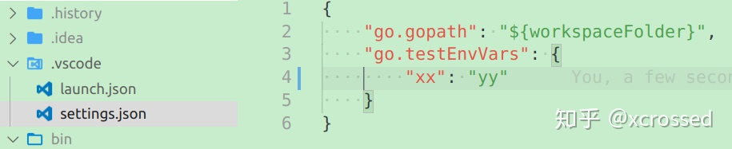
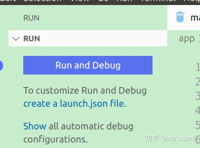
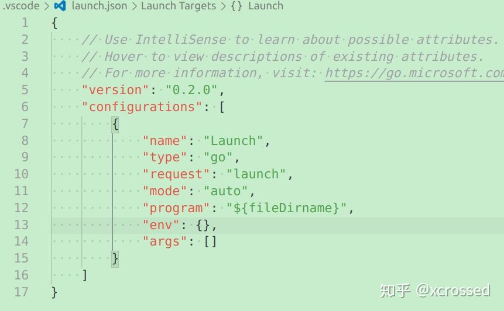
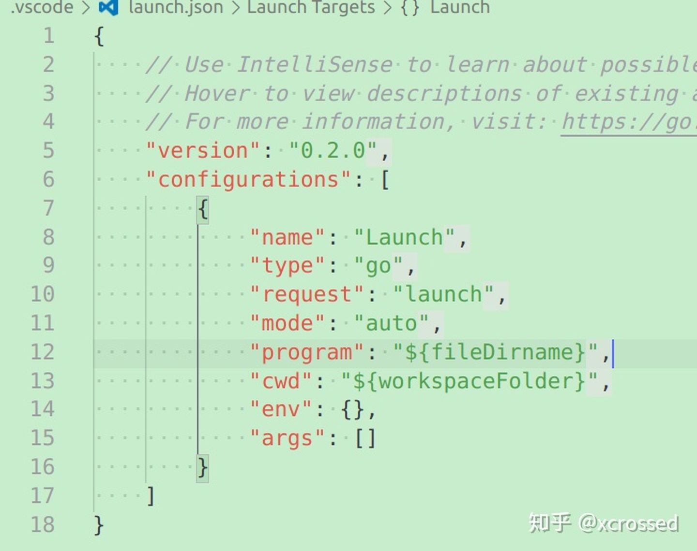

[toc]

## 1. 安装插件

1. 先从扩展管理中安装Go插件
【Rich Go language support for Visual Studio Code】

2. 配置代理
打开【cmd】
go env -w GOPROXY=https://goproxy.cn,direct

go env 进行查看配置

3. 安装Go插件所依赖的go tools
按ctrl+shift+p 调出命令面板，输入go install tools 选Go: Install/Update Tools 安装所有

4. go path配置
gopath直接在环境变量中设置就可以了，不用单独在vscode中设置。

关于go path的设置，还有一个问题，就是要不要设置2个的问题。

设置2个的目的是为了将工程放在第二个gopath下面，第一个是放go get的

在设置2个的时候，执行go get的会默认下载到一个gopath，但这个对于vscode来说可能会有点问题。

vscode中可以为在vscode中安装的go tools设置一个单独的目录具体设置项为 Tools Gopath，使用 ctrl+,  (注意这里是ctrl加上逗号)  然后输入tools gopath ，在下方填你想独立存放刚才第二步安装的工具的存放的地方了。

{
    "go.gopath": "D:/go_learn"
}

5. go mod相关
如果你现在使用了go mod模式，就不用纠结配置几个gopath的问题，只配置一个就好了。vscode的go mod支持需要启用language server按ctrl+, （注意是ctrl + 英文状态的逗号）调出配置界面，输入go.lang

把 Use Language Server设置选中状态即开启了gopls了(✔)，这时vscode就会很好的支持go mod类型的项目了。

6. VsCode Go插件在Go项目中的正确配置

如何运行
如果是一个单独的main.go这种，现在你的vscode应该可以工作了，但是在工程里面可能不行。

工程一般有2种 结构

一种是有src目录，就是go 代码放在工程目录下面的src目录下面，这就可能会导致一些项目不能正确加载，比如非go mod项目。

这时候在工程目录下面建一个.vscode目录，然后在.vscode目录下面创建.settings.json文件

在里面设置gopath

如果你的main包不在src目录下面，则需要设置cwd，也就是工作时切换到的目录

这时候可以选中你的main.go，按ctrl+F5，start Without Debuging，开始运行了．

说一点，如果是go mod的工程，这个gopath就不需要配置了

7. 如何Debug和运行
vscode里面正常的工程项目main包一般在cmd下面，不同的项目可能不同，但一定有一个main包。

选中你的main.go，按F5，这时就会弹出一个需要创建launch.json，点create a launch.json，直接默认的选中go，就会在.vscode目录下生成一个launch.json文件

生成的launch.json如下

这时候一般的程序都可以开始调试了，但是如果你的main.go启动是需要一些配置文件话，需要配置一个cwd的属性．

cwd - current working directory for finding dependencies and other files

加上cwd的属性如下

到此，设置好断点，选中入口文件，按F5就可以进入debug了，然后f10单步之类的快捷键，可以看界面上的提示，自己点几下就知道好玩了．

VsCode Go插件的那些常用快捷
ctrl+p　文件搜索快捷键

ctrl+shift+p　命令快捷键

ctrl+shift+k　删除一行

alt+左方向键　回到上一次编辑的地方

ctrl+鼠标左键，跳到方法定义的地方

#########################################
1、step over 执行当前代码块，但如果当前断点是一个方法（函数），不会进入函数体，只看得到这个方法的结果, 常用

2、step into 进入函数方法体。如果进入方法体后，新方法体里面还有函数，可以继续step into ， 常用

比如当前界面遇到的函数代码是 max（3,5），点击setp into以后，就会跳转到 max函数定义的界面去

3、step out  从上面setp into的方法体 跳出， 常用

4、resume program  以用户设置的断点为单位，执行断点之间的所有代码，到下一个断点停止。

5、stop  停止断点调试

6、mute breakpoints  让用户设置的所有断点失效，IDEA界面效果是红圈圈 变成 灰圈圈，

7、view breakpoints  查看用户设置的所有断点