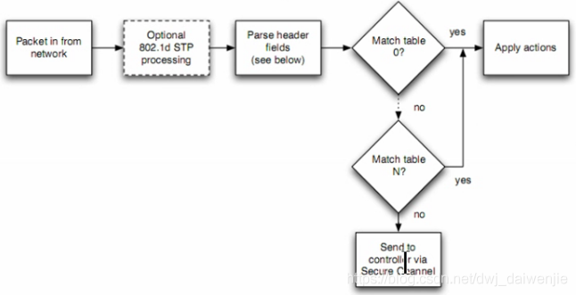

## 1. 基础:
```shell

流（flow）
1.流由管理员定义，根据不同的流执行不同的策略
2.在一段时间内，经过同一个网络的一系列具有相同属性的顺序发送的报文集合称之为流；至于何谓“相同属性”，例如我们可以规定访问同一个IP为一个流，也可以规定同一源/目IP的数据为一个流或者同一个协议为一个流。
3.所有数据都是以流为单位进行处理的。

流表（flow table）
1.流表最常用的动作：
    forward
    discard(drop)
    Next table
2.流表就是交换机里的一张转发表，类似交换机的MAC表和路由器的路由表。
3.每一个流表项都有各种动作
4.流表由一条条的流表项（路由条目）组成。
5.Openflow包含多个流表
6.流表由controller下发

流表项(flow entry)：
流表项是流表的最小单位，每条流表项对应了网络中传输的一条流。
Of1.0:Header Fields(包头域)+Counters+Actions
Of1.3:Match Fields(匹配字段)+Priority+Counters+Instructions+Timeouts+Cookie
```


### 1.1 openflow1.0
1. 流表项
Header Fields       | Counts        | Actions

2. Header Fields(包头域)的主要内容：
入端口(Ingress Port)、源Mac地址(Ether Source)、目的MAC地址(Ether Dst)、以太网类型(Ether Type)、VLAN ID(vlan id)、VLAN优先级(VLAN Priority)、源IP地址(IP src)、目的IP(IP dst)、IP协议(IP proto)、IP TOS位(IP TOS bits)、TCP/UDP源端口(TCP/UDP src Port), TCP/UDP 目的端口(TCP/UDP dst Port)

包头域主要是不再分层，简单的说，就是除了进接口，传统2层到4层的寻址信息都出现在包头域中（MAC，IP，PORT）

3. 计数器Counters

主要对每张表，每个端口，每个流等进行计数，方便流量监管（例如经过这个端口有多少流量？匹配这个流的数据包有多少了、这张表查找了多少次？）主要是将流量可视化

4. 动作Actions

即是对匹配到的流进行处理，传统网络中要不转发要不丢弃，没有第三种选择，openflow1.0规定了必备动作（Require Action）和可选动作（Optional Actions）

必备动作-----转发(Forward)。转发到哪？如下！
- 泛洪选项，ALL -转发到所有出口(但不包括入口)，相当于往所有接口泛洪。
- 给控制器，CONTROLLER -封装并转发给控制器
- 找本地，LOCAL -转发给本地网络栈
- 按表执行，TABLE -对要发出去的包执行流表内的动作
- 从哪里来返回哪里去，IN_PORT -从入口发出

必备动作---丢弃(Dorp)
    没有明确指明处理行动表项的，所匹配的所有分组默认丢弃

可选动作---转发
    NORMAL ：按照传统交换机的2层或者3层进行转发处理
    FLOOD： 通过最小生成树从出口泛洪发出，注意不包括入口

可选动作---入队（Enqueue）
    将包转发到绑定到某个端口的队列中

可选动作----修改域(Modify-field)
    修改包头内容

注意：Openflow与传统网络最大的区别：openflow可以对数据包头部进行修改


### 1.2 openflow1.3
1. 流表项

Mathch Fields   Priority    Counters    Instructions    Timeouts    Cookie
匹配域           优先级      计数器       指令            超出时间     附属属性

在1.3版本中：流表项包头域 修改为-> 匹配域；多了一个 优先级；动作 -> 指令；增加了 超时时间 和 缓存信息。

从1.0版本开始，OpenFlow支持多流表：每张流表都有独立的序号，从序号最小的流表开始匹配，每张表进行独立的处理操作。

2. 匹配域Match Fields

它是之前1.0的拓展，匹配的内容除了2到4层的寻址信息（MAC，IP，PORT），多了MPLS(城域网),IPV6,PBB,Tunnel ID等支持。1.0能匹配12个信息，1.3能匹配39个信息

3. 优先级Priority

用于标志流表匹配的优先顺序，优先顺序越高越早匹配，默认优先级为0

4. 计数器Counters

主要对每张表，每个端口，每个流等进行计数，方便流量监管（例如经过这个端口有多少流量了？匹配这个流的数据包有多少了？这张表查找了多少次？）；还在原有1.0的基础上，加入了对每一个组，每一个动作集（队列）的计数。

5. 超时时间Timeout

用于标志该流表项老化的时间，超过了时间限制就删除，节省了内存资源

6. 附属信息Cookie

由控制器选择的不透明数据值。控制器用来过滤流统计数据，流改变和流删除，但处理数据包时不能使用

7. 指令Instructions（较复杂）：

在新版本的Openflow中复杂了很多，相对于之前1.0版本的动作（actions），因为引入了多流表，所以多了很多复杂的操作（指令、动作集、动作），下面详细介绍

Require Instructions（必备指令）:
Write-Actions action(s):将指定的命令添加到命令集中。也就是说，在1.3中，命令不一定要马上执行，可以积累到命令集中，类似一个脚本，然后一起共同执行。

Goto-Table next-table-id:指定流水线处理进程中的下一张表中的ID(流水线pipeline定义：多级流表的匹配)

Apply-Actions action(s):立即执行指定的行动，而不改变指令集。(这个指令经常用来修改数据包，在两个表之间或者执行同类型的多个行动的时候)

Optional Instructions（可选指令）：
Meter meter id:直接将计流量包丢弃。

Clear-Actions:在行动集中立刻清除所有的动作。

举个例子，在 流 匹配了多个流表表项之后，通过指令积累了一定的动作，如果感觉到不是特别满意，就可以在下一个流匹配的表项中加入 Clear-Action 这个指令，清除掉之前积累的所有动作。

Write-Meterdata meterdata/mask:在元数据区域纪录元数据


动作Action（与之前1.0版本的动作Actions有所不同）
Require Action（必备动作）：
Outport：报文输出到指定端口

Drop:丢弃

Group:用组表处理报文

 Optional Action（可选动作）：
Set-Queue：设置报文的队列ID，为了QoS的需要

Push-Tag/Pop-Tag

Set-Field：设置报文包头的类型和和修改包头的值

Change-TTL：修改TTL的值

Instruction和Action之间的关系：
Instruction（指令）可以影响到Action（动作），即通过指令可以影响动作（如叠加、清除），叠加生成的多个动作生成一个东西叫动作集。


总的来说，1.3版本的流表项，所支持的逻辑需求 更加丰富。
在1.0版本的时候，动作是一个一个执行的，没办法集中处理；而1.3的话，允许动作集中执行，通过命令形成动作集，或者看这些动作不顺眼，用一个Clean-Actions清空命令集。


大总结：
（1）行动集与每个报文相关，默认情况下是空的；
（2）一个流表项可以使用Write-Action指令或者clear-action指令修改行动集；
（3）当一个表项的指令集没有包含Goto-Table指令时，流水线处理就停止了，然后报文的行动集就被执行；
（4）交换机可以通过Apply-Actions指令修改行动执行顺序；行动集包含所有的行动，无论他们以什么顺序加入到行动集中，行动的顺序均按照下列的顺序执行。

动作执行的顺序(动作集Action Set)：
既然，我们使用了第一块的指令，让第二块的动作添加或者是删除到动作集中，目的是为了更好的管理动作；那么当动作需要统一进行的时候，如何确定 动作集中的动作 的先后顺序呢？
比如动作集中 有两个动作添加了进来，一个是将流A封装交给控制器，另外一个是将流B丢弃，哪一个先执行呢？
类比于BGP协议，动态选路确定最优路的时候，有那么多的影响因素，如何确定这些因素影响的优先级？

指令的第三块内容，就是用来干这个的：它们确定了动作集中动作执行的优先顺序。如下：

1. copy TTL inwards: apply copy TTL inward actions to the packet  
2. pop: apply all tag pop actions to the packet  
3. push-MPLS: apply MPLS tag push action to the packet  
4. push-PBB: apply PBB tag push action to the packet  
5. push-VLAN: apply VLAN tag push action to the packet  
6. copy TTL outwards: apply copy TTL outwards action to the packet  
7. decrement TTL: apply decrement TTL action to the packet  
8. set: apply all set-field actions to the packet  
9. qos: apply all QoS actions, such as set queue to the packet  
10. group: 如果指定了组行动，那么按照这个序列中的顺序执行组行动存储段里的行动。  
11. output: 如果没有指定组行动，报文就会按照 output 行动中指定的端口转发。
Output 行动最后执行。如果组行动和输出行动均存在，那么组行动优先级高。如果两者均 不存在，那么报文被丢弃。

我的理解：流找到对应的表项 -> 表项的指令 将表项的动作添加到动作集中/将动作执行 -> 由表项中的优先顺序(如上)确定动作的执行顺序 -> 指令集中没有遇到 Goto-Table指令 则按照顺序执行动作集中的动作。

也就是说，表项中
(1)有指令集，指令集中有 将动作抽象成逻辑层集中处理的指令(Write-Action & Clear-Action) 还有 定义先后顺序的指令；
(2)有匹配执行的动作。

流表匹配：
OF1.1版本：


此为OpenFlow1.1版本的流表匹配操作，引入了多流表，1.0版本没有多流表，多流表的流表匹配称之为流水线处理（Pipeline process），即数据包过来之后被很多的流表都查一遍；交换机从流表0开始查找，序号从小到大匹配。每个包按照流表的优先级依次去匹配流表中的表项，优先级高的优先匹配，一旦匹配成功（yes），直接执行相应动作；如果没能找到匹配的表项，则转发给控制器。

注释：
1.1版本中引入了多级流表的概念
流表匹配(table 0------->table n):
匹配到：直接执行相应动作（apply actions）
未匹配到：通过安全通道交付给控制器处理

老版本的流表匹配通俗理解：要么转发、要么丢弃、要么泛洪。

OF1.3版本：

（1）1.3及之后版本的流表匹配，除了多流表操作之外，还引入了table-miss的处理和action-set的处理。

（2）之前的版本交换机没有匹配到流表项时，则直接丢给控制器处理。而table-miss则用于解决未匹配流的转发或丢弃问题。通过table-miss参数，可以对数据包实现丢弃、给下一个表处理、转发给控制器。

（3）多流表操作中，每个表都有独立的指令，这些指令（执行动作）可以直接在查表的时候执行，也可以通过指令汇总到action-set再叠加执行。

（4）单表时，只有action动作；多表环境下，多个action累加为action-set；决定action-set的一堆动作如何工作的，便是Instruction指令。指令可以将动作写入、修改到动作集action-set中，或者可以直接在读表时执行。

注释：匹配到相应的流表后(table 0------>table n):
1.更新计数器
2.执行指令(更新行动集、更新匹配域、更新元数据)，但并不立即执行动作集里的动作！
未匹配到table：
查看是否存在table-miss表项，table-miss 表项指定在流表中如何处理与其他流表项未匹配的数据包，没有则丢弃数据包，有则根据table-miss的指定对数据包做出相应处理，比如把数据包发送到控制器，或者把数据包扔到后续的表继续匹配。


## 2. openstack 流表
说明:
2个网络，一个独立网络，一个外部网络，4台虚拟机，其中2台在独立网络上，2台在外部网络上。


controller: br-int

```shell
cookie=0x2c9604f5dc0d9115, duration=10272.165s, table=0, n_packets=0, n_bytes=0, priority=65535,vlan_tci=0x0fff/0x1fff actions=drop  # 含有任意VLAN ID的数据流 全部拒绝
 cookie=0x2c9604f5dc0d9115, duration=10272.148s, table=0, n_packets=1522, n_bytes=168763, priority=2,in_port="int-br-ex" actions=drop # 从 int-br-ex进来的数据流 全部拒绝
 cookie=0x2c9604f5dc0d9115, duration=10272.132s, table=0, n_packets=0, n_bytes=0, priority=2,in_port="int-br-vlan" actions=drop # 从int-br-vlan 进来的数据流 全部拒绝
 cookie=0x0, duration=10267.065s, table=0, n_packets=0, n_bytes=0, priority=100,in_port="int-br-mirror" actions=resubmit(,100) # 从 int-br-mirror 的数据流 跳转到 table 100

 cookie=0x2c9604f5dc0d9115, duration=237.386s, table=0, n_packets=191, n_bytes=18971, priority=9,in_port="qvoedb66118-8c" actions=resubmit(,25)  # 从qvoedb66118-8c 进来的数据流 跳转到table 25
 cookie=0x2c9604f5dc0d9115, duration=83.307s, table=0, n_packets=0, n_bytes=0, priority=9,in_port="qvo1fa8fc62-43" actions=resubmit(,25)  # 跳转到table 25
 cookie=0x2c9604f5dc0d9115, duration=237.383s, table=0, n_packets=0, n_bytes=0, priority=10,icmp6,in_port="qvoedb66118-8c",icmp_type=136 actions=resubmit(,24) # 从qvoedb66118-8c 进来的数据流 协议是icmp6的 跳转到table 25
 cookie=0x2c9604f5dc0d9115, duration=83.302s, table=0, n_packets=0, n_bytes=0, priority=10,icmp6,in_port="qvo1fa8fc62-43",icmp_type=136 actions=resubmit(,24)
 cookie=0x2c9604f5dc0d9115, duration=237.381s, table=0, n_packets=5, n_bytes=210, priority=10,arp,in_port="qvoedb66118-8c" actions=resubmit(,24) # 跳转到 table 24
 cookie=0x2c9604f5dc0d9115, duration=83.297s, table=0, n_packets=0, n_bytes=0, priority=10,arp,in_port="qvo1fa8fc62-43" actions=resubmit(,24)

 cookie=0x2c9604f5dc0d9115, duration=10175.342s, table=0, n_packets=16151, n_bytes=2252918, priority=3,in_port="int-br-ex",vlan_tci=0x0000/0x1fff actions=mod_vlan_vid:1,resubmit(,60) # 表示匹配不带802.1Q报文头的数据包，转换成 VLAN ID=1
 cookie=0x2c9604f5dc0d9115, duration=589.574s, table=0, n_packets=196, n_bytes=20055, priority=3,in_port="int-br-vlan",dl_vlan=1 actions=mod_vlan_vid:2,resubmit(,60) # vlan 1 修改为 VLAN 2
 cookie=0x2c9604f5dc0d9115, duration=575.567s, table=0, n_packets=0, n_bytes=0, priority=3,in_port="int-br-vlan",dl_vlan=2 actions=mod_vlan_vid:3,resubmit(,60) # VLAN 2 修改为 VLAN 3
 cookie=0x2c9604f5dc0d9115, duration=10272.168s, table=0, n_packets=1376, n_bytes=151256, priority=0 actions=resubmit(,60)


 cookie=0x2c9604f5dc0d9115, duration=10272.169s, table=23, n_packets=0, n_bytes=0, priority=0 actions=drop
 
 
 cookie=0x2c9604f5dc0d9115, duration=237.384s, table=24, n_packets=0, n_bytes=0, priority=2,icmp6,in_port="qvoedb66118-8c",icmp_type=136,nd_target=fe80::f816:3eff:fed6:e805 actions=resubmit(,60)
 cookie=0x2c9604f5dc0d9115, duration=83.303s, table=24, n_packets=0, n_bytes=0, priority=2,icmp6,in_port="qvo1fa8fc62-43",icmp_type=136,nd_target=fe80::f816:3eff:fe3f:6c87 actions=resubmit(,60)

 cookie=0x2c9604f5dc0d9115, duration=237.382s, table=24, n_packets=5, n_bytes=210, priority=2,arp,in_port="qvoedb66118-8c",arp_spa=192.168.1.137 actions=resubmit(,25)
 cookie=0x2c9604f5dc0d9115, duration=83.301s, table=24, n_packets=0, n_bytes=0, priority=2,arp,in_port="qvo1fa8fc62-43",arp_spa=10.100.7.135 actions=resubmit(,25)
 cookie=0x2c9604f5dc0d9115, duration=10272.166s, table=24, n_packets=0, n_bytes=0, priority=0 actions=drop
 
 cookie=0x2c9604f5dc0d9115, duration=237.388s, table=25, n_packets=196, n_bytes=19181, priority=2,in_port="qvoedb66118-8c",dl_src=fa:16:3e:d6:e8:05 actions=resubmit(,60)
 cookie=0x2c9604f5dc0d9115, duration=83.309s, table=25, n_packets=0, n_bytes=0, priority=2,in_port="qvo1fa8fc62-43",dl_src=fa:16:3e:3f:6c:87 actions=resubmit(,60)


 cookie=0x2c9604f5dc0d9115, duration=10272.167s, table=60, n_packets=1065, n_bytes=116022, priority=3 actions=NORMAL
 cookie=0x0, duration=10267.055s, table=60, n_packets=16854, n_bytes=2327388, priority=4 actions=resubmit(,100),NORMAL


 cookie=0x2c9604f5dc0d9115, duration=10272.166s, table=61, n_packets=0, n_bytes=0, priority=3 actions=NORMAL 


 cookie=0x0, duration=10267.045s, table=100, n_packets=16854, n_bytes=2327388, priority=0 actions=drop # 拒绝所有数据流
```

知识点:

vlan_tci: 
vlan_tci=0x0fff/0x1fff 
0x0fff展开就是0000 1111 1111 1111, 掩码位: 0x1fff 展开就是 0001 1111 1111 1111
所以

vlan_tci=0：表示匹配不带802.1Q报文头的数据包

3    1  12
PCP CFI VID


该报文头包括了2个16bit的部分，这两个部分分别被称为TPID(Tag Protocol IDentifier)和TCI(Tag Control Information)，对于OVS来说，只支持0x8100的Ethertype，所以前面16位TPID是固定的。剩下的TCI又包括3部分：

PCP (Priority Control Point)：3位大小的优先级，即0~7(从低到高)。当交换机/路由器发生传输拥塞时，优先发送优先级高的数据帧。
CFI（Canonical Format Indicator）：长度为1bit，表示MAC地址是否是经典格式。CFI为0说明是经典格式，CFI为1表示为非经典格式。该字段用于区分以太网帧、FDDI帧和令牌环网帧，在以太网帧中，CFI取值为0。而实际上在OVS和OpenFlow中，都不会匹配这个位，直接忽略。
VID（VLAN ID）：长度为12bit，取值范围是0~4095，其中0表示该帧不属于任何一个VLAN，而4095是保留值，不能给用户使用，所以实际可用的VLAN ID一共为4094个(1 ~ 4094)。


arp_spa=ip[/netmask]
arp_tpa=ip[/netmask]
当dl_type指定ARP或RARP时，arp_spa和arp_tpa分别与源和目标IPv4地址匹配。可以将地址指定为IP地址或主机名（例如192.168.1.1或www.example.com）。可选的网络掩码允许将匹配限制为IPv4地址前缀。网络掩码可以指定为点分四边形（例如192.168.1.0/255.255.255.0）或CIDR块（例如192.168.1.0/24）。

arp_sha=xx:xx:xx:xx:xx:xx
arp_tha=xx:xx:xx:xx:xx:xx
当dl_type指定ARP或RARP时，arp_sha和arp_tha分别匹配源和目标硬件地址。地址指定为以冒号分隔的6对十六进制数字（例如00:0A:E4:25:6B:B0）。

arp_sha=xx:xx:xx:xx:xx:xx/xx:xx:xx:xx:xx:xx
arp_tha=xx:xx:xx:xx:xx:xx/xx:xx:xx:xx:xx:xx
当dl_type指定ARP或RARP时，arp_sha和arp_tha分别匹配源和目标硬件地址。地址指定为以冒号分隔的6对十六进制数字（例如00:0A:E4:25:6B:B0），并在斜杠后加上通配符掩码


controller: br-ex

```shell
[root@controller ~]# ovs-ofctl dump-flows br-ex
 cookie=0xebfba158556341cb, duration=18803.760s, table=0, n_packets=850, n_bytes=65324, priority=4,in_port="phy-br-ex",dl_vlan=1 actions=strip_vlan,NORMAL #  从数据包中剥离VLAN标记（如果存在）然后转发
 cookie=0xebfba158556341cb, duration=18900.564s, table=0, n_packets=1151, n_bytes=124830, priority=2,in_port="phy-br-ex" actions=drop
 cookie=0xebfba158556341cb, duration=18900.567s, table=0, n_packets=858167, n_bytes=2830584979, priority=0 actions=NORMAL

```

controller: br-vlan

```shell
[root@controller ~]# ovs-ofctl dump-flows br-vlan
 cookie=0x5990fc945627f2a7, duration=9227.416s, table=0, n_packets=166, n_bytes=19150, priority=4,in_port="phy-br-vlan",dl_vlan=2 actions=mod_vlan_vid:1,NORMAL
 cookie=0x5990fc945627f2a7, duration=9213.409s, table=0, n_packets=12, n_bytes=860, priority=4,in_port="phy-br-vlan",dl_vlan=3 actions=mod_vlan_vid:2,NORMAL
 cookie=0x5990fc945627f2a7, duration=18909.972s, table=0, n_packets=31098, n_bytes=4369973, priority=2,in_port="phy-br-vlan" actions=drop
 cookie=0x5990fc945627f2a7, duration=18909.975s, table=0, n_packets=196, n_bytes=20055, priority=0 actions=NORMAL

```

compute: br-int
```shell
 cookie=0xd2e79ddc78c567cb, duration=15957.950s, table=0, n_packets=0, n_bytes=0, priority=65535,vlan_tci=0x0fff/0x1fff actions=drop # 
 cookie=0xd2e79ddc78c567cb, duration=15957.931s, table=0, n_packets=11909, n_bytes=1670951, priority=2,in_port="int-br-ex" actions=drop
 cookie=0xd2e79ddc78c567cb, duration=15957.913s, table=0, n_packets=22, n_bytes=1704, priority=2,in_port="int-br-vlan" actions=drop
 cookie=0x0, duration=15949.640s, table=0, n_packets=0, n_bytes=0, priority=100,in_port="int-br-mirror" actions=resubmit(,100)
 cookie=0xd2e79ddc78c567cb, duration=8972.431s, table=0, n_packets=191, n_bytes=18971, priority=9,in_port="qvo899ffb14-e4" actions=resubmit(,25)
 cookie=0xd2e79ddc78c567cb, duration=8817.035s, table=0, n_packets=442, n_bytes=43718, priority=9,in_port="qvob0361314-14" actions=resubmit(,25)
 cookie=0xd2e79ddc78c567cb, duration=8972.429s, table=0, n_packets=0, n_bytes=0, priority=10,icmp6,in_port="qvo899ffb14-e4",icmp_type=136 actions=resubmit(,24)
 cookie=0xd2e79ddc78c567cb, duration=8817.032s, table=0, n_packets=0, n_bytes=0, priority=10,icmp6,in_port="qvob0361314-14",icmp_type=136 actions=resubmit(,24)
 cookie=0xd2e79ddc78c567cb, duration=8972.427s, table=0, n_packets=5, n_bytes=210, priority=10,arp,in_port="qvo899ffb14-e4" actions=resubmit(,24)
 cookie=0xd2e79ddc78c567cb, duration=8817.030s, table=0, n_packets=365, n_bytes=15330, priority=10,arp,in_port="qvob0361314-14" actions=resubmit(,24)
 cookie=0xd2e79ddc78c567cb, duration=8974.435s, table=0, n_packets=156, n_bytes=19162, priority=3,in_port="int-br-vlan",dl_vlan=1 actions=mod_vlan_vid:1,resubmit(,60)
 cookie=0xd2e79ddc78c567cb, duration=8822.192s, table=0, n_packets=14830, n_bytes=2112420, priority=3,in_port="int-br-ex",vlan_tci=0x0000/0x1fff actions=mod_vlan_vid:2,resubmit(,60)
 cookie=0xd2e79ddc78c567cb, duration=15957.952s, table=0, n_packets=633, n_bytes=78543, priority=0 actions=resubmit(,60)
 cookie=0xd2e79ddc78c567cb, duration=15957.954s, table=23, n_packets=0, n_bytes=0, priority=0 actions=drop
 cookie=0xd2e79ddc78c567cb, duration=8972.430s, table=24, n_packets=0, n_bytes=0, priority=2,icmp6,in_port="qvo899ffb14-e4",icmp_type=136,nd_target=fe80::f816:3eff:fe19:7f actions=resubmit(,60)
 cookie=0xd2e79ddc78c567cb, duration=8817.033s, table=24, n_packets=0, n_bytes=0, priority=2,icmp6,in_port="qvob0361314-14",icmp_type=136,nd_target=fe80::f816:3eff:fef3:a6fd actions=resubmit(,60)
 cookie=0xd2e79ddc78c567cb, duration=8972.428s, table=24, n_packets=5, n_bytes=210, priority=2,arp,in_port="qvo899ffb14-e4",arp_spa=192.168.1.189 actions=resubmit(,25)
 cookie=0xd2e79ddc78c567cb, duration=8817.031s, table=24, n_packets=365, n_bytes=15330, priority=2,arp,in_port="qvob0361314-14",arp_spa=10.100.7.140 actions=resubmit(,25)
 cookie=0xd2e79ddc78c567cb, duration=15957.951s, table=24, n_packets=0, n_bytes=0, priority=0 actions=drop
 cookie=0xd2e79ddc78c567cb, duration=8972.433s, table=25, n_packets=196, n_bytes=19181, priority=2,in_port="qvo899ffb14-e4",dl_src=fa:16:3e:19:00:7f actions=resubmit(,60)
 cookie=0xd2e79ddc78c567cb, duration=8817.037s, table=25, n_packets=807, n_bytes=59048, priority=2,in_port="qvob0361314-14",dl_src=fa:16:3e:f3:a6:fd actions=resubmit(,60)
 cookie=0xd2e79ddc78c567cb, duration=15957.952s, table=60, n_packets=633, n_bytes=78543, priority=3 actions=NORMAL
 cookie=0x0, duration=15949.629s, table=60, n_packets=15989, n_bytes=2209811, priority=4 actions=resubmit(,100),NORMAL
 cookie=0xd2e79ddc78c567cb, duration=15957.949s, table=61, n_packets=0, n_bytes=0, priority=3 actions=NORMAL
 cookie=0x0, duration=15949.618s, table=100, n_packets=15989, n_bytes=2209811, priority=0 actions=drop

```

compute: br-ex

```shell
 cookie=0x47c1c1c35b1aa30d, duration=8923.247s, table=0, n_packets=811, n_bytes=59216, priority=4,in_port="phy-br-ex",dl_vlan=2 actions=strip_vlan,NORMAL
 cookie=0x47c1c1c35b1aa30d, duration=16058.984s, table=0, n_packets=684, n_bytes=84633, priority=2,in_port="phy-br-ex" actions=drop
 cookie=0x47c1c1c35b1aa30d, duration=16058.986s, table=0, n_packets=824985, n_bytes=2816227179, priority=0 actions=NORMAL

```

compute: br-vlan
```shell
 cookie=0x6fd00e57ecf854a0, duration=9089.653s, table=0, n_packets=196, n_bytes=19181, priority=4,in_port="phy-br-vlan",dl_vlan=1 actions=mod_vlan_vid:1,NORMAL
 cookie=0x6fd00e57ecf854a0, duration=16073.130s, table=0, n_packets=14993, n_bytes=2146662, priority=2,in_port="phy-br-vlan" actions=drop
 cookie=0x6fd00e57ecf854a0, duration=16073.132s, table=0, n_packets=178, n_bytes=20866, priority=0 actions=NORMAL

```
