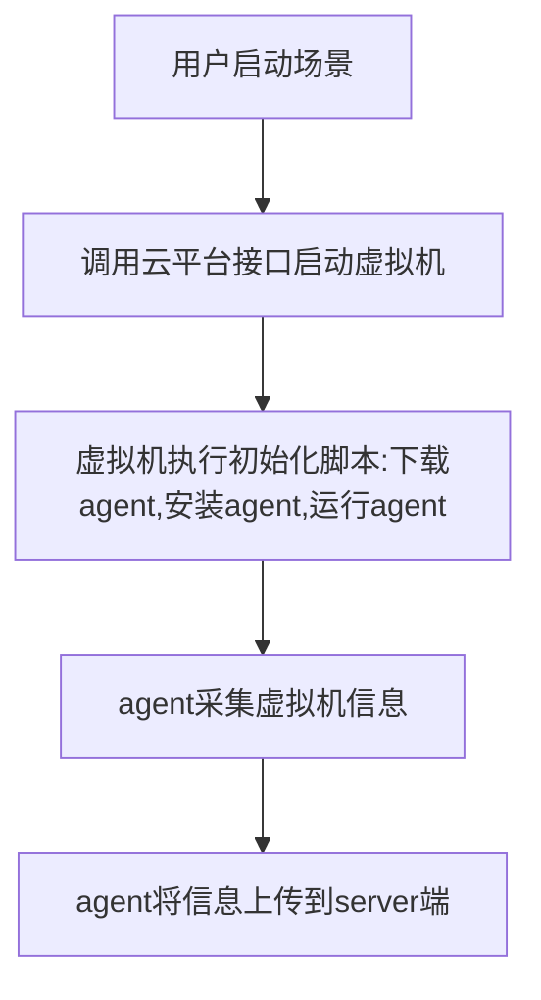

## 探针流表上报方案

### 探针使用场景



由于部分虚拟机对双网卡的支持有限，所以新版本agent上报数据方案改为通过修改流表的方式来实现。

wazuh方案包含server端和agent端，server端为提前起好的一个wazuh虚拟机，分配外部网络IP地址，agent端在虚拟机启动后通过初始化脚本注入到虚拟机内部。

server端与agent端需要进行双向通信。其中server端连接agent通过端口映射的方式进行连接，agent主动上报数据通过修改流表将流量直接转给server机器。

虚拟机在控制节点agent上报流程


虚拟机在计算节点agent上报流程

当有agent采集的数据要上报给server时，由于server与agent不在同一段，所以会先请求网关地址（此处需要虚拟机与网关地址能通），获取到网关后，虚拟机会将流量转发给网关设备，这时流量会首先经过br-int网桥，在br-int网桥上对流量进行识别分析出目标IP地址，如果目标IP地址为server的IP地址，则将流量的目标vlan转为外部网络的vlan，然后将流量正常转发出去。

验证步骤

在服务器上创建wazuh服务器端虚拟机

创建客户端虚拟机并安装agent

配置端口映射及流表规则

验证server与agent的通信

```
处理arp应答
ovs-ofctl add-flow br-int "table=0,priority=65535,arp,arp_tpa=192.168.1.254 actions=LOCAL"

Server
compute   e3fd5ec9-01b4-4758-87d1-46090471c69c   fa:16:3e:f3:a6:fd   10.100.7.140

Agent
controller   37b44c85-3184-47b3-9dc5-0e635bfcebf6   fa:16:3e:d6:e8:05   192.168.1.137


将流量转发到br-ex
ovs-ofctl add-flow br-int table=0,priority=50,arp,arp_tpa=10.100.7.195,actions=mod_vlan_vid=4,output:int-br-ex
ovs-ofctl add-flow br-int table=0,priority=50,ip,nw_dst=10.100.7.195,actions=mod_vlan_vid=4,output:int-br-ex


ovs-ofctl add-flow br-int "table=0,priority=50,arp,arp_tpa=10.100.7.195,actions=mod_dl_dst:fa:16:3e:d6:35:0a,mod_vlan_vid=4,output:int-br-ex"
ovs-ofctl add-flow br-int "table=0,priority=50,ip,nw_dst=10.100.7.195,actions=mod_dl_dst:fa:16:3e:d6:35:0a,mod_vlan_vid=4,output:int-br-ex"


 
ovs-ofctl del-flows br-int "table=0,arp,arp_tpa=10.100.7.195"
ovs-ofctl del-flows br-int "table=0,ip,nw_dst=10.100.7.195"
 
br-ex将流量抛出
ovs-ofctl add-flow br-ex table=0,priority=50,arp,in_port="phy-br-ex",arp_tpa=10.100.7.195,actions=strip_vlan,NORMAL
ovs-ofctl add-flow br-ex table=0,priority=50,ip,in_port="phy-br-ex",nw_dst=10.100.7.195,actions=strip_vlan,NORMAL

priority=4,in_port="phy-br-ex",dl_vlan=4 actions=strip_vlan,NORMAL


ovs-ofctl add-flow br-ex table=0,priority=50,arp,in_port="phy-br-ex",arp_tpa=10.100.7.195,actions=strip_vlan,mod_dl_dst=fa:16:3e:d6:35:0a,NORMAL
ovs-ofctl add-flow br-ex table=0,priority=50,ip,in_port="phy-br-ex",nw_dst=10.100.7.195,actions=strip_vlan,mod_dl_dst=fa:16:3e:d6:35:0a,NORMAL

ovs-ofctl del-flows br-ex "table=0,arp,arp_tpa=10.100.7.195"
ovs-ofctl del-flows br-ex "table=0,ip,nw_dst=10.100.7.195"


ovs-appctl ofproto/trace br-ex in_port=eno2,arp,arp_spa=192.168.1.130,arp_tpa=10.100.7.195 -generate
ovs-appctl ofproto/trace br-int arp,dl_src=fa:16:3e:4b:39:1b,arp_spa=192.168.1.130,arp_tpa=10.100.7.195 -generate
ovs-appctl ofproto/trace br-ex arp,dl_src=fa:16:3e:4b:39:1b,arp_spa=192.168.1.130,arp_tpa=10.100.7.195 -generate


 cookie=0xd3d67e97b591b02b, duration=3020040.641s, table=0, n_packets=0, n_bytes=0, idle_age=65534, hard_age=65534, priority=50,tcp,in_port=2,nw_dst=10.100.14.100,tp_dst=10007 actions=mod_dl_dst:fa:16:3e:f8:42:5c,mod_nw_dst:192.168.252.191,mod_tp_dst:6000,mod_vlan_vid:5,NORMAL
 cookie=0xd3d67e97b591b02b, duration=3020040.571s, table=0, n_packets=0, n_bytes=0, idle_age=65534, hard_age=65534, priority=50,tcp,in_port=101,nw_src=192.168.252.191,nw_dst=10.100.14.0/24,tp_src=6000 actions=mod_nw_src:10.100.14.100,mod_tp_src:10007,mod_dl_dst:ac:1f:6b:3e:fe:d6,mod_vlan_vid:1,output:2
 cookie=0xd3d67e97b591b02b, duration=3020041.215s, table=0, n_packets=0, n_bytes=0, idle_age=65534, hard_age=65534, priority=49,ip,dl_src=fa:16:3e:d5:54:5b,nw_dst=192.168.252.191 actions=strip_vlan,mod_dl_dst:fa:16:3e:f8:42:5c,output:101
 cookie=0xd3d67e97b591b02b, duration=3020041.146s, table=0, n_packets=0, n_bytes=0, idle_age=65534, hard_age=65534, priority=49,ip,dl_src=fa:16:3e:29:a3:1a,nw_dst=192.168.252.191 actions=strip_vlan,mod_dl_dst:fa:16:3e:f8:42:5c,output:101
 cookie=0xd3d67e97b591b02b, duration=3020041.080s, table=0, n_packets=0, n_bytes=0, idle_age=65534, hard_age=65534, priority=49,arp,dl_src=fa:16:3e:d5:54:5b,arp_tpa=192.168.252.191 actions=strip_vlan,mod_dl_dst:fa:16:3e:f8:42:5c,output:101
 cookie=0xd3d67e97b591b02b, duration=3020041.013s, table=0, n_packets=0, n_bytes=0, idle_age=65534, hard_age=65534, priority=49,arp,dl_src=fa:16:3e:29:a3:1a,arp_tpa=192.168.252.191 actions=strip_vlan,mod_dl_dst:fa:16:3e:f8:42:5c,output:101

```


#############################

AGENT端：多节点
ovs-ofctl add-flow br-int table=0,priority=50,arp,arp_tpa=10.100.7.140,actions=mod_vlan_vid=1,output:int-br-ex
ovs-ofctl add-flow br-int table=0,priority=50,ip,nw_dst=10.100.7.140,actions=mod_vlan_vid=1,output:int-br-ex

单节点：
<!-- ovs-ofctl add-flow br-int table=0,priority=50,in_port=qvo899ffb14-e4,arp,arp_tpa=10.100.7.140,actions=mod_vlan_vid=2,output:int-br-ex
ovs-ofctl add-flow br-int table=0,priority=50,in_port=qvo899ffb14-e4,ip,nw_dst=10.100.7.140,actions=mod_vlan_vid=2,output:int-br-ex -->


ovs-ofctl add-flow br-int table=0,priority=50,in_port=qvo899ffb14-e4,icmp,nw_dst=10.100.7.140,actions=mod_vlan_vid=2,output:int-br-ex

回指流表：
多个:
ovs-ofctl add-flow br-int table=0,priority=50,arp,in_port=int-br-ex,arp_tpa=192.168.1.130,actions=output:qvoc2597a36-2b
ovs-ofctl add-flow br-int table=0,priority=50,ip,in_port=int-br-ex,nw_dst=192.168.1.130,actions=output:qvoc2597a36-2b

单个：
<!-- ovs-ofctl add-flow br-int table=0,priority=50,arp,in_port=int-br-ex,arp_tpa=192.168.1.130,actions=output:qvoc2597a36-2b -->
ovs-ofctl add-flow br-int table=0,priority=50,ip,in_port=int-br-ex,nw_dst=192.168.1.130,actions=output:qvoc2597a36-2b

vlan id=1 , 当前节点，虚拟机连接外部网络的qvo的VLAN ID


ovs-appctl ofproto/trace br-ex in_port=ens161,arp,arp_spa=192.168.1.137,arp_tpa=10.100.7.140 -generate


arping 10.100.7.140 -I eth0


#############################

agnet端：192.168.1.189  qvo899ffb14-e4 fa:16:3e:19:00:7f 
server端： 10.100.7.140 qvob0361314-14 fa:16:3e:f3:a6:fd

1. server端和agent在同一节点，agent端到 server端的数据流 VLAN ID转换成 server端的VLAN ID
<!-- agent 端到 server端 -->
ovs-ofctl add-flow br-int "table=0,priority=50,arp,in_port=qvo899ffb14-e4,arp_tpa=10.100.7.140,actions=mod_dl_dst:fa:16:3e:f3:a6:fd,strip_vlan,output:qvob0361314-14"

ovs-ofctl add-flow br-int "table=0,priority=50,ip,in_port=qvo899ffb14-e4,nw_dst=10.100.7.140,actions=mod_dl_dst:fa:16:3e:f3:a6:fd,strip_vlan,output:qvob0361314-14"

<!-- 回指，server端到agent端 -->
ovs-ofctl add-flow br-int "table=0,priority=50,arp,in_port=qvob0361314-14,arp_tpa=192.168.1.189,actions=mod_dl_dst:fa:16:3e:19:00:7f,strip_vlan,output:qvo899ffb14-e4"

ovs-ofctl add-flow br-int "table=0,priority=50,ip,in_port=qvob0361314-14,nw_dst=192.168.1.189,actions=mod_dl_dst:fa:16:3e:19:00:7f,strip_vlan,output:qvo899ffb14-e4"


<!-- ovs-ofctl add-flow br-int table=0,priority=50,arp,in_port=qvo899ffb14-e4,arp_tpa=10.100.7.140,actions=mod_dl_dst:fa:16:3e:f3:a6:fd,mod_vlan_vid=2,output:int-br-ex

ovs-ofctl add-flow br-int table=0,priority=50,ip,in_port=qvo899ffb14-e4,nw_dst=10.100.7.140,actions=mod_dl_dst:fa:16:3e:f3:a6:fd,mod_vlan_vid=2,output:int-br-ex -->

<!-- 测试 -->
ovs-appctl ofproto/trace br-int in_port=qvo899ffb14-e4,arp,arp_spa=192.168.1.189,arp_tpa=10.100.7.140 -generate


2. server端和agent端不在同一节点
agent端: controller , 192.168.1.137 qvoedb66118-8c fa:16:3e:d6:e8:05   route add -net 10.100.7.0/24 eth0
server端： compute  ， 10.100.7.140 qvob0361314-14 fa:16:3e:f3:a6:fd   route add -net 192.168.1.0/24 eth0

<!-- 在agent端执行，agent端 到server端 -->
<!-- vlan id=1 , agent端所在节点，虚拟机连接外部网络的qvo的VLAN ID -->
ovs-ofctl add-flow br-int table=0,priority=50,arp,in_port=qvoedb66118-8c,arp_tpa=10.100.7.140,actions=mod_dl_dst:fa:16:3e:f3:a6:fd,mod_vlan_vid=1,output:int-br-ex

ovs-ofctl add-flow br-int table=0,priority=50,ip,in_port=qvoedb66118-8c,nw_dst=10.100.7.140,actions=mod_dl_dst:fa:16:3e:f3:a6:fd,mod_vlan_vid=1,output:int-br-ex

<!-- 回指 -->

ovs-ofctl add-flow br-int table=0,priority=50,arp,in_port=int-br-ex,arp_tpa=192.168.1.137,actions=mod_dl_dst:fa:16:3e:d6:e8:05,output:qvoedb66118-8c

ovs-ofctl add-flow br-int table=0,priority=50,ip,in_port=int-br-ex,nw_dst=192.168.1.137,actions=mod_dl_dst:fa:16:3e:d6:e8:05,output:qvoedb66118-8c

######### br-ex 回指
ovs-ofctl add-flow br-ex table=0,priority=50,ip,nw_src=10.100.7.140,nw_dst=192.168.1.137,actions=output:phy-br-ex


################# 上面这种方式 openstack网段不能重复，否则流表失效

agnet端：192.168.1.189  qvo899ffb14-e4 fa:16:3e:19:00:7f 
server端： 10.100.7.140 qvob0361314-14 fa:16:3e:f3:a6:fd

1. server端和agent在同一节点，agent端到 server端的数据流 VLAN ID转换成 server端的VLAN ID
<!-- agent 端到 server端 -->
ovs-ofctl add-flow br-int "table=0,priority=50,arp,in_port=qvo899ffb14-e4,arp_tpa=10.100.7.140,actions=mod_nw_src:10.0.0.189,mod_dl_dst:fa:16:3e:f3:a6:fd,strip_vlan,output:qvob0361314-14"

ovs-ofctl add-flow br-int "table=0,priority=50,ip,in_port=qvo899ffb14-e4,nw_dst=10.100.7.140,actions=mod_nw_src:10.0.0.189,mod_dl_dst:fa:16:3e:f3:a6:fd,strip_vlan,output:qvob0361314-14"

<!-- 回指，server端到agent端 -->
ovs-ofctl add-flow br-int "table=0,priority=50,arp,in_port=qvob0361314-14,arp_tpa=10.0.0.189,actions=mod_nw_dst:192.168.1.189,mod_dl_dst:fa:16:3e:19:00:7f,strip_vlan,output:qvo899ffb14-e4"

ovs-ofctl add-flow br-int "table=0,priority=50,ip,in_port=qvob0361314-14,nw_dst=10.0.0.189,actions=mod_nw_dst:192.168.1.189,mod_dl_dst:fa:16:3e:19:00:7f,strip_vlan,output:qvo899ffb14-e4"


2. server端和agent端不在同一节点
agent端: controller , 192.168.1.137 qvoedb66118-8c fa:16:3e:d6:e8:05   route add -net 10.100.7.0/24 eth0
server端： compute  ， 10.100.7.140 qvob0361314-14 fa:16:3e:f3:a6:fd   route add -net 192.168.1.0/24 eth0

<!-- 在agent端执行，agent端 到server端 -->
<!-- vlan id=1 , agent端所在节点，虚拟机连接外部网络的qvo的VLAN ID -->
ovs-ofctl add-flow br-int table=0,priority=50,arp,in_port=qvoedb66118-8c,arp_tpa=10.100.7.140,actions=mod_nw_src:10.0.0.137,mod_dl_dst:fa:16:3e:f3:a6:fd,mod_vlan_vid=1,output:int-br-ex

ovs-ofctl add-flow br-int table=0,priority=50,ip,in_port=qvoedb66118-8c,nw_dst=10.100.7.140,actions=mod_nw_src:10.0.0.137,mod_dl_dst:fa:16:3e:f3:a6:fd,mod_vlan_vid=1,output:int-br-ex

<!-- 回指 -->

ovs-ofctl add-flow br-int table=0,priority=50,arp,in_port=int-br-ex,arp_tpa=10.0.0.137,actions=mod_nw_dst:192.168.1.137,mod_dl_dst:fa:16:3e:d6:e8:05,output:qvoedb66118-8c

ovs-ofctl add-flow br-int table=0,priority=50,ip,in_port=int-br-ex,nw_dst=192.168.1.137,actions=mod_dl_dst:fa:16:3e:d6:e8:05,output:qvoedb66118-8c

######### br-ex 回指
ovs-ofctl add-flow br-ex table=0,priority=50,ip,nw_src=10.100.7.140,nw_dst=10.0.0.137,actions=mod_nw_dst:192.168.1.137,output:phy-br-ex