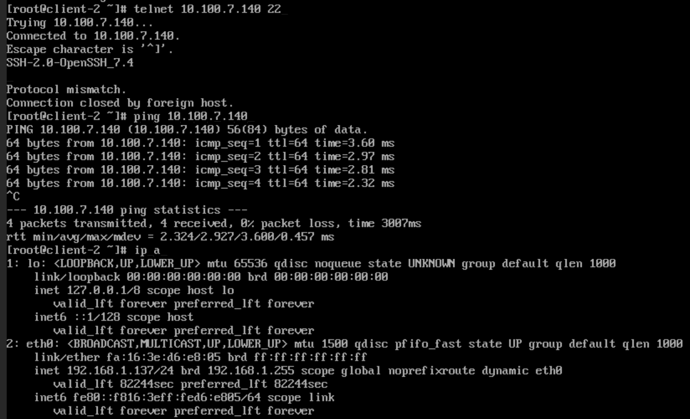

[toc]

# 背景介绍

## 探针使用场景


## 双网卡方案


探针采集双网卡方案的agent端与server端在同一网络，无需额外配置即可直接进行通信，不会出现网络不通导致数据上报问题。但是双网卡方案需要在靶标镜像制作的时候预先配置支持双网卡，否则可能会出现数据采集网络对应的那块网卡无法开机启动的问题。

# 问题分析

针对双网卡方案中部分靶标对双网卡的支持有限，新方案中agent上报数据方案改为通过修改流表的方式来实现。


1. 新方案中 Wazuh server端为提前起好的一个虚拟机，分配外部网络IP地址
2. agent端在虚拟机启动后通过初始化脚本注入到虚拟机内部(metadata服务)
3. Server与agent之间的通信通过流表进行流量转发

当有agent采集的数据要上报给server时，由于server与agent不在同一段，所以会先请求网关地址（**此处需要默认分配一个虚拟路由器，并且虚拟机与网关地址能通**），获取到网关后，虚拟机会将流量转发给网关设备，这时流量会首先经过ovs网桥，在ovs网桥上对流量进行识别分析出目标IP地址，如果目标IP地址为wazuh server的IP地址，则将流量转发到外部网络，由外部网络转发给server机器。

当server与agent进行通信的时候，流量会先进过ovs网桥，在ovs网桥上对流量进行目的IP地址识别，如果识别到目的IP是agent所在虚拟机的话则将流量直接转发给对应agent虚拟机

# 方案测试

## 环境信息

cpcloud 版本: V 版本

| 节点信息                   | 角色      | IP地址      |
| -------------------------- | --------- | ----------- |
| controller（运行计算服务） | 控制+计算 | 10.100.7.50 |
| compute                    | 计算      | 10.100.7.51 |

## 测试步骤 

### 创建网络和路由器

创建2个网络，一个为【独立网络】（创建路由器，并连接独立网络；agent端虚拟机接入独立网络），一个为【外部网络】（server端虚拟机接入外部网络）


路由器仅连接【独立网络】


路由器不需要配置网关，只需要关联【独立网络】

### 创建虚拟机

分别在控制节点和计算节点创建虚拟机


关闭端口安全【4台虚拟机端口均需要去掉】


### 方案1. 流表直接转发

#### 验证agent和server在同一节点

> 所有流表均在agent端所在节点执行

```shell
# agnet端：  192.168.1.189  qvo899ffb14-e4 fa:16:3e:19:00:7f 
# server端： 10.100.7.140   qvob0361314-14 fa:16:3e:f3:a6:fd

# agent 端到 server端
ovs-ofctl add-flow br-int "table=0,priority=50,arp,in_port=qvo899ffb14-e4,arp_tpa=10.100.7.140,actions=mod_dl_dst:fa:16:3e:f3:a6:fd,strip_vlan,output:qvob0361314-14"

ovs-ofctl add-flow br-int "table=0,priority=50,ip,in_port=qvo899ffb14-e4,nw_dst=10.100.7.140,actions=mod_dl_dst:fa:16:3e:f3:a6:fd,strip_vlan,output:qvob0361314-14"

# 回指，server端到agent端
ovs-ofctl add-flow br-int "table=0,priority=50,arp,arp_op=2,in_port=qvob0361314-14,arp_tpa=192.168.1.189,actions=mod_dl_dst:fa:16:3e:19:00:7f,strip_vlan,output:qvo899ffb14-e4"

ovs-ofctl add-flow br-int "table=0,priority=50,ip,in_port=qvob0361314-14,nw_dst=192.168.1.189,actions=mod_dl_dst:fa:16:3e:19:00:7f,strip_vlan,output:qvo899ffb14-e4"

```

测试效果如下图:


#### 验证agent和server不在同一节点

> 所有流表均在agent端所在节点执行

```shell
# agent端:  controller  192.168.1.137  qvoedb66118-8c fa:16:3e:d6:e8:05
# server端： compute    10.100.7.140   qvob0361314-14 fa:16:3e:f3:a6:fd

# 在agent端执行，agent端 到server端 
ovs-ofctl add-flow br-int table=0,priority=50,arp,in_port=qvoedb66118-8c,arp_tpa=10.100.7.140,actions=mod_dl_dst:fa:16:3e:f3:a6:fd,mod_vlan_vid=1,output:int-br-ex

ovs-ofctl add-flow br-int table=0,priority=50,ip,in_port=qvoedb66118-8c,nw_dst=10.100.7.140,actions=mod_dl_dst:fa:16:3e:f3:a6:fd,mod_vlan_vid=1,output:int-br-ex
# 回指
ovs-ofctl add-flow br-int table=0,priority=50,arp,in_port=int-br-ex,arp_tpa=192.168.1.137,actions=mod_dl_dst:fa:16:3e:d6:e8:05,output:qvoedb66118-8c

ovs-ofctl add-flow br-int table=0,priority=50,ip,in_port=int-br-ex,nw_dst=192.168.1.137,actions=mod_dl_dst:fa:16:3e:d6:e8:05,output:qvoedb66118-8c

# 这里是br-ex
ovs-ofctl add-flow br-ex table=0,priority=50,ip,nw_src=10.100.7.140,nw_dst=192.168.1.137,actions=output:phy-br-ex
```

> vlan id=1 , agent端所在节点，虚拟机连接外部网络的qvo的VLAN ID 
>
> 具体查看:
>
> [root@controller ~]# ovs-vsctl show
> b7b08469-968f-4c9b-93f4-e506031f30f9
>     Manager "ptcp:6640:127.0.0.1"
>         is_connected: true
>     ...
>     Bridge br-int
>         Controller "tcp:127.0.0.1:6633"
>             is_connected: true
>         fail_mode: secure
>         datapath_type: system
>         Port br-int
>             Interface br-int
>                 type: internal
>         Port int-br-mirror
>             Interface int-br-mirror
>                 type: patch
>                 options: {peer=mirror-br-int}
>         Port qvoedb66118-8c
>             tag: 2
>             Interface qvoedb66118-8c  # 就是这个下面的 tag: 1 是VLAN ID=1
>         Port qvo1fa8fc62-43
>             tag: 1
>             Interface qvo1fa8fc62-43
>         ...

测试效果:



> 注：本方案有一个限制就是**所有场景中不能有IP地址重复**的情况，否则流表无法失败目标机器。


### 方案2. 通过特殊地址转换

该方案相当于流表直接转发的一个改进方案，针对流表直接转发方案中IP重复的问题，将场景中虚拟机的地址映射为一个固定网段中的地址，但是本方案**需要占用一个固定的网段**，并且该网段不能在场景中使用，还会增加针对**固定网段中的地址分配和回收**的工作

#### agent端和server端同一节点

在agent端所在节点执行

```
{
  "agent_id": "37b44c85-3184-47b3-9dc5-0e635bfcebf6",
  "agent_name": "client-2",
  "agent_host": "controller",
  "agent_ip": "192.168.1.137",
  "agent_mac": "fa:16:3e:d6:e8:05",
  "agent_port": "qvoedb66118-8c",
  "server_ip": "10.100.7.114",
  "server_mac": "fa:16:3e:42:f4:27",
  "server_port": "qvoc71d78e4-1e",
  "server_host": "controller",
  "proxy_ip": "10.0.52.204",
  "request_id": "req-b8ac52e6-845a-41be-9560-18e770682323",
  "success": true
}
```

```shell
# agnet端：192.168.1.189  qvo899ffb14-e4 fa:16:3e:19:00:7f 
# server端： 10.100.7.140 qvob0361314-14 fa:16:3e:f3:a6:fd

# 说明: 新增10.0.0.189 代理地址，防止agent端IP地址冲突

# 1. server端和agent在同一节点，agent端到 server端的数据流 VLAN ID转换成 server端的VLAN ID
#  agent 端到 server端 
ovs-ofctl add-flow br-int "table=0,priority=50,arp,in_port=qvo899ffb14-e4,arp_tpa=10.100.7.140,actions=mod_nw_src:10.0.0.189,mod_dl_dst:fa:16:3e:f3:a6:fd,strip_vlan,output:qvob0361314-14"

ovs-ofctl add-flow br-int "table=0,priority=50,ip,in_port=qvo899ffb14-e4,nw_dst=10.100.7.140,actions=mod_nw_src:10.0.0.189,mod_dl_dst:fa:16:3e:f3:a6:fd,strip_vlan,output:qvob0361314-14"

#  回指，server端到agent端
ovs-ofctl add-flow br-int "table=0,priority=50,arp,in_port=qvob0361314-14,arp_tpa=10.0.0.189,actions=mod_nw_dst:192.168.1.189,mod_dl_dst:fa:16:3e:19:00:7f,strip_vlan,output:qvo899ffb14-e4"

ovs-ofctl add-flow br-int "table=0,priority=50,ip,in_port=qvob0361314-14,nw_dst=10.0.0.189,actions=mod_nw_dst:192.168.1.189,mod_dl_dst:fa:16:3e:19:00:7f,strip_vlan,output:qvo899ffb14-e4"
```
测试效果略


#### agent端和server端不在同一节点

在agent端所在节点执行

```shell
#  server端和agent端不在同一节点
# agent端: controller , 192.168.1.137 qvoedb66118-8c fa:16:3e:d6:e8:05   route add -net 10.100.7.0/24 eth0
# server端： compute  ， 10.100.7.140 qvob0361314-14 fa:16:3e:f3:a6:fd   route add -net 192.168.1.0/24 eth0

# 在agent端执行，agent端 到server端 
#  vlan id=1 , agent端所在节点，虚拟机连接外部网络的qvo的VLAN ID
ovs-ofctl add-flow br-int table=0,priority=50,arp,in_port=qvoedb66118-8c,arp_tpa=10.100.7.140,actions=mod_nw_src:10.0.0.137,mod_dl_dst:fa:16:3e:f3:a6:fd,output:int-br-ex

ovs-ofctl add-flow br-int table=0,priority=50,ip,in_port=qvoedb66118-8c,nw_dst=10.100.7.140,actions=mod_nw_src:10.0.0.137,mod_dl_dst:fa:16:3e:f3:a6:fd,output:int-br-ex

ovs-ofctl add-flow br-ex table=0,priority=50,ip,nw_src=10.0.0.13,nw_dst=10.100.7.140,actions=strip_vlan,NORMAL

# 回指 

ovs-ofctl add-flow br-int table=0,priority=50,arp,in_port=int-br-ex,arp_tpa=10.0.0.137,actions=mod_nw_dst:192.168.1.137,mod_dl_dst:fa:16:3e:d6:e8:05,output:qvoedb66118-8c
# br-ex 已经把目标地址转换成了192.168.1.137，这里不能在转换了
ovs-ofctl add-flow br-int table=0,priority=50,ip,in_port=int-br-ex,nw_dst=192.168.1.137,actions=mod_dl_dst:fa:16:3e:d6:e8:05,output:qvoedb66118-8c

#  br-ex 回指
ovs-ofctl add-flow br-ex table=0,priority=50,ip,nw_src=10.100.7.140,nw_dst=10.0.0.137,actions=mod_nw_dst:192.168.1.137,output:phy-br-ex
```
测试效果同流表直接转发方案


注意点:  agent端为实装设备，不支持。