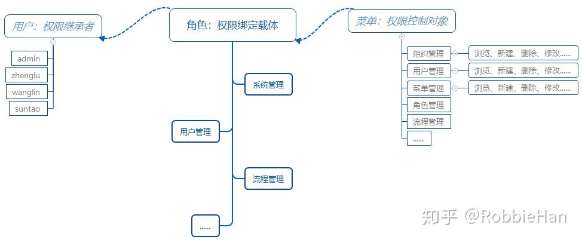
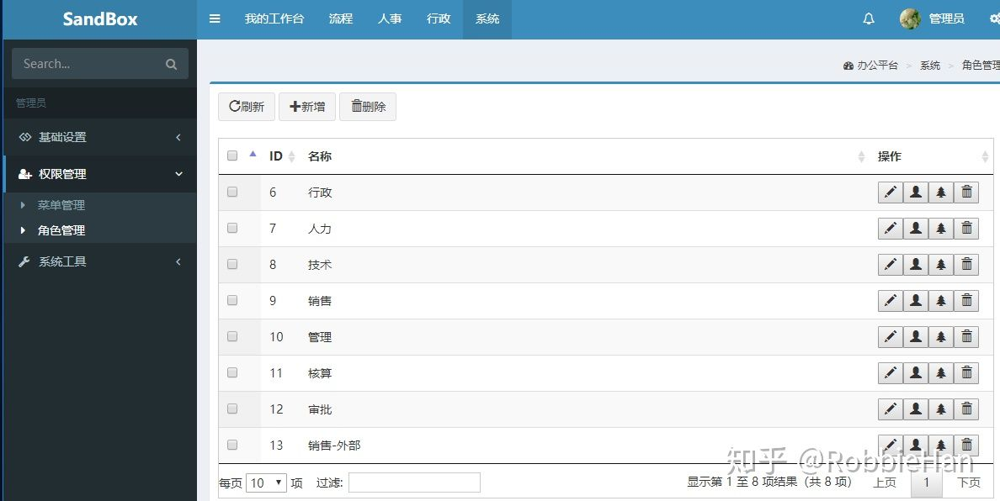
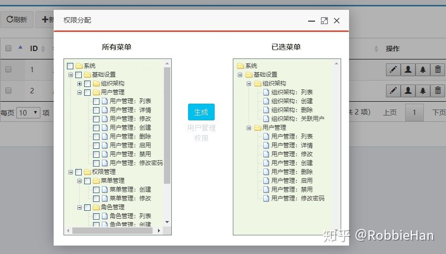
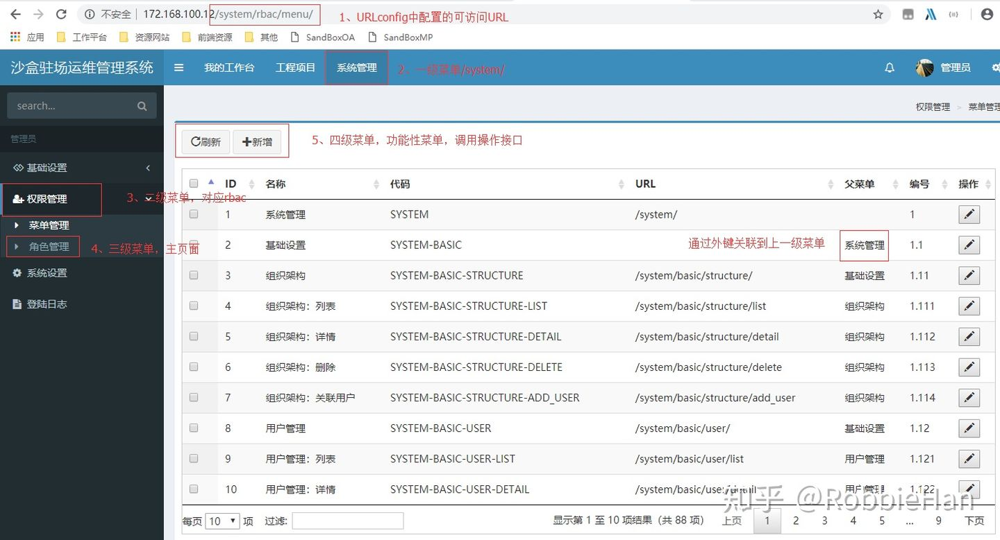

## 1 这套权限管理系统主要功能是什么？
这套系统是采用RBAC权限模型建立的权限管理模块，权限管理包含了三元组：用户、角色、菜单。用户关联角色，角色绑定菜单，用户会继承对应角色的菜单访问权限，同时根据用户继承的权限动态成导航菜单。

在系统中，可以灵活的划分角色组，可以根据功能特性来划分： 
- 比如设置系统管理员角色，绑定系统所有菜单，该角色享有系统全部管理功能； 
- 也可以根据工作职能来划分角色，比如设置行政管理角色，绑定流程管理功能； 
- 权限的划分可以细致到 数据的浏览、新建、删除、修改等操作行为 
- 用户可以关联多个角色组，并继承多个角色组的权限

## 2 如何设置系统权限？
系统运行后，使用管理员用户登录系统，点击头部【系统】导航，计入系统应用：

点击左侧导航栏【基础设置】→【用户管理】在用户管理功能页可以修改用户信息，添加新用户（在添加或修改用户信息的时候可以直接关联角色，继承角色权限）
点击左侧当行栏【权限管理】→【角色管理】在角色管理里面可以添加新的角色，可以修改角色信息，可以关联用户，可以配置角色绑定的菜单。

上图表格中第一个按钮是修改角色信息、第二个是关联用户、第三个是绑定菜单

在角色绑定菜单窗口左侧勾选需要绑定到角色组的菜单，然后点击生成按钮，完成菜单绑定。需要注意的是：如果左侧没有勾选任何菜单，点击生成按钮，系统将会清空当前角色所有权限。

5、如何在权限管理基础上扩展自己的应用？
5.1 如何扩展权限系统
应用的扩展分为两部分： 1. 在现有的app(system)先新增加自己的功能 2. 在权限基础上创建新的app

无论是新增应用还是新建app，参考知乎发布的权限管理功能实现的文章，了解权限管理三元组的创建过程，按照这个流程你可以随意在权限系统的基础上进行扩建自己的应用。

在扩展的过程中唯一需要注意的是要遵循权限管理模块URL的定义规则，创建新的功能后要把URL按照层级录入数据库，绑定角色组，分配给对应的用户即可。

5.2 URL数据录入规范
为了实现基于角色组权限的访问控制和动态导航生成，项目中所有的URL数据都是录入数据库的，除了权限管理包含的三元组的访问URL之外，项目中每次新增应用，都需要将URL录入数据库，并绑定授权访问的角色组。

看图说话：

在项目中URL的定义是遵循一定规范的，具体规范如下：
1、一级菜单： 使用 app名称来命名的，看下sandboxMP/sandboxMP/urls.py中配置：

path('system/', include('system.urls', namespace='system')),
2、二级菜单： 是在具体app应用的urls.py中配置，通过include导入一级菜单定义的URLconf文件，二级菜单可以是一个功能URL也可以是一个分组，项目中把菜单管理和角色管理两个功能划分到一个分组rbac ，看下sandboxMP/apps/system/urls.py中配置：

path('rbac/menu/', views_menu.MenuListView.as_view(), name='rbac-menu'),
path('rbac/role/', views_role.RoleView.as_view(), name='rbac-role'),
菜单管理和角色管理两个功能都划分到rbac分组，rbac就是我们的二级菜单，它在导航栏中是一个折叠菜单，录入数据库时URL字段是空的。二级菜单通过外键绑定到一级菜单
3、三级菜单： 三级菜单是具体的功能菜单，通过三级菜单可以跳转到具体功能页面。三级菜单通过外键关联到二级菜单，注意：如果功能菜单直接关联到一级菜单，它将直接在左侧导航栏显示，不再属于任何折叠的菜单分组。当二级菜单是一个功能菜单，而不是分组时，录入系统时需要配置功能菜单的访问URL。

4、四级菜单： 具体的功能操作菜单，它属于某一个功能菜单，例如下面角色创建，列表，更新，和删除这些菜单都属于角色管理：

path('rbac/role/create/', views_role.RoleCreateView.as_view(), name='rbac-role-create'),
path('rbac/role/list/', views_role.RoleListView.as_view(), name='rbac-role-list'),
path('rbac/role/update/', views_role.RoleUpdateView.as_view(), name='rbac-role-update'),
path('rbac/role/delete/', views_role.RoleDeleteView.as_view(), name='rbac-role-delete'),
功能操作菜单通过外键关联到功能菜单，当功能菜单被定义为二级菜单时，该功能菜单下对应的操作菜单就是三级。

5、菜单编号： 用来作为菜单排序使用

一级菜单编号为1，2，3，4等，例如系统管理编号为1，工程项目编号为2 ；
二级菜单编号以一级菜单编号开头，例如基础设置编号为1.1， 权限管理编号为1.2 ；
三级菜单编号以二级菜单编号开头，例如菜单管理编号为1.21， 角色管理编号为1.22 ；
四级菜单编号以三级菜单编号开头，例如菜单管理中的添加功能编号为1.211 ，修改功能编号为1.212。
6、菜单图标： 导航上菜单显示的图标
只有二级菜单才会定义图标，图标使用的是Font Awesome图标库，具体图标案例可访问官方网站查询：

http://fontawesome.dashgame.com/
7、菜单名称： 用来标识菜单具体作用，角色绑定时菜单树形结构显示的具体名称。
8、父菜单： 定义菜单层级关系，输入菜单时一定不要搞错层级。
9、菜单编码: 前端通过菜单编码来给当前访问的菜单添加激活的高亮样式
