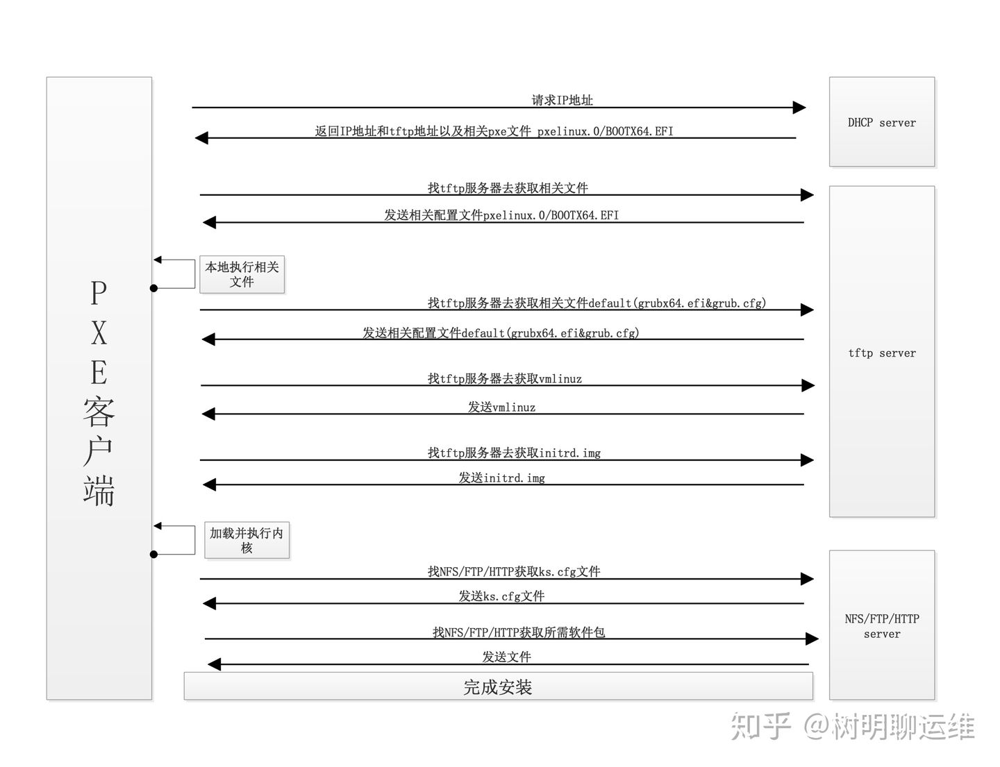
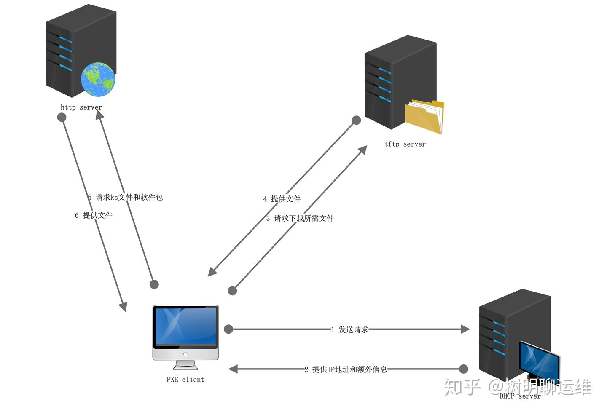

## 1. 原理

### 1.1 PXE原理
什么是PXE 预启动执行环境（PXE）是由Intel公司开发的最新技术，工作于Client/Server的网络模式，支持工作站通过网络从远端服务器下载映像，并由此支持通过网络启动操作系统，在启动过程中，终端要求服务器分配IP地址，再用TFTP（trivial file transfer protocol）或MTFTP(multicast trivial file transfer protocol)协议下载一个启动软件包到本机内存中执行，由这个启动软件包完成终端（客户端）基本软件设置，从而引导预先安装在服务器中的终端操作系统。PXE可以引导多种操作系统，如：Windows95/98/2000/windows2003/windows2008/winXP/win7/win8,linux系列系统等。

PXE原理 PXE是在没有软驱、硬盘、CD-ROM的情况下引导计算机的一种方式，也就是BIOS将使用PXE协议从网络引导。整个安装的过程是这样的：PXE网卡启动 => DHCP获得IP地址 => 从TFTP上下载 pxelinux.0、vmlinuz、initr.img 等 => 引导系统进入安装步骤 => 通过PEX linux 下载ks.cfg文件并跟据ks.cfg自动化安装系统 => 完成。



### 1.2 TFTP原理
TFTP服务 TFTP是用来下载远程文件的最简单网络协议，它其于UDP协议而实现。

### 1.3 KS文件
什么是kickstart KickStart是一种无人职守安装方式。KickStart的工作原理是通过记录典型的安装过程中所需人工干预填写的各种参数，并生成一个名为ks.cfg的文件；在其后的安装过程中（不只局限于生成KickStart安装文件的机器）当出现要求填写参数的情况时，安装程序会首先去查找KickStart生成的文件，当找到合适的参数时，就采用找到的参数，当没有找到合适的参数时，才需要安装者手工干预。这样，如果KickStart文件涵盖了安装过程中出现的所有需要填写的参数时，安装者完全可以只告诉安装程序从何处取ks.cfg文件，然后去忙自己的事情。等安装完毕，安装程序会根据ks.cfg中设置的重启选项来重启系统，并结束安装。



1. PXE Client向DHCP发送请求： 　　PXE Client从自己的PXE网卡启动，通过PXE BootROM(自启动芯片)会以UDP(简单用户数据报协议)发送一个广播请求，向本网络中的DHCP服务器索取IP。

2. DHCP服务器提供信息： 　　DHCP服务器收到客户端的请求，验证是否来至合法的PXE Client的请求，验证通过它将给客户端一个“提供”响应，这个“提供”响应中包含了为客户端分配的IP地址、pxelinux启动程序(TFTP)位置，以及配置文件所在位置。

3. PXE客户端请求下载启动文件： 　　客户端收到服务器的“回应”后，会回应一个帧，以请求传送启动所需文件。这些启动文件包括：pxelinux.0、pxelinux.cfg/default、vmlinuz、initrd.img等文件。

4. Boot Server响应客户端请求并传送文件： 　　当服务器收到客户端的请求后，他们之间之后将有更多的信息在客户端与服务器之间作应答, 用以决定启动参数。BootROM由TFTP通讯协议从Boot Server下载启动安装程序所必须的文件(pxelinux.0、pxelinux.cfg/default)。default文件下载完成后，会根据该文件中定义的引导顺序，启动Linux安装程序的引导内核。

5. 请求下载自动应答文件： 　　客户端通过pxelinux.cfg/default文件成功的引导Linux安装内核后，安装程序首先必须确定你通过什么安装介质来安装linux，如果是通过网络安装(NFS, FTP, HTTP)，则会在这个时候初始化网络，并定位安装源位置。接着会读取default文件中指定的自动应答文件ks.cfg所在位置，根据该位置请求下载该文件。 　　这里有个问题，在第2步和第5步初始化2次网络了，这是由于PXE获取的是安装用的内核以及安装程序等，而安装程序要获取的是安装系统所需的二进制包以及配置文件。因此PXE模块和安装程序是相对独立的，PXE的网络配置并不能传递给安装程序，从而进行两次获取IP地址过程，但IP地址在DHCP的租期内是一样的。

6. 客户端安装操作系统： 　　将ks.cfg文件下载回来后，通过该文件找到OS Server，并按照该文件的配置请求下载安装过程需要的软件包。 　　OS Server和客户端建立连接后，将开始传输软件包，客户端将开始安装操作系统。安装完成后，将提示重新引导计算机

## 2. 实战

base system: CentOS8.4.2105
目标: 实现自动装机，支持UEFI+legecy

```shell
systemctl disable firewalld
systemctl stop firewalld
setenforce 0
sed -i 's@SELINUX=.*@SELINUX=disabled@g' /etc/selinux/config

dnf install dhcp-server tftp-server httpd syslinux -y

\cp dhcpd.conf /etc/dhcp/dhcpd.conf
sed -i "s/192.168.1.0/$DHCP_SUBNET/" /etc/dhcp/dhcpd.conf
sed -i "s/192.168.1.100 192.168.1.254/$DHCP_RANGE/" /etc/dhcp/dhcpd.conf
sed -i "s/192.168.1.1/$DHCP_SERVER/g" /etc/dhcp/dhcpd.conf

systemctl enable dhcpd.service
systemctl start dhcpd.service


test -e /var/www/html/centos8 || mkdir /var/www/html/centos8
mount -o loop -t iso9660 CentOS-8.4.2105-x86_64-dvd1.iso /mnt/

\cp -rp /mnt/* /var/www/html/centos8  # 这里需要注意的点是，需要mv centos8/BaseOS/* centos8

\cp /usr/share/syslinux/pxelinux.0       /var/lib/tftpboot/
# \cp /usr/share/syslinux/menu.c32 /var/lib/tftpboot/
# cp /usr/share/syslinux/vesamenu.c32 /var/lib/tftpboot/
# cp  /usr/share/syslinux/libcom32.c32 /var/lib/tftpboot/
# cp  /usr/share/syslinux/libutil.c32 /var/lib/tftpboot/

\cp /mnt/isolinux/{boot.msg,vmlinuz,ldlinux.c32,initrd.img}       /var/lib/tftpboot/

test -e /var/lib/tftpboot/pxelinux.cfg || mkdir /var/lib/tftpboot/pxelinux.cfg

\cp default.cfg /var/lib/tftpboot/pxelinux.cfg/
sed -i "s@192.168.1.1@$DHCP_SERVER@g" /var/lib/tftpboot/pxelinux.cfg/default
# sed -i "s@192.168.1.1@$DHCP_SERVER@g" /var/www/html/ks.cfg
# chmod -R 777 /var/www/html/ks.cfg

systemctl enable tftp
systemctl start tftp
systemctl enable httpd
systemctl start httpd


```

ks.cfg


#### 配置支持UEFI
test -e /var/lib/tftpboot/uefi/ || mkdir /var/lib/tftpboot/uefi/
\cp -rp /mnt/EFI/BOOT/* /var/lib/tftpboot/uefi/

[root@localhost ~]# more /var/lib/tftpboot/uefi/grub.cfg 
set default="0"
set timeout=3
menuentry 'Install CentOS Linux 8'  {
        linuxefi /vmlinuz ip=dhcp inst.ks=http://192.168.7.90/ks.cfg
        initrdefi /initrd.img
}

[root@localhost ~]# systemctl restart tftp

```
