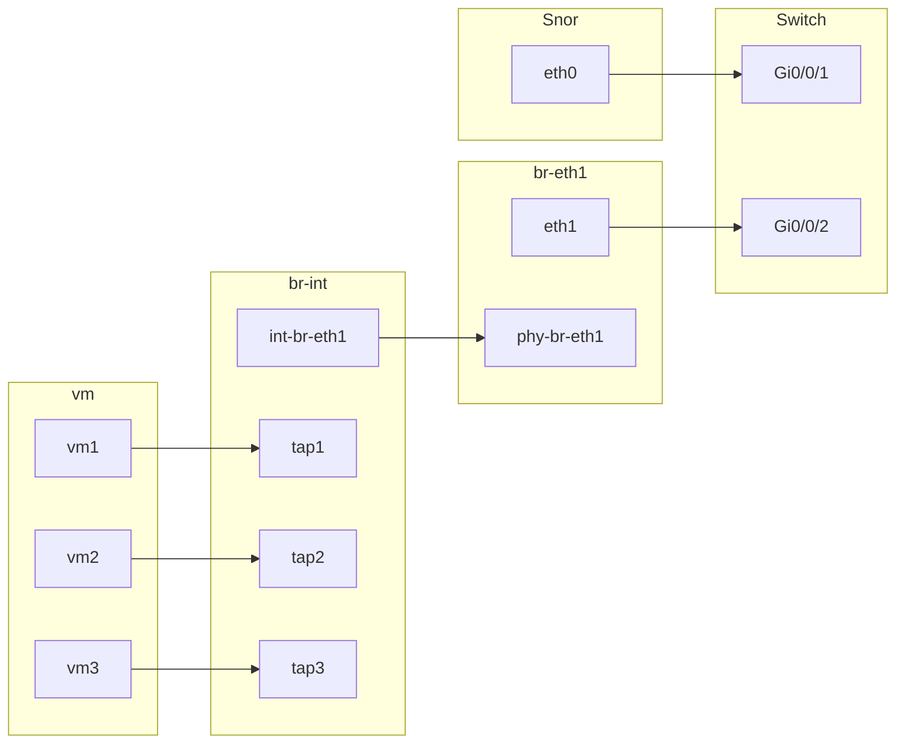

# 一 设计文档

## 1.1 说明

虚拟流量镜像到实体设备

靶场底层云平台已具备端口镜像功能 (TAAS 模块 )， 用于带外采集功能，将整个场景所有虚拟节点的流量镜像到 Snort 虚拟机，只支持将虚拟端口镜像到虚拟端口 官方最新版本也不支持上面这种场景。
需要解决的问题 :

1. 云平台需要支持将虚拟流量镜像到实体装备，考虑到计算节点有多个，而接收镜像流量的实体装备可能只有一个，需要各计算节点先将流量输出到交换机，再由交换机输出到实体装备。
2. 在场景编排⻚面上允许用户指定需要进行流量镜像的虚拟设备，对于本需求需要将整个内部网络上所有虚拟端口镜像到实体装备。

## 1.2 原理

### 拓扑图



### 具体实现

```bash
# 需要实现
ovs-vsctl \
-- --id=@m create mirror name=m0 select-all=true select-vlan=3 output-vlan=51 \
-- set bridge br-int mirrors=@m

# 关闭VLAN: 51 的MAC学习功能，避免影响正常网络转发:
ovs-vsctl set bridge br-int flood_vlans=51
ovs-vsctl set bridge br-eth1 flood_vlans=51

# 允许vlan 51的镜像包正常转发
ovs-ofctl add-flow br-eth1 "hard_timeout=0,idle_timeout=0,priority=3,table=0,dl_vlan=51,actions=NORMAL"

###################################################### ovs 镜像操作 ##########################################################
# 1、create
# 1.1 批量添加
ovs-vsctl \
-- --id=@m1 create mirror name=m1 select-all=true select-vlan=3 output-vlan=52 \
-- --id=@m2 create mirror name=m2 select-all=true select-vlan=3 output-vlan=51 \
-- --id=@m3 create mirror name=m3 select-all=true select-vlan=3 output-vlan=53 \
-- set bridge br-int mirrors=@m1,@m2,@m3

# 1.2 单个添加（本次选择这种方式)
ovs-vsctl \
-- --id=@m4 create mirror name=m4 select-all=true select-vlan=3 output-vlan=54 \
-- add bridge br-int mirrors @m4

# 1.3 批量测试脚本
[root@controller ~]# cat multi_mirror.sh 
#!/bin/bash
for i in {1..500}; do
ovs-vsctl \
-- --id='@m'$i create mirror name=m$i select-all=true select-vlan=3 output-vlan=1$i \
-- add bridge br-int mirrors '@m'$i
done

# 2、delete
# 删除单个mirror
ovs-vsctl -- --id=@m1 get mirror m1 -- remove bridge br-int mirrors @m1

# 3、get/list
ovs-vsctl list mirror
```

## 1.3 流程图

#### 1. 创建流程图

```sequence
	participant 靶场
	participant neutron_client
	participant neutron_server
	participant ovs_openvswitch_agent
	participant 数据库
	
	 靶场->靶场:1.启动靶场
	 靶场->neutron_client:2.调用create接口
	 neutron_client->neutron_server:3.调用rest_api create接口
	 neutron_server->ovs_openvswitch_agent:4.通过RPC发送创建消息
	 ovs_openvswitch_agent -->neutron_server:5.接口返回消息
	 ovs_openvswitch_agent->neutron_server:6. 当agent重启时，发送RPC消息，重新载入数据库记录
	 neutron_server-->ovs_openvswitch_agent:7.返回RPC消息
	 neutron_server->数据库:8. 写入数据库
	 neutron_server-->靶场:9. 返回创建信息

```

#### 2. 删除流程图

```sequence
	participant 靶场
	participant neutron_client
	participant neutron_server
	participant ovs_openvswitch_agent
	participant 数据库
	
	 靶场->靶场:1.启动靶场
	 靶场->neutron_client:2.调用delete接口
	 neutron_client->neutron_server:3.调用rest_api delete接口
	 neutron_server->ovs_openvswitch_agent:4.通过RPC发送创建消息
	 ovs_openvswitch_agent -->neutron_server:5.接口返回消息
	 neutron_server->数据库:6. 删除数据库对应记录
	  neutron_server->靶场:7. 返回删除信息
```

#### 3. 查询流程图

```sequence
	participant 靶场
	participant neutron_client
	participant neutron_server
	participant 数据库
	
	 靶场->靶场:1.启动靶场
	 靶场->neutron_client:2.调用查询接口
	 neutron_client->neutron_server:3.调用rest_api 查询接口
	 neutron_server->数据库:4. 查询数据库信息
	 neutron_server-->靶场:5. 返回查询信息
```


## 1.4 对外接口设计

### CREATE

##### 接口名称

create_networkmirror(src_network_id,dst_vlan_id )

#####  接口参数

| 参数名称       | 参数类型 | 参数说明        |
| -------------- | -------- | --------------- |
| src_network_id | String   | 虚拟网络UUID    |
| dst_vlan_id    | String   | 外部网络VLAN ID |

#####  返回值

返回网络镜像对象

**格式示例**

```
{
    "id": "33748c23-38dd-4f70-b774-522fc69e7b67",
    "mirror_name": "m0",
    "src_network_id": "626f6aba-50dd-47ef-81c0-4c659fe72184",
    "dst_vlan_id": "51"
}
```

**字段说明**

| 字段名称       | 字段类型 | 字段说明                  |
| -------------- | -------- | ------------------------- |
| id             | uuid     | id                        |
| mirror_name    | string   | OpenvSwitch交换机镜像名称 |
| src_network_id | string   | 虚拟网络UUID              |
| dst_vlan_id    | string   | 外部网络VLAN ID           |

##### 错误说明

| 错误码                  | 错误原因         | 错误提示                   |
| ----------------------- | ---------------- | -------------------------- |
| NotFoundSourceNetworkID | 虚拟网络ID不存在 | 无法找到对应虚拟网络ID资源 |

### DELETE

##### 接口名称

delete_networkmirror(id)

#####  接口参数

| 参数名称 | 参数类型 | 参数说明 |
| -------- | -------- | -------- |
| id       | uuid     | id       |

#####  返回值

空

##### 错误说明

| 错误码        | 错误原因         | 错误提示               |
| ------------- | ---------------- | ---------------------- |
| NotFoundObjID | 网络镜像id不存在 | 无法找到网络镜像ID资源 |


### SHOW

##### 接口名称

get_networkmirror(id)

#####  接口参数

| 参数名称 | 参数类型 | 参数说明 |
| -------- | -------- | -------- |
| id       | uuid     | id       |

#####  返回值

返回一个网络镜像

**格式示例**

```
{
    "id": "33748c23-38dd-4f70-b774-522fc69e7b67",
    "mirror_name": "m0",
    "src_network_id": "626f6aba-50dd-47ef-81c0-4c659fe72184",
    "dst_vlan_id": "51"
}
```

**字段说明**

| 字段名称       | 字段类型 | 字段说明                  |
| -------------- | -------- | ------------------------- |
| id             | uuid     | id                        |
| mirror_name    | string   | OpenvSwitch交换机镜像名称 |
| src_network_id | string   | 虚拟网络UUID              |
| dst_vlan_id    | string   | 外部网络VLAN ID           |

##### 错误说明

| 错误码   | 错误原因         | 错误提示                   |
| -------- | ---------------- | -------------------------- |
| NotFound | 虚拟网络ID不存在 | 无法找到对应虚拟网络ID资源 |

### LIST

##### 接口名称

list_networkmirror()

#####  接口参数

空

#####  返回值

返回所有网络镜像列表

**格式示例**

```
[{
    "id": "33748c23-38dd-4f70-b774-522fc69e7b67",
    "mirror_name": "m0",
    "src_network_id": "626f6aba-50dd-47ef-81c0-4c659fe72184",
    "dst_vlan_id": "51"
},
...
{
    "id": "33748c23-38dd-4f70-b774-522fc69e7b67",
    "mirror_name": "m0",
    "src_network_id": "626f6aba-50dd-47ef-81c0-4c659fe72184",
    "dst_vlan_id": "51"
}]
```

**字段说明**

| 字段名称       | 字段类型 | 字段说明                  |
| -------------- | -------- | ------------------------- |
| id             | uuid     | id                        |
| mirror_name    | string   | OpenvSwitch交换机镜像名称 |
| src_network_id | string   | 虚拟网络UUID              |
| dst_vlan_id    | string   | 外部网络VLAN ID           |


# 二 开发步骤

## 2.1 agent端需要运行的指令

```bash
# 需要实现
ovs-vsctl \
-- --id=@m create mirror name=m0 select-all=true select-vlan=3 output-vlan=51 \
-- set bridge br-int mirrors=@m

# 关闭VLAN: 51 的MAC学习功能，避免影响正常网络转发:
ovs-vsctl set bridge br-int flood_vlans=51
ovs-vsctl set bridge br-eth1 flood_vlans=51

# 允许vlan 51的镜像包正常转发
ovs-ofctl add-flow br-eth1 "hard_timeout=0,idle_timeout=0,priority=3,table=0,dl_vlan=51,actions=NORMAL"

###################################################### ovs 镜像操作 ##########################################################
# 1、create
# 1.1 批量添加
ovs-vsctl \
-- --id=@m1 create mirror name=m1 select-all=true select-vlan=3 output-vlan=52 \
-- --id=@m2 create mirror name=m2 select-all=true select-vlan=3 output-vlan=51 \
-- --id=@m3 create mirror name=m3 select-all=true select-vlan=3 output-vlan=53 \
-- set bridge br-int mirrors=@m1,@m2,@m3

# 1.2 单个添加（本次选择这种方式)
ovs-vsctl \
-- --id=@m4 create mirror name=m4 select-all=true select-vlan=3 output-vlan=54 \
-- add bridge br-int mirrors @m4

# 1.3 批量测试脚本
[root@controller ~]# cat multi_mirror.sh 
#!/bin/bash
for i in {1..500}; do
ovs-vsctl \
-- --id='@m'$i create mirror name=m$i select-all=true select-vlan=3 output-vlan=1$i \
-- add bridge br-int mirrors '@m'$i
done

# 2、delete
# 删除单个mirror
ovs-vsctl -- --id=@m1 get mirror m1 -- remove bridge br-int mirrors @m1

# 3、get/list
ovs-vsctl list mirror


# 禁止MAC地址学习命令参考，agent重启后不会丢失
ovs-vsctl get bridge br-eth1 flood_vlans	# 获取禁止MAC地址学习表
ovs-vsctl add bridge br-eth1 flood_vlan 21  # 单个添加禁止MAC地址学习
ovs-vsctl remove bridge br-eth1 flood_vlan 21 # 删除单个

# flows命令参考
ovs-ofctl add-flow br-eth1 "hard_timeout=0,idle_timeout=0,priority=3,table=0,dl_vlan=51,actions=NORMAL"  # 添加单个
ovs-ofctl del-flows br-eth1 in_port="phy-br-eth1",dl_vlan=3 # 删除单个

# mirror命令参考
ovs-vsctl \
-- --id=@m4 create mirror name=m4 select-all=true select-vlan=3 output-vlan=54 \
-- add bridge br-int mirrors @m4   # 添加单个
ovs-vsctl -- --id=@m1 get mirror m1 -- remove bridge br-int mirrors @m1  # 删除单个

ovs-vsctl -- --id=@m1 get mirror m1 # 获取单个

```


## 2.2 开发环境搭建

### 2.2.1 远程调试环境

[参考][http://192.168.240.1:8080/pages/viewpage.action?pageId=3573014]

```bash
1、配置远程工具
主要使用pycharm IDE工具

File>>Settings>>Project Interpreter>>配置图标>>Show All>>Add

1）进入Python解释器新增页面；

2）选择SSH Interpreter；

3）配置远程服务器SSH连接配置；

4）选择下一步；

5）选择远程服务器解释器目录，保证可以找到解释器执行文件，如：/usr/bin/python2

6）配置Sync floders，本地目录与远程目录关联，以便资源同步，如：

Local path：/home/yujing/workspace/cpcloud/neutron

Deployment path：/usr/lib/python2.7/site-packages/neutron

8）完成以上配置，SSH连接配置及Deployment配置都将在PyCharm中自动创建。

9）如果变量内容加载过慢或不能加载，Preference --> python debugger --> Gevent compatible，勾选后重跑。（在settings中搜索Gevent compatible）

2、创建远程调试脚本
Run>>Edit Configurations

1）新建Python类型；

2）修改Script path目录，为远程服务器执行文件目录，如：/usr/bin/neutron-server
Parameters： --config-file /usr/share/neutron/neutron-dist.conf --config-dir /usr/share/neutron/server --config-file /etc/neutron/neutron.conf --config-file /etc/neutron/plugin.ini --config-file /etc/neutron/taas_plugin.ini --config-dir /etc/neutron/conf.d/common --config-dir /etc/neutron/conf.d/neutron-server --log-file /var/log/neutron/server.log

3）选择Python解释器：第一步配置的远程服务器解释器；

4）执行。

3、nova调试日志配置
考虑到调试方便性，需要将日志直接输出到控制台，修改nova日志配置

1）配置开启控制台输出：neutron.conf>>use_stderr=true (可以选择，非必须)

2）配置开启调试信息输出：debug=true

3）配置nova-api单进程：api_workers = 1

4、测试
服务器上执行：systemctl stop neturon-server
开发环境设置断点后可以执行debug了
```


## 2.3 具体开发

### 2.3.1 定义表结构

表结构和数据库相关

```python
# neutron/db/models/networkmirror.py

# Copyright 2013 IBM Corp.
# All Rights Reserved.
#
#    Licensed under the Apache License, Version 2.0 (the "License"); you may
#    not use this file except in compliance with the License. You may obtain
#    a copy of the License at
#
#         http://www.apache.org/licenses/LICENSE-2.0
#
#    Unless required by applicable law or agreed to in writing, software
#    distributed under the License is distributed on an "AS IS" BASIS, WITHOUT
#    WARRANTIES OR CONDITIONS OF ANY KIND, either express or implied. See the
#    License for the specific language governing permissions and limitations
#    under the License.

from neutron_lib.db import model_base
import sqlalchemy as sa

class NetworkMirror(model_base.BASEV2):
    __tablename__ = "networkmirror"
    id = sa.Column(sa.String(255), primary_key=True, unique=True)
    mirror_name = sa.Column(sa.String(255), nullable=False)
    # network uuid
    src_network_id = sa.Column(sa.String(255), nullable=False)
    # phy network vlan id
    dst_vlan_id = sa.Column(sa.String(16), nullable=False)
    # association phy network bridge
    # association_bridge = sa.Column(sa.String(16), nullable=False)
```


定义数据库类对象

```python
# neutron/objects/networkmirror.py


# Copyright (c) 2016 Intel Corporation.
# All Rights Reserved.
#
#    Licensed under the Apache License, Version 2.0 (the "License"); you may
#    not use this file except in compliance with the License. You may obtain
#    a copy of the License at
#
#         http://www.apache.org/licenses/LICENSE-2.0
#
#    Unless required by applicable law or agreed to in writing, software
#    distributed under the License is distributed on an "AS IS" BASIS, WITHOUT
#    WARRANTIES OR CONDITIONS OF ANY KIND, either express or implied. See the
#    License for the specific language governing permissions and limitations
#    under the License.

from oslo_versionedobjects import fields as obj_fields

from neutron.db.models import networkmirror as models
from neutron.objects import base
from neutron.objects import common_types


@base.NeutronObjectRegistry.register
class NetworkMirror(base.NeutronDbObject):
    # Version 1.0: Initial version
    VERSION = '1.0'

    db_model = models.NetworkMirror

    fields = {
        'id': obj_fields.StringField(nullable=False),
        'mirror_name': obj_fields.StringField(nullable=False),
        'src_network_id': obj_fields.StringField(nullable=False),
        'dst_vlan_id': obj_fields.StringField(nullable=False)
    }

    def from_db_object(self, db_obj):
        super(NetworkMirror, self).from_db_object(db_obj)

```


定义数据库操作方法

```python
# neutron/db/networkmirror.py

# Copyright (c) 2013 OpenStack Foundation.
# All Rights Reserved.
#
#    Licensed under the Apache License, Version 2.0 (the "License"); you may
#    not use this file except in compliance with the License. You may obtain
#    a copy of the License at
#
#         http://www.apache.org/licenses/LICENSE-2.0
#
#    Unless required by applicable law or agreed to in writing, software
#    distributed under the License is distributed on an "AS IS" BASIS, WITHOUT
#    WARRANTIES OR CONDITIONS OF ANY KIND, either express or implied. See the
#    License for the specific language governing permissions and limitations
#    under the License.

import json

from neutron_lib.exceptions import NeutronException
from oslo_log import log as logging

from neutron.db import _utils as db_utils
from neutron.db import api as db_api
from neutron.db import common_db_mixin
from neutron.objects import base as base_obj
from neutron.objects import networkmirror as obj_mirror
import uuid

LOG = logging.getLogger(__name__)


class NetworkMirrorNotFound(NeutronException):
    message = "Network mirror not found."

class NetwokMirrorDBMixin(common_db_mixin.CommonDbMixin):
    @staticmethod
    def _make_mirror_dict(mirror_obj, fields=None):
        res = {'id': mirror_obj['id'],
               'mirror_name': mirror_obj['mirror_name'],
               'src_network_id': mirror_obj['src_network_id'],
               'dst_vlan_id': mirror_obj['dst_vlan_id']}
        return db_utils.resource_fields(res, fields)

    def _get_networkmirror(self, context, mirror_id):
        mirror = obj_mirror.NetworkMirror.get_object(context, id=mirror_id)
        if not mirror:
            raise NetworkMirrorNotFound(mirror_id=mirror_id)
        return mirror

    @db_api.retry_if_session_inactive()
    def get_networkmirror(self, context, mirror_id, fields=None):
        mirror = self._get_networkmirror(context, mirror_id)
        return self._make_mirror_dict(mirror, fields)

    @db_api.retry_if_session_inactive()
    def get_networkmirrors(self, context, filters=None, fields=None,
                           sorts=None, limit=None, marker=None, page_reverse=False):
        pager = base_obj.Pager(sorts, limit, page_reverse, marker)
        filters = filters or {}
        mirror_objs = obj_mirror.NetworkMirror.get_objects(context, _pager=pager,
                                                     **filters)
        return [self._make_mirror_dict(mirror_object, fields)
                for mirror_object in mirror_objs]

    @db_api.retry_if_session_inactive()
    def create_networkmirror(self, context, networkmirror):
        mirror = networkmirror['networkmirror']
        mirror_name=uuid.uuid1().hex
        obj = obj_mirror.NetworkMirror(
            context, mirror_name=mirror_name,
            src_network_id=mirror['src_network_id'],
            dst_vlan_id=mirror['dst_vlan_id'])

        obj.create()
        return self._make_mirror_dict(obj)

    @db_api.retry_if_session_inactive()
    def networkmirror_get_by_src_network_id(self, context, src_network_id):
        mirror = self.get_networkmirrors(context, filters={"src_network_id": src_network_id})
        if mirror:
            return mirror[0]


    @db_api.retry_if_session_inactive()
    def delete_networkmirror(self, context, id):
        mirror = self._get_networkmirror(context, id)
        if mirror:
            mirror.delete()
```

### 2.3.2 定义rest api

```python
# neutron/extensions/networkmirror.py

"""
extension API接口实现：
1、所有的 Extension Service 的类,都必须继承自 class ExtensionDescriptor ,而且必须实现它的四个抽象接口: get_name、get_alias、get_description、get_updated。
2、extension service 加载 ： api_extensions_path = ***    #***表 示 Extension Service 的代码目录，或者放在neutron/extensions 代码目录下
3、文件名和类名保持一直，比如dns.py 中只会加载 class Dns 的类

1 )代码文件必须位于 extensions 目录下, extensions 目录包括在配置文件 etc/neutron.conf 自定义的目录和 Neutron 的官方目录“ neutron/extensions ” 。
2 )文件名必须不能以“_”开头 。
3 ) class name 必须与 file name 相同(不区分大小写) 。
4) class 必须继承自 class ExtensionDescriptor 。
5 )必须实现了 get_name 、 get_alias 、 get_description 、 get_updated 4 个接口 。
Neutron 才会真正加载这个 Extension Service 。 所谓加载,就是在 Neutron 代码启动时,创建这些 Extension class 的实例 。
"""

# Copyright 2012 VMware, Inc.
# All rights reserved.
#
#    Licensed under the Apache License, Version 2.0 (the "License"); you may
#    not use this file except in compliance with the License. You may obtain
#    a copy of the License at
#
#         http://www.apache.org/licenses/LICENSE-2.0
#
#    Unless required by applicable law or agreed to in writing, software
#    distributed under the License is distributed on an "AS IS" BASIS, WITHOUT
#    WARRANTIES OR CONDITIONS OF ANY KIND, either express or implied. See the
#    License for the specific language governing permissions and limitations
#    under the License.

from neutron.api import extensions
from neutron.api.v2 import base
from neutron_lib.api import extensions as api_extensions
from neutron_lib.plugins import directory
from oslo_log import log as logging

LOG = logging.getLogger(__name__)

ALIAS = "networkmirror"
API_PREFIX = '/' + ALIAS

NETWORK_MIRROR= "networkmirror"
NETWORK_MIRRORS = '%ss' % NETWORK_MIRROR

RESOURCE_ATTRIBUTE_MAP = {
    NETWORK_MIRRORS: {
        'id': {
            'allow_post': False,
            'validate': {'type:uuid': None},
            'is_visible': True,
            'primary_key': True
        },
        'mirror_name': {
            'allow_post': False,
            'validate': {'type:string': 16},
            'is_visible': True
        },
        'src_network_id': {
            'allow_post': True,
            'validate': {'type:string': 255},
            'is_visible': True
        },
        'dst_vlan_id': {
            'allow_post': True,
            'validate': {'type:string': 16},
            'is_visible': True
        },
        'tenant_id': {
            'allow_post': True, 'allow_put': False,
            'required_by_policy': True,
            'validate': {'type:string': 255},
            'is_visible': True
        }
    }
}


class Networkmirror(api_extensions.ExtensionDescriptor):

    @classmethod
    def get_name(cls):
        return ALIAS

    @classmethod
    def get_alias(cls):
        return ALIAS

    @classmethod
    def get_description(cls):
        return "The network mirror extension"

    @classmethod
    def get_updated(cls):
        return "2020-08-03T10:00:00-00:00"

    @classmethod
    def get_resources(cls):
        exts = []
        plugin = directory.get_plugin(ALIAS)
        resource_name = NETWORK_MIRROR
        collection_name = NETWORK_MIRRORS
        params = RESOURCE_ATTRIBUTE_MAP.get(NETWORK_MIRRORS)
        controller = base.create_resource(collection_name,
                                          resource_name,
                                          plugin, params,
                                          allow_bulk=True)
        ex = extensions.ResourceExtension(collection_name,
                                          controller,
                                          attr_map=params)
        exts.append(ex)
        return exts

    def get_extended_resources(self, version):
        if version == "2.0":
            return RESOURCE_ATTRIBUTE_MAP
        else:
            return {}


```

### 2.2.4 plugins实现

```bash
vim /etc/neutron/neutron.conf
service_plugins = cr_extra_flow,portmapping,qos,router,switch,networkmirror
```

```python
# neutron/services 目录下创建networkmirror 包目录
# 在 networkmirror目录下创建networkmirror_plugin.py 和networkmirror_rpc.py 文件

# neutron/services/networkmirror/networkmirror_plugin.py

from oslo_log import log as logging
from oslo_log import helpers as log_helpers

from neutron_lib.services import base as service_base

from neutron.common import rpc as n_rpc
from neutron.common import topics
from neutron.db.networkmirror import NetwokMirrorDBMixin
from neutron import service
from neutron.services.networkmirror.networkmirror_rpc import NetworkMirrorAgentNotifyAPI, NetworkMirrorRpcCallback

LOG = logging.getLogger(__name__)

class NetworkMirrorPlugin(service_base.ServicePluginBase, NetwokMirrorDBMixin):
    supported_extension_aliases = ["networkmirror"]

    def __init__(self):
        super(NetworkMirrorPlugin, self).__init__()
        rpc_worker = service.RpcWorker([self], worker_process_count=0)
        self._start_rpc_notifiers()
        self.add_worker(rpc_worker)

    @classmethod
    def get_plugin_type(cls):
        return 'networkmirror'

    def _setup_rpc(self):
        """Initialize components to support agent communication."""
        self.endpoints = [NetworkMirrorRpcCallback()]

    @log_helpers.log_method_call
    def start_rpc_listeners(self):
        """Start the RPC loop to let the plugin communicate with agents."""
        self._setup_rpc()
        self.topic = topics.NETWORKMIRROR
        self.conn = n_rpc.create_connection()
        self.conn.create_consumer(self.topic,
                                  self.endpoints,
                                  fanout=False)
        return self.conn.consume_in_threads()

    @log_helpers.log_method_call
    def _start_rpc_notifiers(self):
        self.notifier = NetworkMirrorAgentNotifyAPI()

    def get_plugin_description(self):
        return "Add network mirror for ovs"

    def create_networkmirror(self, context, networkmirror):
        mirror = super(NetworkMirrorPlugin, self).create_networkmirror(context, networkmirror)
        if mirror:
            # create mirror on target server
            result = self.notifier.networkmirror_create_rpc(context, mirror)
            if result:
                return mirror
            # if create failed on target server, delete flow on db
            super(NetworkMirrorPlugin, self).delete_networkmirror(context, mirror.get("id"))
            raise Exception("Failed to create networkmirror on ovs.")
        return {}

    def recreate_networkmirror(self, context, src_network):
        mirror = super(NetworkMirrorPlugin, self).networkmirror_get_by_src_network_id(context, src_network)
        if mirror:
            # create mirror on target server
            result = self.notifier.networkmirror_recreate_rpc(context, mirror)
            if result:
                return mirror
            # if create failed on target server, delete flow on db
            super(NetworkMirrorPlugin, self).delete_networkmirror(context, mirror.get("id"))
            raise Exception("Failed to create networkmirror on ovs.")
        return {}


    def delete_networkmirror_db(self, context, id):
        super(NetworkMirrorPlugin, self).delete_networkmirror(context, id)

    def delete_networkmirror(self, context, id):
        mirror = self.get_networkmirror(context, id)
        # rpc delete message
        self.notifier.networkmirror_delete_rpc(context, mirror)
        # db delete
        super(NetworkMirrorPlugin, self).delete_networkmirror(context, id)


        
# neutron/services/networkmirror/networkmirror_rpc.py


# Copyright (c) 2013 OpenStack Foundation
# All Rights Reserved.
#
#    Licensed under the Apache License, Version 2.0 (the "License"); you may
#    not use this file except in compliance with the License. You may obtain
#    a copy of the License at
#
#         http://www.apache.org/licenses/LICENSE-2.0
#
#    Unless required by applicable law or agreed to in writing, software
#    distributed under the License is distributed on an "AS IS" BASIS, WITHOUT
#    WARRANTIES OR CONDITIONS OF ANY KIND, either express or implied. See the
#    License for the specific language governing permissions and limitations
#    under the License.
import oslo_messaging
from oslo_log import log as logging

from neutron_lib import context as neutron_context
from neutron_lib.plugins import directory

from neutron.common import rpc as n_rpc
from neutron.common import topics
from neutron.db import api as db_api

LOG = logging.getLogger(__name__)

class NetworkMirrorAgentNotifyAPI(object):
    """plugin --rpc--> agent"""
    def __init__(self, topic=topics.AGENT):
        self.topic_networkmirror_create = topics.get_topic_name(topic,
                                                                topics.NETWORKMIRROR,
                                                                topics.CREATE)
        self.topic_networkmirror_delete = topics.get_topic_name(topic,
                                                                topics.NETWORKMIRROR,
                                                                topics.DELETE)
        self.topic_networkmirror_recreate = topics.get_topic_name(topic,
                                                                topics.NETWORKMIRROR,
                                                                topics.UPDATE)
        target = oslo_messaging.Target(topic=topic, version="1.0")
        self.client = n_rpc.get_client(target)

    def networkmirror_create_rpc(self, context, networkmirror):
        cctxt = self.client.prepare(topic=self.topic_networkmirror_create, fanout=True)
        cctxt.cast(context, "create_networkmirror", networkmirror=networkmirror)
        return True

    def networkmirror_delete_rpc(self, context, networkmirror):
        cctxt = self.client.prepare(topic=self.topic_networkmirror_delete, fanout=True)
        cctxt.cast(context, "delete_networkmirror", networkmirror=networkmirror)
        return True

    def networkmirror_recreate_rpc(self, context, networkmirror):
        cctxt = self.client.prepare(topic=self.topic_networkmirror_recreate, fanout=True)
        cctxt.cast(context, "create_networkmirror", networkmirror=networkmirror)
        return True

class NetworkMirrorRpcCallback(object):
    """agent --rpc--> plugin"""
    target = oslo_messaging.Target(version="1.0")

    @property
    def networkmirror_plugin(self):
        if not hasattr(self, '_networkmirror'):
            self._networkmirror = directory.get_plugin(topics.NETWORKMIRROR)
        return self._networkmirror

    @db_api.retry_db_errors
    def get_networkmirrors(self, content, **kwargs):
        context = neutron_context.get_admin_context()
        return self.networkmirror_plugin.get_networkmirrors(context, **kwargs)

    @db_api.retry_db_errors
    def delete_networkmirror_db(self, context, mirror_id):
        context = neutron_context.get_admin_context()
        self.networkmirror_plugin.delete_networkmirror_db(context, mirror_id)

    @db_api.retry_db_errors
    def networkmirror_recreate(self, context, src_network):
        context = neutron_context.get_admin_context()
        self.networkmirror_plugin.recreate_networkmirror(context, src_network)
        

# neutron/common/topic.py 中新加topic.py

NETWORKMIRROR = "networkmirror"

# 注册plugin
cd /usr/lib/python2.7/site-packages/neutron-12.0.2-py2.7.egg-info
vim entry_points.txt 

networkmirror = neutron.services.networkmirror.networkmirror_plugin:NetworkMirrorPlugin
    
# 注册plugin，上面的注册仅仅是开发临时注册
neutron.service_plugins = 
	...
	networkmirror = neutron.services.networkmirror.networkmirror_plugin:NetworkMirrorPlugin
```


### 2.3.4 更新表结构

```python
neutron-db-manage --subproject neutron revision -m "networkmirror" --autogenerate
neutron-db-manage --subproject neutron upgrade --expand

# 在neturon/db/migration/alembic_migrations/versions/queens/expand/d1aa747df50b_networkmirror.py中
# Copyright 2020 OpenStack Foundation
#
#    Licensed under the Apache License, Version 2.0 (the "License"); you may
#    not use this file except in compliance with the License. You may obtain
#    a copy of the License at
#
#         http://www.apache.org/licenses/LICENSE-2.0
#
#    Unless required by applicable law or agreed to in writing, software
#    distributed under the License is distributed on an "AS IS" BASIS, WITHOUT
#    WARRANTIES OR CONDITIONS OF ANY KIND, either express or implied. See the
#    License for the specific language governing permissions and limitations
#    under the License.
#

"""add networkmirror table

Revision ID: d1aa747df50b
Revises: 91cbe52f8153
Create Date: 2020-08-24 16:04:36.957083

"""

# revision identifiers, used by Alembic.
revision = 'd1aa747df50b'
down_revision = '91cbe52f8153'

from alembic import op
import sqlalchemy as sa


def upgrade():
    # ### commands auto generated by Alembic - please adjust! ###
    op.create_table('networkmirror',
    sa.Column('id', sa.String(length=255), nullable=False),
    sa.Column('mirror_name', sa.String(length=255), nullable=False),
    sa.Column('src_network_id', sa.String(length=255), nullable=False),
    sa.Column('dst_vlan_id', sa.String(length=16), nullable=False),
    sa.PrimaryKeyConstraint('id'),
    sa.UniqueConstraint('id'),
    mysql_engine='InnoDB'
    )
    # ### end Alembic commands ###
    
    

    
########################## 手工创建table
CREATE TABLE IF NOT EXISTS neutron.networkmirror(
	id INT NOT NULL AUTO_INCREMENT,
    mirror_name VARCHAR(255) NOT NULL,
    src_network_id VARCHAR(255) NOT NULL,
    dst_vlan_id VARCHAR(16) NOT NULL,
    PRIMARY KEY (id)
);

```


### 2.3.5 neutron client实现

```python
# neutronclient/neutron/v2_0/networkmirror.py

# Copyright 2012 OpenStack Foundation.
# All Rights Reserved
#
#    Licensed under the Apache License, Version 2.0 (the "License"); you may
#    not use this file except in compliance with the License. You may obtain
#    a copy of the License at
#
#         http://www.apache.org/licenses/LICENSE-2.0
#
#    Unless required by applicable law or agreed to in writing, software
#    distributed under the License is distributed on an "AS IS" BASIS, WITHOUT
#    WARRANTIES OR CONDITIONS OF ANY KIND, either express or implied. See the
#    License for the specific language governing permissions and limitations
#    under the License.
#

from __future__ import print_function

from neutronclient.common import utils
from neutronclient.neutron import v2_0 as neutronV20

class ListNetworkMirror(neutronV20.ListCommand):
    """List network mirror"""
    resource = 'networkmirror'
    list_columns = ['id', 'mirror_name', 'src_network_id', 'dst_vlan_id']
    pagination_support = True
    sorting_support = True

class ShowNetworkMirror(neutronV20.ShowCommand):
    """Show info of a network mirror"""
    resource = 'networkmirror'
    allow_names = False

class DeleteNetworkMirror(neutronV20.DeleteCommand):
    """Delete a network mirror"""
    resource = 'networkmirror'
    allow_names = False

class CreateNetworkMirror(neutronV20.CreateCommand):
    """Create a network mirror"""
    resource = 'networkmirror'

    def add_known_arguments(self, parser):
        parser.add_argument(
            'src_network_id', metavar='NETWORK_UUID',
            help='set source network uuid')
        parser.add_argument(
            'dst_vlan_id', metavar='VLAN_ID',
            help='set dest network vlan id')

    def args2body(self, parsed_args):
        body = {'src_network_id': parsed_args.src_network_id,
                'dst_vlan_id': parsed_args.dst_vlan_id}
        print(self.resource, body)
        return {self.resource: body}


neutronclient/v2_0/client.py

    networkmirror_path = "/networkmirrors/%s"
    networkmirrors_path = "/networkmirrors"
    
EXTED_PLURALS = { 'networkmirrors': 'networkmirror'}

    def list_networkmirrors(self, **_params):
        return self.get(self.networkmirrors_path, params=_params)

    def show_networkmirror(self, id, **_params):
        return self.get(self.networkmirror_path % id, params=_params)

    def create_networkmirror(self, body=None):
        return self.post(self.networkmirrors_path, body=body)

    def delete_networkmirror(self, id):
        return self.delete(self.networkmirror_path % id)

cd /usr/lib/python2.7/site-packages/python_neutronclient-6.7.0-py2.7.egg-info

vim entry_points.txt
networkmirror-list = neutronclient.neutron.v2_0.networkmirror:ListNetworkMirror
networkmirror-show = neutronclient.neutron.v2_0.networkmirror:ShowNetworkMirror
networkmirror-delete = neutronclient.neutron.v2_0.networkmirror:DeleteNetworkMirror
networkmirror-create = neutronclient.neutron.v2_0.networkmirror:CreateNetworkMirror

```


### 2.3.6 neutron client测试：

```bash
neutron networkmirror-create 626f6aba-50dd-47ef-81c0-4c659fe72184 51
```


### 2.3.7 agent开发

```python
# plugins/ml2/drivers/ovs-neutron-agent.py

创建2条消息：
1.client 调用rest api发往agent消息，然后agent实现2个函数，大概在667行，等待结果返回。 client需要实现rpc client端， agent端的consumer需要接收topic消息，大概在neutron/plugins/ml2/drivers/openvswitch/agnet/ovs_neutron_agent.py中的414行左右
2. agent 需要查询数据库并且初始化流表等，agent端需要实现client端在162行。plugins端需要实现一个rpc server端

# plugins/ml2/drivers/openvswitch/agent/ovs_neutron_agent.py
# 实现rpc client，发消息到topics.NETWORKMIRROR
self.networkmirror_rpc_client = n_rpc.get_client(oslo_messaging.Target(topic=topics.NETWORKMIRROR, version='1.0'))


# 定义rpcserver
        consumers = [[constants.TUNNEL, topics.UPDATE],
                     [constants.TUNNEL, topics.DELETE],
                     [topics.DVR, topics.UPDATE],
                     [topics.PORTMAPPING, topics.CREATE],
                     [topics.PORTMAPPING, topics.DELETE],
                     [topics.CR_EXTRA_FLOW, topics.CREATE],
                     [topics.CR_EXTRA_FLOW, topics.DELETE],
                     [topics.CR_EXTRA_FLOW, "get_local_lan"],
                     [topics.CR_EXTRA_FLOW, "get_local_lan_segid"],
                     [topics.NETWORKMIRROR, topics.CREATE],
                     [topics.NETWORKMIRROR, topics.DELETE],
                     [topics.NETWORKMIRROR, topics.UPDATE],
                     [topics.OVSFLOW, "select"]]


    def _info_networkmirror(self, context, networkmirror):
        # add self.vlan_manager.mapping.items() to tran_vid
        self.trans_mappings = self.provision_local_vlan(networkmirror.get("mirror_name"),
                                                        network_type=n_const.TYPE_LOCAL,
                                                        physical_network=None, segmentation_id=None)

        self.trans_vid = self.vlan_manager.get(networkmirror.get("mirror_name")).vlan
        self.phy_br = self.phys_brs['vlanprovider']

        for physical_network, bridge in self.bridge_mappings.items():
            if physical_network == "vlanprovider":
                self.phys_br_name = bridge

    def _create_mirror(self, context, networkmirror):
        """add mirror if not exist"""

        try:
            cmd = "ovs-vsctl -- --id=@m get mirror {}".format(networkmirror.get("mirror_name")).split(" ")
            execute(cmd, run_as_root=True)
        except Exception as e:
            src_vid = self.vlan_manager.get(networkmirror.get("src_network_id")).vlan
            cmd = "ovs-vsctl -- --id=@m create mirror name={} select-all=true select-vlan={} " \
                  "output-vlan={} -- add bridge br-int mirrors @m".format(networkmirror.get("mirror_name"),
                                                                          src_vid,
                                                                          self.trans_vid).split(" ")
            execute(cmd, run_as_root=True)
            LOG.info("Add mirror name {name} on br-int".format(name=networkmirror.get("mirror_name")))
        else:
            LOG.info("mirror name {name} on br-int exist".format(name=networkmirror.get("mirror_name")))

    def _create_flow(self, context, networkmirror):
        """add flow and flood_vlans"""
        dl_vlan = networkmirror.get("dst_vlan_id")
        match = {"in_port": "phy-%s" % (self.phys_br_name), "dl_vlan": self.trans_vid}
        actions = "mod_vlan_vid={},NORMAL".format(dl_vlan)

        # add flow
        self.phy_br.install_instructions(instructions=actions, table_id=0, priority=3, **match)
        LOG.info("Add flow on {}".format(self.phy_br))

        # add other
        cmd_phys_br = "ovs-vsctl add bridge {} flood_vlans {}".format(self.phys_br_name,
                                                                      networkmirror.get("dst_vlan_id")).split(" ")
        execute(cmd_phys_br, run_as_root=True)
        LOG.info("Add network_uuid %s to vlan %s network mirror finish." %(networkmirror.get("src_network_id"),
                                                           networkmirror.get("dst_vlan_id")))

    def _delete_networkmirror(self, context, networkmirror):
        """delete mirror, flow, flood_vlans"""
        self._info_networkmirror(context, networkmirror)
        dl_vlan = networkmirror.get("dst_vlan_id")

        match = {"in_port": "phy-%s" % (self.phys_br_name), "dl_vlan": self.trans_vid}
        # delete flow
        self.phy_br.uninstall_flows(table_id=0,
                                     strict=True,
                                     priority=3,
                                     **match)
        LOG.info("Delete flow on {}".format(self.phy_br))

        # delete mirror
        # ovs-vsctl -- --id=@m1 get mirror m1 -- remove bridge br-int mirrors @m1
        cmd = "ovs-vsctl -- --id=@m get mirror {} -- remove bridge br-int mirrors @m".format(
            networkmirror.get("mirror_name")).split(" ")

        execute(cmd, run_as_root=True)
        LOG.info("Delete vlan {name} mirror on br-int".format(name=networkmirror.get("mirror_name")))
        cmd_phys_br = "ovs-vsctl remove bridge {} flood_vlans {}".format(self.phys_br_name,
                                                                         dl_vlan).split(" ")
        execute(cmd_phys_br, run_as_root=True)
        LOG.info("Delete %s to %s network mirror finish." %(networkmirror.get("src_network_id"),
                                                           networkmirror.get("dst_vlan_id")))

    def _clean_networkmirror(self):
        """clean mirror, flood_vlans"""
        for physical_network, bridge in self.bridge_mappings.items():
            if physical_network == "vlanprovider":
                phys_br_name = bridge
        clean_mac_cmd = "ovs-vsctl clear bridge {} flood_vlans".format(phys_br_name).split(" ")
        clean_mirror_cmd = "ovs-vsctl clear bridge br-int mirrors".split(" ")
        execute(clean_mac_cmd, run_as_root=True)
        execute(clean_mirror_cmd, run_as_root=True)
        LOG.info("Clean mac floods and vlan mirror.")

    def create_networkmirror(self, context, networkmirror):
        """create main"""
        self._info_networkmirror(context, networkmirror)
        LOG.info("Start create network mirror")
        if self.vlan_manager.get(networkmirror.get("src_network_id")):
            self._create_mirror(context, networkmirror)
            try:
                self._create_flow(context, networkmirror)

            except Exception as e:
                LOG.error("Create network mirror error: %s" %e)
        else:
            LOG.info("Network %s not found" % (networkmirror.get("src_network_id")))

    def delete_networkmirror(self, context, networkmirror):
        """delete main"""
        try:
            self._delete_networkmirror(context, networkmirror)
        except Exception as e:
            LOG.info("Delete network mirror error: %s" %e)

    def _networkmirror_recreate(self, context, src_network):
        """recreate networkmirror agent-->rpc-->plugins-->db/rpc-->agent"""
        LOG.info("Network mirror recreate network_uuid: %s" %(src_network))
        cctxt = self.networkmirror_rpc_client.prepare()
        cctxt.cast(context, 'networkmirror_recreate', src_network=src_network)

    def setup_networkmirrors(self):
        """reboot agent trigger"""
        LOG.info("Init network mirrors from database.")
        cctxt = self.networkmirror_rpc_client.prepare()
        networkmirrors = cctxt.call(self.context, 'get_networkmirrors')
        self._clean_networkmirror()
        for networkmirror in networkmirrors:
            LOG.info("Setup networkmirrors uuid %s" %networkmirror.get("src_network_id"))
            self.create_networkmirror(self.context, networkmirror)
            
            
 # 虚拟机迁移时候调用recreate
        def treat_devices_added_or_updated(self, devices, ovs_restarted):
        skipped_devices = []
        need_binding_devices = []
        network_sets = set()
        devices_details_list = (
            self.plugin_rpc.get_devices_details_list_and_failed_devices(
                self.context,
                devices,
                self.agent_id,
                self.conf.host))
        failed_devices = set(devices_details_list.get('failed_devices'))

        devices = devices_details_list.get('devices')
        vif_by_id = self.int_br.get_vifs_by_ids(
            [vif['device'] for vif in devices])
        for details in devices:
            device = details['device']
            LOG.debug("Processing port: %s", device)
            port = vif_by_id.get(device)
            if not port:
                # The port disappeared and cannot be processed
                LOG.info("Port %s was not found on the integration bridge "
                         "and will therefore not be processed", device)
                self.ext_manager.delete_port(self.context, {'port_id': device})
                skipped_devices.append(device)
                continue

            if 'port_id' in details:
                LOG.info("Port %(device)s updated. Details: %(details)s",
                         {'device': device, 'details': details})
                details['vif_port'] = port
                need_binding = self.treat_vif_port(port, details['port_id'],
                                                   details['network_id'],
                                                   details['network_type'],
                                                   details['physical_network'],
                                                   details['segmentation_id'],
                                                   details['admin_state_up'],
                                                   details['fixed_ips'],
                                                   details['device_owner'],
                                                   ovs_restarted)
                if need_binding:
                    need_binding_devices.append(details)
                self._update_port_network(details['port_id'],
                                          details['network_id'])
                self.ext_manager.handle_port(self.context, details)
                self._portmapping_recreate_at_port(self.context, port)
                network_sets.add(details['network_id'])
            else:
                LOG.warning(
                    "Device %s not defined on plugin or binding failed",
                    device)
                if (port and port.ofport != -1):
                    self.port_dead(port)
        if network_sets:
            LOG.info("treat_devices_added_or_updated_network_sets: %s" %(network_sets))
            for network_set in network_sets:
                self._networkmirror_recreate(self.context, network_set)
        return (skipped_devices, need_binding_devices,
                failed_devices)
    
    
   # 重启agent时需要运行setup函数
    def rpc_loop(self, polling_manager=None):
        if not polling_manager:
            polling_manager = polling.get_polling_manager(
                minimize_polling=False)

        。。。。
                except Exception:
                    LOG.exception("Error while processing VIF ports")
                    # Put the ports back in self.updated_port
                    self.updated_ports |= updated_ports_copy
                    sync = True
            else:
                # setup cr extra flows after all bridges and ports inited
                if self.need_sync_cr_flow:
                    self.need_sync_cr_flow = False
                    self.setup_cr_extra_flows()
                    self.setup_cr_vlan_flows()
                    self._setup_portmappings_on_controller()
                    self.setup_networkmirrors()

            port_stats = self.get_port_stats(port_info, ancillary_port_info)
            self.loop_count_and_wait(start, port_stats)
```


### 2.3.8 sv_cloud开发

```python
# sv_cloud/network/views.py
	@logger_decorator
    def create_networkmirror(self, src_network_id, dst_vlan_id):
        """

        :param src_network_id: Network id that needs to be mirrored
        :param dst_vlan_id: Mirror dst vlan id
        :return:
        """
        try:
            return self.neutron_cli.create_network_mirror(src_network_id, dst_vlan_id)
        except Exception as e:
            err_msg = _("Unable to create networkmirror")
            self._handle_error(err_msg, e)

    @logger_decorator
    def delete_networkmirror(self, id):
        try:
            return self.neutron_cli.delete_network_mirror(id)
        except Exception as e:
            err_msg = _("Unable to delete networkmirror")
            self._handle_error(err_msg, e)

    @logger_decorator
    def get_networkmirror(self, id):
        try:
            return self.neutron_cli.get_network_mirror(id)
        except Exception as e:
            err_msg = _("Unable to get networkmirror")
            self._handle_error(err_msg, e)

    @logger_decorator
    def list_networkmirror(self):
        try:
            return self.neutron_cli.list_network_mirror()
        except Exception as e:
            err_msg = _("Unable to list networkmirror")
            self._handle_error(err_msg, e)
            
# sv_cloud/clients/neutron_client.py

    def create_network_mirror(self, src_network_id, dst_vlan_id):
        body = {
            'networkmirror': {
                'src_network_id': src_network_id,
                'dst_vlan_id': dst_vlan_id
            }
        }
        return self.neutron_client.create_networkmirror(body)

    def delete_network_mirror(self, id):
        return self.neutron_client.delete_networkmirror(id)

    def get_network_mirror(self, id):
        return self.neutron_client.show_networkmirror(id)

    def list_network_mirror(self):
        return self.neutron_client.list_networkmirrors()  # 这里跳到neutronclient/v2_0/client.py 文件中
```

